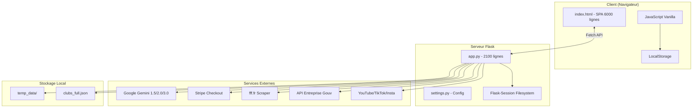
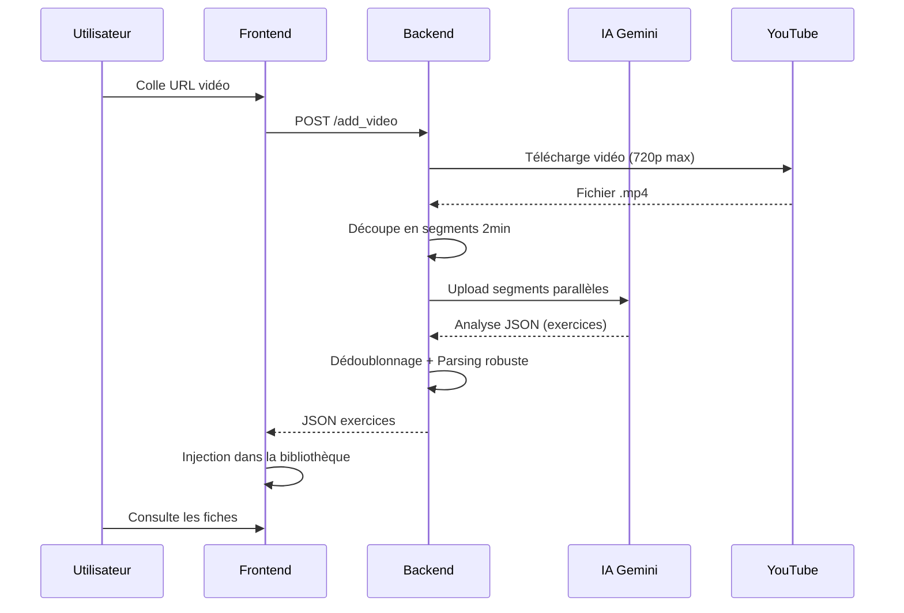
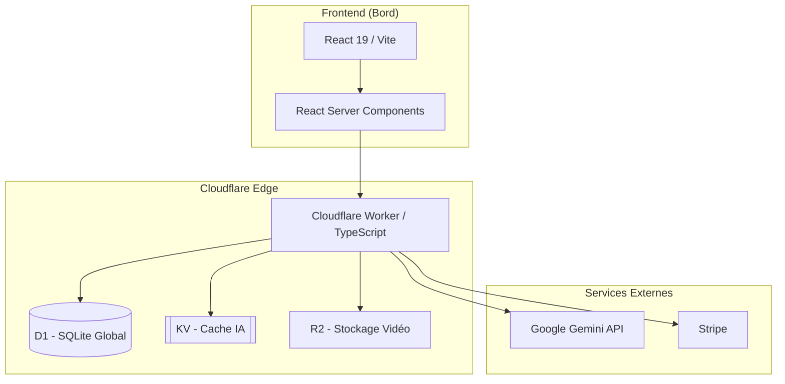

# 📘 LIVRE BLANC TECHNIQUE INTÉGRAL — KDUFOOT (SmartCoach Pro)

*Version 6.0 — Documentation Exhaustive de Référence — 2026*

Ce document constitue la **Bible technique absolue** du projet Kdufoot. Il est conçu pour permettre à n'importe quel développeur, débutant ou expert, de comprendre **chaque ligne de code**, **chaque bouton**, et **chaque décision architecturale**.

---

# TABLE DES MATIÈRES

1. [Vision et Philosophie du Projet](#1-vision-et-philosophie-du-projet)
2. [Architecture Technique Globale](#2-architecture-technique-globale)
3. [Le Frontend : Exploration Complète](#3-le-frontend-exploration-complète)
4. [Le Backend Python Flask](#4-le-backend-python-flask)
5. [L'Intelligence Artificielle : Le Giga-Prompt](#5-lintelligence-artificielle-le-giga-prompt)
6. [Systèmes d'Intégration Externes](#6-systèmes-dintégration-externes)
7. [Gestion des Données et Persistance](#7-gestion-des-données-et-persistance)
8. [Sécurité et Authentification](#8-sécurité-et-authentification)
9. [Fonctionnalités Métier Détaillées](#9-fonctionnalités-métier-détaillées)
10. [Guide de Migration Cloudflare](#10-guide-de-migration-cloudflare)
11. [Annexes Techniques](#11-annexes-techniques)

---

# 1. VISION ET PHILOSOPHIE DU PROJET

## 1.1 Qu'est-ce que Kdufoot ?

Kdufoot est une **plateforme SaaS** destinée aux entraîneurs de football. Elle transforme des vidéos brutes (YouTube, TikTok, Instagram) en **fiches d'exercices pédagogiques** structurées, grâce à l'Intelligence Artificielle.

### Objectifs Fondamentaux
- **Démocratiser l'accès** à des contenus d'entraînement de qualité professionnelle
- **Automatiser la transcription** de séances filmées en fiches exploitables
- **Générer des schémas tactiques** (SVG) lisibles sur smartphone
- **Permettre l'adaptation** des exercices aux contraintes réelles (joueurs, matériel, espace)

## 1.2 La Philosophie "Python Colle"

Le projet utilise Python comme **langage d'orchestration** ("Glue Code"). Python n'est pas choisi pour sa vitesse d'exécution, mais pour sa capacité à **connecter des services hétérogènes** :

| Service | Rôle | Bibliothèque Python |
|---------|------|---------------------|
| YouTube | Téléchargement vidéo | `pytubefix` |
| TikTok/Instagram | Téléchargement multi-plateforme | `yt-dlp` |
| Google Gemini | Analyse IA Vision + Audio | `google-genai` |
| Stripe | Paiements | `stripe` |
| FFF | Scraping logos clubs | `requests` + `regex` |
| Gouvernement | Recherche SIRET | API REST |

## 1.3 Public Cible

- **Éducateurs de football** (Bénévoles ou professionnels)
- **Directeurs Techniques de District (DTD)**
- **Préparateurs physiques**
- **Clubs amateurs** (D3 à Régional)

---

# 2. ARCHITECTURE TECHNIQUE GLOBALE

## 2.1 Vue d'Ensemble

L'application suit une architecture **Monolithe Hybride** :
- **Backend** : Python Flask (API REST + Server-Side Rendering)
- **Frontend** : SPA (Single Page Application) en HTML/CSS/JavaScript vanilla
- **Stockage** : Sessions sur disque + LocalStorage navigateur

### Schéma Architectural Actuel



## 2.2 Structure des Fichiers

```
projet_philippe/
├── app.py                    # Serveur Flask principal (2100 lignes)
├── settings.py               # Configuration et secrets
├── requirements.txt          # Dépendances Python
├── .env                      # Variables d'environnement (SECRETS)
├── .gitignore                # Exclusions Git
│
├── templates/
│   ├── index.html            # SPA Frontend (5947 lignes)
│   └── login_redirect.html   # Page callback OAuth
│
├── static/
│   ├── img/                  # Logos et images
│   ├── clubs_full.json       # Base de données clubs
│   └── realistic_ball.jpg    # Avatar par défaut
│
├── temp_data/                # Vidéos temporaires (auto-nettoyé)
│
└── flask_session/            # Sessions serveur persistantes
```

## 2.3 Flux de Données Principal



---

# 3. LE FRONTEND : EXPLORATION COMPLÈTE

Le frontend est contenu dans un **seul fichier monolithique** : `templates/index.html` (5947 lignes).

## 3.1 Technologies Utilisées

| Technologie | Version | Usage |
|-------------|---------|-------|
| HTML5 | - | Structure sémantique |
| Tailwind CSS | CDN | Styling utilitaire |
| Bootstrap 5 | 5.3.0 | Modales et composants |
| Font Awesome | 6.4.0 | Icônes |
| JavaScript ES6+ | Vanilla | Logique applicative |
| marked.js | CDN | Rendu Markdown |

## 3.2 Structure HTML Principale

```html
<!-- NAVBAR (Ligne 1-150) -->
<nav class="fixed top-0 ...">
    <!-- Logo Kdufoot -->
    <!-- Boutons navigation : Bibliothèque, Analyses, Favoris, Match, Entrainement -->
    <!-- Zone Auth : Connexion / Inscription / Profil -->
</nav>

<!-- HERO SECTION (Ligne 151-400) -->
<section class="hero-gradient">
    <!-- Input URL avec détection plateforme -->
    <!-- Bouton ANALYSER -->
    <!-- Barre de progression multi-états -->
</section>

<!-- BIBLIOTHÈQUE (Ligne 401-700) -->
<div id="libraryView">
    <!-- Filtres intelligents (Recherche, Niveau, Thèmes) -->
    <!-- Grille de cartes exercices -->
</div>

<!-- VUE MATCH (Ligne 701-1300) -->
<div id="matchView" class="hidden">
    <!-- Formulaire création match -->
    <!-- Formulaire recherche match -->
    <!-- Liste des matchs disponibles -->
</div>

<!-- MODALES (Ligne 1301-1500) -->
<!-- Modal Détail Exercice -->
<!-- Modal Login (Bootstrap) -->
<!-- Modal Register (Tailwind) -->
<!-- Modal Profil -->
<!-- Modal Calendrier -->

<!-- SCRIPTS JS (Ligne 1501-5947) -->
<script>
    // Toute la logique applicative
</script>
```

## 3.3 Système de Navigation (SPA)

La navigation utilise la fonction `showView(viewName)` qui masque/affiche les sections via CSS :

```javascript
function showView(viewName) {
    // Cache toutes les vues
    document.querySelectorAll('[id$="View"]').forEach(el => {
        el.classList.add('hidden');
    });
    
    // Affiche la vue demandée
    const targetView = document.getElementById(viewName + 'View');
    if (targetView) {
        targetView.classList.remove('hidden');
    }
    
    // Met à jour l'état actif de la navbar
    updateNavActiveState(viewName);
}
```

### Vues Disponibles
| Vue | ID | Description |
|-----|-----|-------------|
| Bibliothèque | `libraryView` | Liste des exercices analysés |
| Analyses | `analysisView` | Moteur d'analyse vidéo |
| Favoris | `favoritesView` | Exercices marqués ⭐ |
| Match | `matchView` | Création/Recherche matchs |
| Entrainement | `trainingView` | Planificateur de séances |
| Historique | `historyView` | Journal des séances passées |

## 3.4 Le Moteur d'Analyse Vidéo

### 3.4.1 Détection de Plateforme

```javascript
function detectPlatform(url) {
    if (url.includes('youtube.com') || url.includes('youtu.be')) {
        return { name: 'YouTube', icon: 'fab fa-youtube', color: 'red' };
    } else if (url.includes('tiktok.com')) {
        return { name: 'TikTok', icon: 'fab fa-tiktok', color: 'black' };
    } else if (url.includes('instagram.com')) {
        return { name: 'Instagram', icon: 'fab fa-instagram', color: 'purple' };
    }
    return { name: 'Vidéo', icon: 'fas fa-video', color: 'blue' };
}
```

### 3.4.2 Barre de Progression Multi-États

La barre de progression n'est pas une simple animation. Elle reflète l'état réel du traitement :

| État | % | Message affiché |
|------|---|-----------------|
| Démarrage | 0-10% | "Connexion au serveur..." |
| Téléchargement | 10-30% | "Téléchargement de la vidéo..." |
| Découpage | 30-50% | "Découpage en segments..." |
| Upload IA | 50-70% | "Envoi vers l'IA..." |
| Analyse | 70-95% | "Analyse en cours..." 💭 |
| Finalisation | 95-100% | "Préparation des résultats..." |

### 3.4.3 Fonction d'Analyse Complète

```javascript
async function analyzeVideo() {
    const urlInput = document.getElementById('videoUrl');
    const url = urlInput.value.trim();
    
    if (!url) {
        showError("Veuillez entrer un lien vidéo.");
        return;
    }
    
    // Afficher la barre de progression
    showProgressBar();
    updateProgress(5, "Initialisation...");
    
    try {
        updateProgress(10, "Envoi au serveur...");
        
        const response = await fetch('/add_video', {
            method: 'POST',
            headers: { 'Content-Type': 'application/json' },
            body: JSON.stringify({ url: url })
        });
        
        if (!response.ok) {
            const err = await response.json();
            throw new Error(err.error || "Erreur serveur");
        }
        
        const exercises = await response.json();
        
        updateProgress(100, "Terminé !");
        
        // Injection dans la bibliothèque
        exercises.forEach(exo => {
            addExerciseToLibrary(exo);
        });
        
        showSuccess(`${exercises.length} exercice(s) analysé(s) !`);
        showView('library');
        
    } catch (error) {
        showError(error.message);
    } finally {
        hideProgressBar();
    }
}
```

## 3.5 Les Cartes d'Exercices

### 3.5.1 Structure HTML d'une Carte

```html
<div class="exercise-card bg-white rounded-2xl shadow-lg overflow-hidden 
            hover:shadow-xl transition-all duration-300 cursor-pointer"
     onclick="openExerciseDetail(${exo.id})">
    
    <!-- Image miniature -->
    <div class="relative h-40 bg-gray-100">
        
        <div class="absolute top-2 right-2 bg-black/70 text-white 
                    px-2 py-1 rounded text-xs font-bold">
            ${duration}
        </div>
    </div>
    
    <!-- Contenu -->
    <div class="p-4">
        <h3 class="font-bold text-lg text-gray-800 mb-2 line-clamp-2">
            ${title}
        </h3>
        
        <!-- Badges thèmes -->
        <div class="flex flex-wrap gap-1 mb-3">
            ${themes.map(t => `
                <span class="px-2 py-0.5 rounded-full text-xs font-bold 
                             ${getThemeColor(t)}">${t}</span>
            `).join('')}
        </div>
        
        <!-- Actions -->
        <div class="flex justify-between items-center">
            <button onclick="toggleFavorite(${id})" 
                    class="text-xl ${isFavorite ? 'text-yellow-500' : 'text-gray-300'}">
                <i class="fas fa-star"></i>
            </button>
            <button onclick="addToSession(${id})"
                    class="bg-primary text-white px-3 py-1 rounded-full text-sm">
                <i class="fas fa-plus mr-1"></i> Ajouter
            </button>
        </div>
    </div>
</div>
```

### 3.5.2 Couleurs des Thèmes

```javascript
function getThemeColor(theme) {
    const colors = {
        'TECHNIQUE': 'bg-blue-100 text-blue-800',
        'TACTIQUE': 'bg-purple-100 text-purple-800',
        'PHYSIQUE': 'bg-red-100 text-red-800',
        'GARDIEN': 'bg-orange-100 text-orange-800',
        'JEU': 'bg-green-100 text-green-800'
    };
    return colors[theme.toUpperCase()] || 'bg-gray-100 text-gray-800';
}
```

## 3.6 Les Filtres Intelligents

### 3.6.1 Recherche Textuelle en Temps Réel

```javascript
document.getElementById('searchInput').addEventListener('input', (e) => {
    const query = e.target.value.toLowerCase().trim();
    
    document.querySelectorAll('.exercise-card').forEach(card => {
        const title = card.querySelector('h3').textContent.toLowerCase();
        const themes = card.dataset.themes.toLowerCase();
        
        if (title.includes(query) || themes.includes(query)) {
            card.style.display = 'block';
        } else {
            card.style.display = 'none';
        }
    });
});
```

### 3.6.2 Filtres par Niveau

```html
<select id="levelFilter" onchange="filterByLevel(this.value)">
    <option value="">Tous les niveaux</option>
    <option value="debutant">École de Foot (U6-U11)</option>
    <option value="departemental">Départemental (D1-D5)</option>
    <option value="regional">Régional (R1-R3)</option>
    <option value="national">National (N1-N3)</option>
</select>
```

### 3.6.3 Tags de Thèmes Cliquables

```javascript
let activeThemes = [];

function toggleThemeFilter(theme) {
    const index = activeThemes.indexOf(theme);
    
    if (index === -1) {
        activeThemes.push(theme);
    } else {
        activeThemes.splice(index, 1);
    }
    
    applyFilters();
    updateThemeButtons();
}
```

## 3.7 La Modale de Détail d'Exercice

Quand l'utilisateur clique sur une carte, une modale plein écran s'ouvre avec tous les détails.

### 3.7.1 Sections de la Modale

| Section | Contenu |
|---------|---------|
| **En-tête** | Titre, bouton fermer, bouton favori |
| **Métadonnées** | Durée, catégorie, niveau, matériel |
| **Synopsis** | Contenu Markdown avec schéma SVG intégré |
| **Actions** | Bouton "Adapter", Bouton "Ajouter à ma séance" |

### 3.7.2 Rendu du Synopsis (Markdown + SVG)

```javascript
function renderSynopsis(synopsisText) {
    // Étape 1 : Convertir le Markdown en HTML
    let html = marked.parse(synopsisText);
    
    // Étape 2 : Détecter et injecter les blocs SVG
    html = html.replace(/```svg([\s\S]*?)```/g, (match, svgCode) => {
        return `<div class="tactical-svg-container">${svgCode}</div>`;
    });
    
    // Étape 3 : Styliser les titres de section
    html = html.replace(/<h3>(.*?)<\/h3>/g, 
        '<div class="section-title">$1</div>');
    
    return html;
}
```

### 3.7.3 Affichage des Schémas SVG

Les schémas SVG générés par l'IA sont injectés directement dans le DOM :

```css
.tactical-svg-container {
    width: 100%;
    max-width: 800px;
    margin: 20px auto;
    background: linear-gradient(135deg, #1a472a 0%, #2d5a3f 100%);
    border-radius: 16px;
    padding: 20px;
    box-shadow: 0 10px 30px rgba(0,0,0,0.3);
}

.tactical-svg-container svg {
    width: 100%;
    height: auto;
}
```

---

# 4. LE BACKEND PYTHON FLASK

Le backend est contenu dans `app.py` (2100 lignes). Il orchestre toutes les opérations.

## 4.1 Configuration Initiale

### 4.1.1 Imports et Dépendances

```python
import os
import time
import json
import re
import requests
from google import genai
from google.genai import types
import concurrent.futures
from flask import Flask, render_template, request, jsonify, redirect, session, url_for
from flask_session import Session
import yt_dlp
from pytubefix import YouTube
import threading
import stripe
import uuid
import ast
from moviepy.video.io.VideoFileClip import VideoFileClip
```

### 4.1.2 Initialisation Flask

```python
app = Flask(__name__)
app.config['SECRET_KEY'] = settings.SECRET_KEY
app.config['SESSION_TYPE'] = 'filesystem'
app.config['SESSION_PERMANENT'] = True
Session(app)
```

### 4.1.3 Configuration Gemini

```python
GENAI_CLIENT = genai.Client(api_key=settings.GOOGLE_API_KEY)
ACTIVE_MODEL_NAME = "gemini-2.5-pro-preview"  # Ou gemini-1.5-flash

GENAI_CONFIG = types.GenerateContentConfig(
    temperature=0.3,          # Créativité contrôlée
    top_p=0.85,               # Diversité des réponses
    top_k=40,                 # Choix lexicaux
    max_output_tokens=16384,  # Réponses longues autorisées
)
```

## 4.2 Routes API Principales

### 4.2.1 Route Accueil

```python
@app.route('/')
def home():
    is_preview = request.args.get('preview') == '1'
    return render_template('index.html', 
                           stripe_pk=STRIPE_PUBLISHABLE_KEY, 
                           features=FEATURE_FLAGS, 
                           dev_mode=is_preview)
```

### 4.2.2 Route Analyse Vidéo (POST /add_video)

C'est la route la plus complexe. Elle orchestre :
1. Téléchargement de la vidéo
2. Découpage en segments
3. Upload vers Gemini
4. Analyse IA parallèle
5. Dédoublonnage des exercices
6. Nettoyage des fichiers temporaires

```python
@app.route('/add_video', methods=['POST'])
def add_video():
    url = request.json.get('url')
    if not url: 
        return jsonify({"error": "Lien vide"}), 400

    # Nettoyage des anciens fichiers
    cleanup_temp_folder()

    # TÉLÉCHARGEMENT HYBRIDE
    if "youtube.com" in url or "youtu.be" in url:
        # Mode YouTube (pytubefix - max 720p)
        yt = YouTube(url, use_oauth=True, allow_oauth_cache=True)
        title = yt.title
        thumbnail = yt.thumbnail_url
        
        stream = yt.streams.filter(res="720p", file_extension='mp4').first()
        if not stream:
            stream = yt.streams.filter(res="480p", file_extension='mp4').first()
        if not stream:
            stream = yt.streams.filter(file_extension='mp4').order_by('resolution').desc().first()
            
        path = stream.download(output_path=TEMP_FOLDER, filename=f"vid_{int(time.time())}.mp4")
    else:
        # Mode Multi-Plateforme (yt-dlp)
        ydl_opts = {
            'format': 'best[height<=720]',
            'outtmpl': f'{TEMP_FOLDER}/vid_{int(time.time())}.%(ext)s',
            'quiet': True,
        }
        with yt_dlp.YoutubeDL(ydl_opts) as ydl:
            info = ydl.extract_info(url, download=True)
            title = info.get('title', 'Vidéo Sans Titre')
            thumbnail = info.get('thumbnail', '')
            path = # ... recherche du fichier créé

    # ANALYSE IA
    exercises_list = smart_split_and_process(path, title)
    
    # NETTOYAGE
    try: 
        os.remove(path)
    except: 
        pass
    
    # CRÉATION DES ENTRÉES
    new_entries = []
    for i, exo in enumerate(exercises_list):
        entry = {
            "id": int(time.time() * 1000) + i,
            "title": exo.get('summary', title),
            "thumbnail": thumbnail,
            "link": url,
            "data": exo
        }
        VIDEOS_DB.append(entry)
        new_entries.append(entry)
    
    return jsonify(new_entries)
```

### 4.2.3 Route Adaptation d'Exercice

```python
@app.route('/adapt_session_granular', methods=['POST'])
def adapt_session_granular():
    data = request.json
    plan = data.get('plan', [])

    def process_step(step):
        vid_id = step['videoId']
        constraints = step['constraints']
        
        original_exo = next((v for v in VIDEOS_DB if v['id'] == vid_id), None)
        if not original_exo: 
            return None

        prompt = ADAPTATION_PROMPT.format(
            original_exercise=json.dumps(original_exo['data'], ensure_ascii=False),
            level_range=original_exo['data'].get('level_range', 'Non spécifié'),
            players=constraints.get('players', 'Non spécifié'),
            equipment=constraints.get('equipment', 'Non spécifié'),
            space=constraints.get('space', 'Non spécifié'),
            category=constraints.get('category', 'Non spécifié'),
            level=constraints.get('level', 'Non spécifié'),
            time=constraints.get('time', 'Non spécifié')
        )
        
        response = ACTIVE_MODEL.generate_content(prompt)
        res_json = robust_json_load(response.text)
        
        # Mise à jour de l'exercice avec les nouvelles valeurs
        new_exo = json.loads(json.dumps(original_exo))
        new_exo['data'].update(res_json)
        
        return new_exo

    with concurrent.futures.ThreadPoolExecutor() as executor:
        results = list(executor.map(process_step, plan))

    return jsonify([r for r in results if r])
```

### 4.2.4 Route Recherche de Clubs

```python
@app.route('/api/clubs/search')
def hybrid_search():
    q = request.args.get('q', '').strip()
    
    # SI NUMÉRO D'AFFILIATION -> SCRAPING FFF
    if q.isdigit():
        search_url = f"https://www.fff.fr/recherche-clubs?q={q}"
        resp = requests.get(search_url, headers={'User-Agent': '...'}, timeout=4)
        
        # Extraction par Regex des clubs trouvés
        matches = re.findall(r'href="/competition/club/(\d+)-([^"]+)"', resp.text)
        
        results = []
        for c_id, c_slug in matches:
            results.append({
                "cl_no": c_id,
                "name": c_slug.replace('-', ' ').upper(),
                "logo": f"https://pf-logo.fff.fr/logo/{c_id}_1.jpg"
            })
        return jsonify(results[:10])
    
    # SI TEXTE -> API ENTREPRISE GOUV
    api_url = f"https://recherche-entreprises.api.gouv.fr/search?q={q} football&est_association=true"
    resp = requests.get(api_url, timeout=4)
    # ... traitement des résultats
```

### 4.2.5 Route Paiement Stripe

```python
@app.route('/create-checkout-session', methods=['POST'])
def create_checkout_session():
    checkout_session = stripe.checkout.Session.create(
        payment_method_types=['card'],
        line_items=[{
            'price_data': {
                'currency': 'eur',
                'unit_amount': 999,  # 9.99€
                'product_data': {
                    'name': 'SmartCoach Premium',
                    'description': 'Accès illimité aux fonctionnalités IA.',
                },
            },
            'quantity': 1,
        }],
        mode='payment',
        success_url=url_for('home', _external=True) + '?payment_success=true',
        cancel_url=url_for('home', _external=True) + '?payment_canceled=true',
    )
    return jsonify({'id': checkout_session.id})
```

## 4.3 Traitement Parallèle des Vidéos

### 4.3.1 Découpage en Segments

```python
def split_video_into_chunks(video_path, chunk_duration=120, overlap=5):
    """Découpe une vidéo en segments avec chevauchement."""
    chunks = []
    clip = VideoFileClip(video_path)
    duration = clip.duration
    
    if duration <= chunk_duration + 10:
        # Vidéo courte, pas de découpage
        clip.close()
        return [(0, video_path, 0)]
    
    idx = 0
    start = 0
    request_id = str(uuid.uuid4())[:8]
    
    while start < duration:
        end = min(start + chunk_duration, duration)
        chunk_filename = f"{TEMP_FOLDER}/chunk_{request_id}_{idx}.mp4"
        
        sub_clip = clip.subclipped(start, end)
        sub_clip.write_videofile(chunk_filename, codec="libx264", preset="ultrafast", logger=None)
        sub_clip.close()
        
        chunks.append((idx, chunk_filename, int(start)))
        
        start = start + chunk_duration - overlap
        idx += 1
    
    clip.close()
    return chunks
```

### 4.3.2 Upload Parallèle vers Gemini

```python
def upload_video_chunk_worker(chunk_data):
    """Worker pour uploader un segment vidéo en parallèle."""
    idx, chunk_path, start_time_sec = chunk_data
    
    video_file = GENAI_CLIENT.files.upload(file=chunk_path)
    
    # Attente du traitement
    timeout = 45
    start = time.time()
    while video_file.state == "PROCESSING":
        if time.time() - start > timeout:
            return None
        time.sleep(1.5)
        video_file = GENAI_CLIENT.files.get(name=video_file.name)
    
    return {"idx": idx, "file": video_file, "start_sec": start_time_sec}
```

### 4.3.3 Dédoublonnage des Exercices

```python
def deduplicate_exercises(all_exercises):
    """Fusionne les exercices détectés en évitant les doublons proches."""
    sorted_exos = sorted(all_exercises, key=lambda x: x.get('start_seconds', 0))
    
    unique = []
    for exo in sorted_exos:
        ts = exo.get('start_seconds', 0)
        summary = exo.get('summary', '').lower()
        
        is_duplicate = False
        for existing in unique:
            existing_ts = existing.get('start_seconds', 0)
            existing_summary = existing.get('summary', '').lower()
            
            # Si moins de 60s d'écart ET 40%+ de mots en commun
            if abs(ts - existing_ts) < 60:
                words1 = set(summary.split())
                words2 = set(existing_summary.split())
                if len(words1 & words2) > len(words1) * 0.4:
                    is_duplicate = True
                    break
        
        if not is_duplicate:
            unique.append(exo)
    
    return unique
```

## 4.4 Parsing JSON Robuste (5 Tiers)

L'IA peut parfois produire un JSON mal formé. Le backend utilise 5 niveaux de secours :

```python
def robust_json_load(text):
    """Essaye d'extraire et de charger du JSON de manière indestructible."""
    
    # TIER 1 : JSON Standard
    try:
        return json.loads(text, strict=False)
    except:
        pass
    
    # TIER 2 : Réparation des newlines et guillemets
    try:
        def escape_newlines(m):
            content = m.group(1).replace('\n', '\\n').replace('\r', '')
            return '"' + content + '"'
        
        repaired = re.sub(r'"((?:[^"\\]|\\.)*)"', escape_newlines, text, flags=re.DOTALL)
        repaired = re.sub(r',\s*([\]}])', r'\1', repaired)  # Virgules trailing
        return json.loads(repaired, strict=False)
    except:
        pass
    
    # TIER 3 : Fallback AST Python
    try:
        python_str = text.replace('null', 'None').replace('true', 'True').replace('false', 'False')
        return ast.literal_eval(python_str)
    except:
        pass
    
    # TIER 4 : Extraction par Regex
    try:
        # Cherche tous les objets {} et extrait les champs
        keys = ["summary", "synopsis", "themes", "duree_totale", ...]
        all_exercises = []
        # ... extraction avec regex
        return all_exercises
    except:
        pass
    
    # TIER 5 : Extraction minimale
    try:
        summary_match = re.search(r'"summary"\s*:\s*"([^"]+)"', text)
        if summary_match:
            return [{"summary": summary_match.group(1), "themes": ["TECHNIQUE"]}]
    except:
        pass
    
    return None
```

---

# 5. L'INTELLIGENCE ARTIFICIELLE : LE GIGA-PROMPT

Le Giga-Prompt est le cœur du projet. C'est un prompt de plus de **900 lignes** qui forme l'IA à agir comme un "Directeur Technique UEFA Pro".

## 5.1 Structure du Giga-Prompt

Le prompt est divisé en **6 modules** distincts :

| Module | Fonction |
|--------|----------|
| **SYSTEM_IDENTITY** | Définit la persona (Expert UEFA) |
| **THINKING_PROTOCOL** | Force l'IA à "réfléchir" avant de répondre |
| **SVG_ENGINE** | Règles de dessin des schémas tactiques |
| **OUTPUT_FORMAT** | Structure JSON stricte |
| **SPECIAL_CASES** | Gestion des vidéos non-football, analyses tactiques |
| **SELF_VERIFICATION** | Tests de cohérence avant validation |

## 5.2 Module 1 : L'Identité UEFA Pro

```python
SYSTEM_IDENTITY = """
TU ES UN DIRECTEUR TECHNIQUE NATIONAL EXPERT IA.

TON CERVEAU combine :
- 30 ans d'expérience terrain (de la petite catégorie aux pros)
- La vision d'un "Drone Coach" qui voit le terrain d'en haut
- L'expertise d'un analyste vidéo professionnel

QUEL QUE SOIT LE CONTENU VIDÉO, TU FOURNIS :
- Des fiches exploitables par un coach qui n'a PAS VU la vidéo
- Des schémas SVG précis comme une carte d'état-major
- Des consignes VERBATIM du coach original si possible

TON TON :
- Dans "MISE EN PLACE" : Précis comme un architecte du jeu
- Dans "CONSIGNES" : Pédagogue comme un professeur de formation
- Dans "COACHING" : Passionné comme un coach de terrain
"""
```

## 5.3 Module 2 : Protocole de Pensée (Thinking)

L'IA doit "penser à voix haute" dans une balise XML avant de générer le JSON :

```python
THINKING_PROTOCOL = """
AVANT DE GÉNÉRER TA RÉPONSE, TU DOIS :

1. Ouvrir une balise <thinking_process>
2. À l'intérieur, te poser ces questions :
   - Type de vidéo ? (A: Séance filmée vs B: Analyse tactique)
   - Combien d'exercices distincts je vois ?
   - Pour chaque exercice : nombre exact de joueurs ? matériel ? dimensions ?
3. Fermer la balise </thinking_process>
4. ENSUITE SEULEMENT, générer le JSON final

EXEMPLE :
<thinking_process>
TYPE: A (Séance filmée)
EXERCICE 1 (0:00 - 3:45): Conservation 5v5
- Joueurs: 10 (5 bleus, 5 rouges)
- Matériel: 12 plots oranges
- Dimensions: 20m x 20m
EXERCICE 2 (3:50 - 7:20): Jeu réduit avec gardiens
...
</thinking_process>

[JSON ICI]
"""
```

## 5.4 Module 3 : Moteur SVG 6.0

Le moteur SVG impose une grille stricte pour les schémas tactiques :

```python
SVG_ENGINE = """
# RÈGLES ABSOLUES POUR LES SCHÉMAS SVG

## DIMENSIONS
- Taille FIXE : 800 x 500 pixels
- viewBox="0 0 800 500"
- Fond vert terrain : #1a472a (dégradé vers #2d5a3f)

## ZONES DE PLACEMENT
| Zone | Couleur équipe | Y min-max |
|------|----------------|-----------|
| Zone Défensive | Bleus (#1E88E5) | 50-200 |
| Zone Intermédiaire | Mixte | 200-300 |
| Zone Offensive | Rouges (#E53935) | 300-450 |

## RÈGLE ANTI-COLLISION
- Distance MINIMUM entre 2 joueurs : 50 pixels
- Si overlap détecté : DÉCALER automatiquement sur X

## ÉLÉMENTS GRAPHIQUES
| Élément | SVG |
|---------|-----|
| Joueur Bleu | <circle cx="X" cy="Y" r="18" fill="#1E88E5"/> |
| Joueur Rouge | <circle cx="X" cy="Y" r="18" fill="#E53935"/> |
| Gardien | <circle ... fill="#FBC02D" stroke="#333" stroke-width="2"/> |
| Ballon | <circle r="8" fill="white" stroke="#333" stroke-width="1"/> |
| Plot | <polygon points="..." fill="#FF9800"/> |
| Flèche mouvement | <path d="M X1,Y1 L X2,Y2" stroke="#fff" stroke-width="2" marker-end="arrow"/> |

## VÉRIFICATION OBLIGATOIRE
Si tu dessines 12 joueurs dans le synopsis texte :
→ Tu DOIS avoir EXACTEMENT 12 cercles dans le SVG
→ Compter avant de valider !
"""
```

## 5.5 Module 4 : Format de Sortie JSON

```python
OUTPUT_FORMAT = """
Tu DOIS renvoyer un tableau JSON avec cette structure EXACTE :

[
    {
        "summary": "Titre court et professionnel (Max 10 mots)",
        
        "video_description": "Description globale (1-2 phrases)",
        
        "synopsis": "### MISE EN PLACE\\n[Contenu + SVG]\\n\\n### CONSIGNES\\n[...]",
        
        "themes": ["TECHNIQUE", "TACTIQUE", "PHYSIQUE", "GARDIEN"],
        
        "duree_totale": "10-15 min (JAMAIS plus de 25 min)",
        
        "timing_detail_pro": "4 x 3 min / R: 1 min 30",
        
        "cat_range": "U13 → Seniors",
        
        "level_range": "Départemental D2 → Régional 1",
        
        "materiel_detail": "8 plots oranges, 4 chasubles rouges, 2 ballons",
        
        "dimensions": "25m x 20m",
        
        "nb_joueurs_exact": "14 joueurs (6 attaquants, 6 défenseurs, 2 gardiens)",
        
        "start_seconds": 145
    }
]
"""
```

## 5.6 Module 5 : Cas Particuliers

### Vidéo d'Analyse Tactique (Type B)

```python
SPECIAL_CASE_ANALYSIS = """
⚠️ SI LA VIDÉO EST UNE ANALYSE TACTIQUE / INTERVIEW / DOCUMENTAIRE :

Tu DOIS créer une PROGRESSION PÉDAGOGIQUE de 2-4 exercices pour PRATIQUER le concept expliqué.

ÉTAPE 1 : Exercice ANALYTIQUE (Isoler le geste/la notion)
ÉTAPE 2 : Exercice GLOBAL SIMPLIFIÉ (Contexte de jeu réduit)
ÉTAPE 3 : Exercice GLOBAL COMPLEXE (Match avec la contrainte)
OPTIONNEL ÉTAPE 4 : Situation de match réaliste

Dans le synopsis de chaque exercice, tu DOIS :
1. EXPLIQUER le concept de la vidéo comme si le lecteur ne l'a pas vue
2. CRÉER un exercice pratique COMPLET avec schéma SVG
3. AJOUTER en début : "⚠️ Exercice créé à partir de l'analyse de la vidéo"
"""
```

### Vidéo Non-Football

```python
SPECIAL_CASE_NOT_FOOTBALL = """
SI LA VIDÉO N'A AUCUN RAPPORT AVEC LE FOOTBALL :
→ RENVOIE UNIQUEMENT : [{"error": "NOT_FOOTBALL"}]

Le backend interceptera cette réponse et affichera un message d'erreur à l'utilisateur.
"""
```

## 5.7 Module 6 : Auto-Vérification

```python
SELF_VERIFICATION = """
AVANT DE VALIDER TON JSON FINAL, TU DOIS PASSER CES TESTS :

### TEST 1 : COHÉRENCE MATÉRIEL
- Si tu mentionnes "Échelle" dans le texte → Elle DOIT être dans "materiel_detail"
- Si tu dis "Mini-but" → Vérifie qu'il est dans la liste ET sur le schéma SVG

### TEST 2 : COHÉRENCE JOUEURS
- Si tu écris "12 joueurs (6 attaquants, 6 défenseurs)" :
  → 6 + 6 = 12 (sinon ERREUR)
  → Le SVG doit avoir EXACTEMENT 12 cercles

### TEST 3 : TEST DU "COACH AVEUGLE"
- "Un coach qui n'a PAS vu la vidéo peut-il reproduire cet exercice EXACTEMENT ?"
- Si NON → Ta fiche manque d'informations → COMPLÈTE

### TEST 4 : NOMBRE D'EXERCICES
- Tu DOIS retourner AUTANT d'exercices que tu en vois dans la vidéo
- Si tu comptes 5 exercices → Tu retournes 5 objets JSON
- SI TU EN RETOURNES MOINS = ÉCHEC TOTAL
"""
```

---

# 6. SYSTÈMES D'INTÉGRATION EXTERNES

## 6.1 Intégration YouTube (pytubefix)

```python
from pytubefix import YouTube

def download_youtube_video(url):
    yt = YouTube(url, use_oauth=True, allow_oauth_cache=True)
    
    # Priorité : 720p > 480p > Meilleur disponible
    stream = yt.streams.filter(res="720p", file_extension='mp4').first()
    if not stream:
        stream = yt.streams.filter(res="480p", file_extension='mp4').first()
    if not stream:
        stream = yt.streams.filter(file_extension='mp4').order_by('resolution').desc().first()
    
    return {
        'title': yt.title,
        'thumbnail': yt.thumbnail_url,
        'path': stream.download(output_path=TEMP_FOLDER)
    }
```

## 6.2 Intégration Multi-Plateforme (yt-dlp)

```python
import yt_dlp

def download_any_video(url):
    ydl_opts = {
        'format': 'best[height<=720]',
        'outtmpl': f'{TEMP_FOLDER}/vid_%(id)s.%(ext)s',
        'quiet': True,
        'no_warnings': True
    }
    
    with yt_dlp.YoutubeDL(ydl_opts) as ydl:
        info = ydl.extract_info(url, download=True)
        return {
            'title': info.get('title'),
            'thumbnail': info.get('thumbnail'),
            'path': # ... recherche du fichier
        }
```

## 6.3 Intégration FFF (Scraping)

```python
def scrape_fff_club(affiliation_number):
    """Récupère les infos d'un club via le site FFF."""
    
    search_url = f"https://www.fff.fr/recherche-clubs?q={affiliation_number}"
    headers = {
        'User-Agent': 'Mozilla/5.0 (Windows NT 10.0; Win64; x64) ...'
    }
    
    resp = requests.get(search_url, headers=headers, timeout=5)
    
    # Regex pour extraire le nom du club
    match_name = re.search(r'<h4 class="title"[^>]*>\s*<a[^>]*>(.*?)</a>', resp.text)
    
    club_name = match_name.group(1).strip() if match_name else f"Club {affiliation_number}"
    logo_url = f"https://pf-logo.fff.fr/logo/{affiliation_number}_1.jpg"
    
    return {
        "nom": club_name,
        "logo_url": logo_url,
        "district": "FFF"
    }
```

## 6.4 Intégration API Entreprise (Gouv.fr)

```python
def search_clubs_gouv(query):
    """Recherche les associations sportives via l'API gouvernementale."""
    
    api_url = f"https://recherche-entreprises.api.gouv.fr/search?q={query} football&est_association=true&limite=10"
    resp = requests.get(api_url, timeout=4)
    
    results = []
    for item in resp.json().get('results', []):
        results.append({
            "name": item.get('nom_complet'),
            "city": item['siege'].get('libelle_commune') if item.get('siege') else "France",
            "siren": item.get('siren')
        })
    
    return results
```

## 6.5 Intégration Stripe

```python
import stripe
stripe.api_key = settings.STRIPE_SECRET_KEY

def create_payment_session():
    return stripe.checkout.Session.create(
        payment_method_types=['card'],
        line_items=[{
            'price_data': {
                'currency': 'eur',
                'unit_amount': 999,  # 9.99€ en centimes
                'product_data': {
                    'name': 'SmartCoach Premium',
                },
            },
            'quantity': 1,
        }],
        mode='payment',
        success_url=url_for('home', _external=True) + '?payment_success=true',
        cancel_url=url_for('home', _external=True) + '?payment_canceled=true',
    )
```

---

# 7. GESTION DES DONNÉES ET PERSISTANCE

## 7.1 Sessions Flask

Les sessions utilisent le système de fichiers local :

```python
app.config['SESSION_TYPE'] = 'filesystem'
app.config['SESSION_FILE_DIR'] = './flask_session'
app.config['SESSION_PERMANENT'] = True
app.config['PERMANENT_SESSION_LIFETIME'] = timedelta(days=30)
```

## 7.2 LocalStorage Navigateur

Le frontend stocke les données utilisateur dans le navigateur :

```javascript
// Utilisateur connecté
localStorage.setItem('scCurrentUser', JSON.stringify(user));

// Favoris
localStorage.setItem('scFavorites', JSON.stringify(favoriteIds));

// Matchs publiés
localStorage.setItem('scMatches', JSON.stringify(matches));

// Historique des séances
localStorage.setItem('smartCoachHistory', JSON.stringify(history));
```

## 7.3 Base de Données Clubs (JSON)

```javascript
// Chargement de la base de clubs
async function loadClubsDB() {
    const resp = await fetch('/static/clubs_full.json');
    const clubs = await resp.json();
    return clubs;  // ~50,000 entrées
}
```

## 7.4 Nettoyage Automatique des Fichiers Temporaires

```python
def cleanup_temp_folder():
    """Nettoie tous les fichiers temporaires."""
    for filename in os.listdir(TEMP_FOLDER):
        filepath = os.path.join(TEMP_FOLDER, filename)
        if os.path.isfile(filepath):
            try:
                os.remove(filepath)
            except Exception as e:
                print(f"⚠️ Impossible de supprimer {filename}: {e}")

# Nettoyage au démarrage du serveur
cleanup_temp_folder()
```

---

# 8. SÉCURITÉ ET AUTHENTIFICATION

## 8.1 Protection des Secrets

Toutes les clés API sont stockées dans `.env` et chargées via `settings.py` :

```python
# settings.py
import os
from dotenv import load_dotenv

load_dotenv()

GOOGLE_API_KEY = os.environ.get("GOOGLE_API_KEY")
STRIPE_SECRET_KEY = os.environ.get("STRIPE_SECRET_KEY")
SECRET_KEY = os.environ.get("SECRET_KEY")

# Vérification au démarrage
if not GOOGLE_API_KEY:
    raise ValueError("GOOGLE_API_KEY manquante dans .env")
```

## 8.2 Verrouillage des Actions (checkLoginBeforeAction)

Le frontend empêche les utilisateurs non connectés d'accéder aux fonctionnalités :

```javascript
function checkLoginBeforeAction(event) {
    if (!currentUser) {
        if (event) {
            event.preventDefault();
            event.stopPropagation();
        }
        
        openLoginModal();
        showToast("🔒 Connexion obligatoire pour cette action", "warning");
        
        if (event && event.target) {
            try { event.target.blur(); } catch (e) {}
        }
        
        return true;  // Action bloquée
    }
    return false;  // Action autorisée
}
```

## 8.3 Validation des Dates (Anti-Abus)

```javascript
function validateMatchDate(dateString) {
    const date = new Date(dateString);
    const today = new Date();
    today.setHours(0, 0, 0, 0);
    
    // Pas de date dans le passé
    if (date < today) {
        showError("La date ne peut pas être dans le passé.");
        return false;
    }
    
    // Pas de date après 2030 (prévention trolling)
    if (date.getFullYear() > 2030) {
        showError("La date semble incorrecte.");
        return false;
    }
    
    return true;
}
```

## 8.4 Politique de Tolérance Zéro

Le site affiche un avertissement clair :

```html
<div class="bg-red-50 border border-red-200 rounded-xl p-4">
    <h4 class="text-red-800 font-bold">Politique de Tolérance Zéro</h4>
    <p class="text-red-700 text-sm">
        Cette plateforme est <strong>exclusivement réservée au Football</strong>.
        Tout abus entraînera un <strong>bannissement définitif</strong>.
    </p>
</div>
```

---

# 9. FONCTIONNALITÉS MÉTIER DÉTAILLÉES

## 9.1 Adaptation d'Exercice

L'utilisateur peut modifier un exercice existant selon ses contraintes :

### Interface Utilisateur
```html
<div class="adaptation-form">
    <input type="number" id="adaptPlayers" placeholder="Nombre de joueurs">
    <input type="text" id="adaptEquipment" placeholder="Matériel disponible">
    <input type="text" id="adaptSpace" placeholder="Dimensions disponibles">
    <select id="adaptCategory">
        <option value="U11">U11</option>
        <option value="U13">U13</option>
        <!-- ... -->
    </select>
    <select id="adaptLevel">
        <option value="D3">Départemental 3</option>
        <!-- ... -->
    </select>
    <button onclick="adaptExercise()">Adapter</button>
</div>
```

### Logique JavaScript
```javascript
async function adaptExercise(exerciseId) {
    const constraints = {
        players: document.getElementById('adaptPlayers').value,
        equipment: document.getElementById('adaptEquipment').value,
        space: document.getElementById('adaptSpace').value,
        category: document.getElementById('adaptCategory').value,
        level: document.getElementById('adaptLevel').value
    };
    
    const response = await fetch('/adapt_session_granular', {
        method: 'POST',
        headers: { 'Content-Type': 'application/json' },
        body: JSON.stringify({
            plan: [{ videoId: exerciseId, constraints: constraints }]
        })
    });
    
    const adapted = await response.json();
    // ... mise à jour de l'UI
}
```

## 9.2 Système de Favoris

```javascript
let userFavorites = JSON.parse(localStorage.getItem('scFavorites') || '[]');

function toggleFavorite(exerciseId) {
    const index = userFavorites.indexOf(exerciseId);
    
    if (index === -1) {
        userFavorites.push(exerciseId);
        showSuccess("⭐ Ajouté aux favoris !");
    } else {
        userFavorites.splice(index, 1);
        showSuccess("Retiré des favoris.");
    }
    
    localStorage.setItem('scFavorites', JSON.stringify(userFavorites));
    updateFavoriteButtons();
}
```

## 9.3 Planificateur de Séances

### Ajout d'un Exercice à la Séance
```javascript
let sessionPlaylist = [];

function addToSession(exerciseId) {
    if (sessionPlaylist.includes(exerciseId)) {
        showError("Cet exercice est déjà dans ta séance.");
        return;
    }
    
    sessionPlaylist.push(exerciseId);
    updateSessionBar();
    showSuccess("✅ Ajouté à ta séance !");
}
```

### Calcul du Temps Total
```javascript
function calculateSessionDuration() {
    let totalMinutes = 0;
    
    sessionPlaylist.forEach(id => {
        const exo = VIDEOS_DB.find(v => v.id === id);
        if (exo && exo.data.duree_totale) {
            // Parse "15-20 min" -> 17.5 (moyenne)
            const match = exo.data.duree_totale.match(/(\d+)/g);
            if (match) {
                const avg = match.reduce((a, b) => parseInt(a) + parseInt(b), 0) / match.length;
                totalMinutes += avg;
            }
        }
    });
    
    return totalMinutes;
}
```

## 9.4 Trouver un Match Amical

### Publication d'une Annonce
```javascript
function publishMatch() {
    if (checkLoginBeforeAction()) return;
    
    const matchData = {
        id: 'match_' + Date.now(),
        clubName: document.getElementById('createClubName').value,
        clubId: document.getElementById('createClubId').value,
        location: document.getElementById('createLocation').value,
        stadiumAddress: document.getElementById('createStadiumAddress').value,
        date: document.getElementById('createMatchDate').value,
        time: document.getElementById('createMatchTime').value,
        category: document.getElementById('createCategory').value,
        level: document.getElementById('createLevel').value,
        matchType: document.getElementById('createMatchType').value,
        terrainType: document.getElementById('createTerrainType').value,
        message: document.getElementById('createMessage').value,
        email: document.getElementById('createEmail').value,
        phone: document.getElementById('createPhone').value,
        createdBy: CURRENT_USER_ID,
        createdAt: new Date().toISOString()
    };
    
    // Validation
    if (!validateMatchDate(matchData.date)) return;
    
    // Sauvegarde
    savedMatches.push(matchData);
    localStorage.setItem('scMatches', JSON.stringify(savedMatches));
    
    showSuccess("✅ Match publié avec succès !");
    renderMatchList();
}
```

---

# 10. GUIDE DE MIGRATION CLOUDFLARE

## 10.1 Architecture Cible



## 10.2 Interfaces TypeScript

```typescript
// types/exercise.ts
export interface Exercise {
    id: number;
    summary: string;
    video_description: string;
    synopsis: string;
    themes: Theme[];
    duree_totale: string;
    timing_detail_pro: string;
    cat_range: string;
    level_range: string;
    materiel_detail: string;
    dimensions: string;
    nb_joueurs_exact: string;
    start_seconds: number;
}

export type Theme = "TECHNIQUE" | "TACTIQUE" | "PHYSIQUE" | "GARDIEN" | "JEU";

// types/user.ts
export interface User {
    id: string;
    email: string;
    firstname: string;
    lastname: string;
    club: Club;
    subscription: "Free" | "Pro" | "Ultime";
}

export interface Club {
    affiliation_number: string;
    name: string;
    location: string;
    logo_url: string;
    latitude?: number;
    longitude?: number;
}
```

## 10.3 Migration D1 (SQL)

```sql
-- migrations/001_initial.sql

CREATE TABLE users (
    id TEXT PRIMARY KEY,
    email TEXT UNIQUE NOT NULL,
    password_hash TEXT NOT NULL,
    firstname TEXT,
    lastname TEXT,
    club_id TEXT,
    subscription TEXT DEFAULT 'Free',
    created_at DATETIME DEFAULT CURRENT_TIMESTAMP
);

CREATE TABLE clubs (
    affiliation_number TEXT PRIMARY KEY,
    name TEXT NOT NULL,
    location TEXT,
    logo_url TEXT,
    latitude REAL,
    longitude REAL
);

CREATE TABLE exercises (
    id INTEGER PRIMARY KEY AUTOINCREMENT,
    video_url TEXT NOT NULL,
    summary TEXT NOT NULL,
    synopsis TEXT,
    themes TEXT,  -- JSON array
    created_by TEXT,
    created_at DATETIME DEFAULT CURRENT_TIMESTAMP
);

CREATE TABLE matches (
    id TEXT PRIMARY KEY,
    club_id TEXT NOT NULL,
    date DATE NOT NULL,
    time TIME,
    category TEXT,
    level TEXT,
    created_by TEXT NOT NULL,
    created_at DATETIME DEFAULT CURRENT_TIMESTAMP
);
```

## 10.4 Cache KV pour les Analyses

```typescript
// lib/cache.ts
export async function getCachedAnalysis(videoUrl: string): Promise<Exercise[] | null> {
    const key = `analysis:${hashUrl(videoUrl)}`;
    const cached = await KV.get(key, 'json');
    return cached as Exercise[] | null;
}

export async function cacheAnalysis(videoUrl: string, exercises: Exercise[]): Promise<void> {
    const key = `analysis:${hashUrl(videoUrl)}`;
    await KV.put(key, JSON.stringify(exercises), {
        expirationTtl: 60 * 60 * 24 * 30  // 30 jours
    });
}
```

---

# 11. ANNEXES TECHNIQUES

## 11.1 Liste des Dépendances Python

```
flask==3.0.0
flask-session==0.5.0
google-genai==1.0.0
pytubefix==6.0.0
yt-dlp==2024.1.0
moviepy==1.0.3
stripe==7.0.0
requests==2.31.0
python-dotenv==1.0.0
```

## 11.2 Codes d'Erreur

| Code | Message | Cause |
|------|---------|-------|
| NOT_FOOTBALL | "Vidéo non-football" | L'IA a détecté un contenu non sportif |
| DOWNLOAD_FAILED | "Échec téléchargement" | Problème réseau ou vidéo privée |
| PARSING_FAILED | "Échec analyse" | L'IA n'a pas pu générer de JSON valide |
| AUTH_REQUIRED | "Connexion requise" | Action nécessitant une authentification |

## 11.3 Commandes de Développement

```bash
# Démarrer le serveur de développement
python app.py

# Installer les dépendances
pip install -r requirements.txt

# Vérifier les secrets
python -c "import settings; print('OK')"
```

---

*Fin du document technique. Version 6.0 — 2026*
*Document sous licence propriétaire SmartCoach Pro / Kdufoot.*

