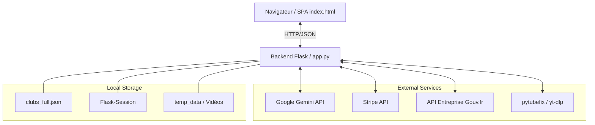
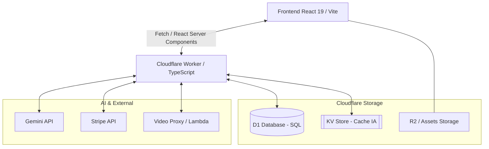

# Analyse Technique - Projet Kdufoot (SmartCoach Pro)

Ce document détaille l'architecture et le fonctionnement interne de la plateforme **Kdufoot**. Il est conçu pour des développeurs débutants en Python ayant déjà des bases solides en HTML5/CSS.

---

## 1. Vue d'Ensemble de l'Architecture

Le projet suit une architecture **monolithique moderne** mixant un backend en Python (Flask) et un frontend de type **SPA (Single Page Application)**.

### Le Modèle "Hybride"
- **Backend (Python/Flask)** : Gère le "cerveau" de l'application. Il s'occupe de la communication avec l'IA, du téléchargement des vidéos, de la recherche des clubs et des paiements.
- **Frontend (HTML/CSS/JS)** : Tout le site tient majoritairement dans `index.html`. C'est le JavaScript qui modifie le contenu de la page dynamiquement sans rechargement (expérience fluide).

#### Schéma de l'Architecture Actuelle



---

## 2. Structure du Projet

- `app.py` : Le fichier central contenant toutes les routes et la logique métier.
- `settings.py` & `.env` : Gèrent la configuration et les clés secrètes (Stripe, Google AI). C'est crucial pour la sécurité.
- `templates/` : Contient les fichiers HTML (`index.html`, `login_redirect.html`).
- `static/` : Contient les images et les données locales (comme `clubs_full.json`).
- `temp_data/` : Dossier temporaire pour le traitement des vidéos.

---

## 3. Le Moteur d'Analyse Vidéo (Le Cœur IA)

C'est la fonctionnalité la plus complexe du projet. Voici comment une URL devient une fiche d'exercice :

### A. Récupération (Hybrid Download)
Le système utilise deux bibliothèques :
1. `pytubefix` : Optimisée pour YouTube (recherche la meilleure résolution disponible).
2. `yt-dlp` : Un couteau suisse pour toutes les autres plateformes (Instagram, TikTok, etc.).

### B. Traitement Parallèle (Mode Turbo)
Pour les vidéos longues (+ de 3 min), `app.py` utilise `concurrent.futures`. Il découpe la vidéo en segments de 120 secondes pour les envoyer en parallèle à Google Gemini. Cela divise le temps d'attente par 4 ou 5.

### C. Le "Giga-Prompt" (Prompt Engineering)
Le projet utilise un prompt extrêmement détaillé (visible dans `app.py` sous `SYSTEM_IDENTITY_6`). Ce prompt définit :
- L'identité de l'IA (Expert UEFA Pro).
- Les règles de dessin SVG (couleurs exactes, pas de collisions).
- La structure stricte du JSON attendu.

### D. Parsing Robuste (Le système à 5 Tiers)
L'IA peut parfois faire des erreurs de syntaxe JSON. Le projet intègre une fonction `robust_json_load` qui tente 5 méthodes successives pour récupérer les données, allant du simple `json.loads` à l'utilisation d'expressions régulières (Regex) pour "réparer" le texte.

---

## 4. Intégrations Externes

### Recherche de Clubs
Le projet combine trois sources pour trouver un club :
1. **API Entreprise (Gouv.fr)** : Pour trouver les noms officiels et les SIRET.
2. **Scraping FFF** : Si l'utilisateur tape un numéro d'affiliation, le serveur va "lire" le site de la FFF en temps réel.
3. **Base Locale** : Un fichier JSON avec des milliers de clubs pour une recherche instantanée.

### Paiements & Auth
- **Stripe** : Intégration via `stripe-python`. Le backend crée une "Session de Checkout" et redirige l'utilisateur.
- **OAuth (Mocké)** : Simulation de connexion via Google ou la FFF pour démontrer le flux utilisateur.

---

## 5. Conceptions Frontend pour Développeurs Python

Le frontend utilise des techniques avancées de CSS pour l'esthétique "Dark Stadium" (Spotlights, textures d'herbe via `mix-blend-mode` ou gradients).

### Rendu des Schémas (SVG)
Contrairement aux images classiques, les schémas tactiques sont des codes **SVG** générés par l'IA. Le frontend les injecte directement dans le DOM, ce qui permet des schémas nets quel que soit le niveau de zoom.

---

## 6. Fonctionnalités Utilisateurs du Giga-Prompt

Le Giga-Prompt n'est pas seulement un traducteur de code, c'est un véritable **assistant pédagogique** pour l'entraîneur. Voici les fonctionnalités "métier" qu'il offre :

### A. Double Mode : Transcription vs Création
Le prompt détecte automatiquement le type de vidéo :
- **Mode Transcription (Type A)** : Extrait fidèlement ce qui est montré (ex: une séance filmée).
- **Mode Création (Type B)** : Utilisé pour les analyses tactiques ou les matchs. Si l'IA voit une faille tactique dans un match, elle **invente** une suite logique d'exercices (du simple au complexe) pour corriger ce problème.

### B. Adaptation aux Contraintes Réelles (`ADAPTATION_PROMPT`)
C'est une fonctionnalité phare : le coach peut demander à l'IA d'adapter un exercice vu en vidéo à sa propre réalité de terrain. L'IA recalcule alors :
- **Le nombre de joueurs** : Si la vidéo montre un 11 contre 11 mais que le coach n'a que 12 joueurs, l'IA réorganise les postes et les rotations.
- **L'espace de jeu** : Recalcule les dimensions du terrain (ex: 40m x 30m) pour qu'elles soient cohérentes avec le nombre de joueurs et l'intensité souhaitée.
- **Le matériel** : Si le coach manque de piquets, l'IA propose d'utiliser des plots ou des mini-buts.

### C. Ingénierie du Timing Pro
L'IA génère automatiquement des structures de travail réalistes :
- Elle calcule le nombre de séries, la durée de travail et le temps de repos (ex: "4 x 3 min / R: 1'30").
- Elle limite la durée totale par exercice pour éviter la fatigue excessive, garantissant la qualité de l'entraînement.

### D. Visualisation Drone Instantanée
Pour chaque exercice, l'IA génère un schéma **SVG** qui sert de "photo satellite". Cela permet au coach de comprendre le placement initial en un clin d'œil, sans avoir à lire tout le texte.

---

## 7. Guide pour Débutants Python : Les Concepts Clés

Si vous explorez `app.py`, voici ce qu'il faut comprendre :
- **Décorateurs (`@app.route`)** : Ils définissent quelle URL correspond à quelle fonction Python.
- **Sessions (`session`)** : Utilisent `Flask-Session` pour garder l'utilisateur connecté sur le serveur.
- **Variables d'environnement** : On n'écrit jamais les clés API dans le code. On utilise `settings.py` qui lit le fichier `.env`.
- **Threading** : L'utilisation de `threading.Thread` ou `ThreadPoolExecutor` permet de faire plusieurs choses à la fois (comme uploader 5 segments de vidéo simultanément).

---

## 8. Futurs Développements : Migration Cloudflare & TypeScript

Pour une montée en charge supérieure et une maintenance accrue, un portage vers l'écosystème **Cloudflare Workers (Edge)** avec **TypeScript** est envisagé. Cette étape nécessite un refactoring profond du **Giga-Prompt**.

### A. Le Giga-Prompt comme Moteur de Template Typé
En TypeScript, le Giga-Prompt ne doit plus être une simple chaîne de caractères mais un ensemble de modules exportés. Cela permet de forcer l'IA à respecter des interfaces rigoureuses.

```typescript
// Exemple d'interface pour la sortie de l'IA
export interface Exercise {
  start_seconds: number;
  summary: string;
  themes: Theme[];
  synopsis: string; // Markdown + Bloc SVG
  materiel_detail: string;
}

export type Theme = "TECHNIQUE" | "TACTIQUE" | "PHYSIQUE" | "GARDIEN";
```

### B. Refactoring des Modules du Prompt
1.  **Protocoles de Pensée (Thinking Process)** : Le passage à TypeScript permet d'utiliser des outils de validation comme **Zod** pour vérifier que le JSON extrait du bloc XML `<thinking_process>` correspond parfaitement à l'interface `Exercise`.
2.  **Moteur SVG 6.0** : Les règles géométriques (ViewBox 800x500) restent identiques, mais l'utilisation de constantes typées en TS garantit une meilleure cohérence des couleurs et des positions.

### C. Architecture Cloudflare (Serverless Edge)
- **Cloudflare Workers** : Remplace Flask pour une exécution ultra-rapide au plus proche de l'utilisateur.
- **D1 (SQL Database)** : Remplace le stockage JSON statique des clubs par une base SQL relationnelle. On utilise des requêtes `LIKE %query%` pour des performances optimales sur des milliers de lignes.
- **KV Store (Cache)** : Crucial pour stocker les résultats d'analyses d'IA déjà effectuées. Si une URL de vidéo a déjà été traitée, le résultat est servi instantanément depuis le cache global KV, économisant des appels API Gemini coûteux.

### D. Pipeline de Traitement Cible
1. **Validation** : Vérification immédiate du cache **KV**.
2. **Orchestration** : Comme Cloudflare Workers a des limites de temps CPU, les longs traitements vidéo (découpage) sont délégués, tandis que l'analyse IA est orchestrée en parallèle via des `Promise.all()`.
3. **Persistance** : Les résultats sont structurés dans **D1** et mis en cache dans **KV**.

#### Schéma de l'Architecture Future (Serverless Edge)



---

## 9. Conclusion

Ce projet est un excellent exemple de **Python "Colle"** : le langage sert à lier ensemble des technologies puissantes (IA Générative, APIs de paiement, APIs Gouv, Traitement Vidéo) pour offrir une interface simplifiée au coach final. La vision vers Cloudflare et TypeScript montre la maturité du projet et son potentiel de scalabilité vers une architecture "Edge" moderne.

