# 📘 ENCYCLOPÉDIE TECHNIQUE INTÉGRALE — KDUFOOT

*Version 7.0 — Documentation Exhaustive de Référence — 2026*
*Plus de 5000 lignes d'explications détaillées en français*

---

# PARTIE 1 : INTRODUCTION ET VISION DU PROJET

## 1.1 Qu'est-ce que Kdufoot ?

Kdufoot est une plateforme web d'analyse vidéo intelligente destinée aux entraîneurs de football. Cette application utilise l'intelligence artificielle de Google (Gemini) pour transformer n'importe quelle vidéo d'entraînement ou de match en fiches d'exercices structurées, complètes et directement exploitables sur le terrain.

L'application a été conçue pour répondre à un besoin précis : permettre aux coachs de tous niveaux (du bénévole au professionnel) de gagner du temps dans la préparation de leurs séances. Au lieu de prendre des notes manuellement en regardant une vidéo YouTube d'un entraîneur professionnel, Kdufoot analyse automatiquement le contenu et génère des fiches détaillées avec schémas tactiques.

### 1.1.1 Le Problème Résolu

Avant Kdufoot, un entraîneur qui trouvait une vidéo intéressante sur YouTube devait :
1. Regarder la vidéo entière (parfois 30-60 minutes)
2. Prendre des notes manuellement sur papier
3. Dessiner les schémas à la main
4. Adapter mentalement l'exercice à son effectif
5. Retranscrire le tout dans un format exploitable

Ce processus prenait en moyenne 2 à 3 heures de travail. Avec Kdufoot, ce même travail est accompli en moins de 5 minutes. L'entraîneur colle simplement le lien de la vidéo, et l'IA analyse automatiquement le contenu pour extraire chaque exercice avec son schéma SVG, ses consignes, ses variantes et ses points de coaching.

### 1.1.2 La Philosophie Technique

Le projet repose sur plusieurs principes fondamentaux :

**Principe 1 : Zéro Installation**
L'application fonctionne entièrement dans le navigateur web. Aucune installation n'est requise. Un coach peut y accéder depuis son smartphone sur le bord du terrain, depuis sa tablette dans le vestiaire, ou depuis son ordinateur à la maison.

**Principe 2 : Intelligence Contextuelle**
L'IA ne se contente pas de transcrire ce qu'elle voit. Elle comprend le contexte footballistique. Si la vidéo montre un match avec une équipe en difficulté sur les transitions défensives, l'IA va créer des exercices spécifiques pour travailler ce point faible.

**Principe 3 : Adaptation Dynamique**
Chaque exercice généré peut être adapté en temps réel. Si le coach a 12 joueurs au lieu de 16, ou s'il n'a pas de mini-buts, l'IA recalcule l'exercice pour correspondre aux contraintes réelles.

**Principe 4 : Communauté Intégrée**
Au-delà de l'analyse vidéo, Kdufoot permet aux coachs de trouver des adversaires pour des matchs amicaux. Cette fonctionnalité "Trouver mon match" crée un réseau social professionnel entre entraîneurs.

## 1.2 Architecture Technique Globale

L'application est construite selon une architecture monolithique Flask. Cela signifie que le serveur Python gère à la fois le rendu des pages HTML et les appels API. Cette architecture a été choisie pour sa simplicité de déploiement et de maintenance.

### 1.2.1 Les Fichiers Principaux

Le projet est organisé autour de fichiers clés :

**app.py (2100 lignes)**
C'est le cœur du serveur. Ce fichier Python contient :
- La configuration de l'application Flask
- Toutes les routes API (endpoints)
- La logique d'analyse IA (le "Giga-Prompt")
- L'intégration avec les services externes (Stripe, APIs gouvernementales)
- La gestion des téléchargements vidéo

**templates/index.html (5947 lignes)**
C'est l'interface utilisateur complète. Ce fichier HTML massif contient :
- Toute la structure des pages (Navigation, Bibliothèque, Favoris, Entraînement, Matchs, Historique)
- Le CSS intégré (styles Tailwind + styles personnalisés)
- Le JavaScript complet (toutes les fonctions d'interaction)
- Les templates des cartes d'exercices

**settings.py**
Ce fichier contient les clés API et secrets. Il est exclu de Git pour des raisons de sécurité. Les clés sont :
- GOOGLE_API_KEY : clé pour l'API Gemini
- STRIPE_SECRET_KEY : clé secrète Stripe pour les paiements
- STRIPE_PUBLISHABLE_KEY : clé publique Stripe
- SECRET_KEY : clé de chiffrement des sessions Flask

### 1.2.2 Le Flux de Données

Quand un utilisateur colle un lien vidéo et clique sur "ANALYSER", voici ce qui se passe :

1. **Étape Frontend** : Le JavaScript capture l'URL et l'envoie via une requête POST à `/add_video`

2. **Étape Téléchargement** : Le backend détecte la plateforme (YouTube, TikTok, Instagram, etc.) et utilise le bon outil de téléchargement (pytubefix pour YouTube, yt-dlp pour les autres)

3. **Étape Découpage** : Si la vidéo dépasse 10 minutes, elle est découpée en segments de 10 minutes maximum pour respecter les limites de l'API Gemini

4. **Étape Analyse IA** : Chaque segment est envoyé à Gemini avec le "Giga-Prompt" (un prompt de plus de 500 lignes qui définit exactement comment analyser le contenu)

5. **Étape Parallélisation** : Si plusieurs segments existent, ils sont analysés en parallèle avec ThreadPoolExecutor pour gagner du temps

6. **Étape Parsing** : Les réponses JSON de Gemini sont parsées avec un système de "5 tiers" ultra-robuste qui peut récupérer des données même si le JSON est malformé

7. **Étape Déduplication** : Les exercices similaires sont fusionnés pour éviter les doublons

8. **Étape Retour** : Les exercices sont renvoyés au frontend qui les affiche sous forme de cartes interactives

## 1.3 Technologies Utilisées

### 1.3.1 Backend Python

**Flask (Framework Web)**
Flask est un micro-framework Python. Il a été choisi pour sa légèreté et sa flexibilité. La configuration est minimale :

```python
app = Flask(__name__)
app.config['SECRET_KEY'] = settings.SECRET_KEY
app.config['SESSION_TYPE'] = 'filesystem'
Session(app)
```

**Google Gemini (Intelligence Artificielle)**
Gemini est le modèle d'IA multimodal de Google. Il peut analyser à la fois du texte, des images et des vidéos. L'application utilise le SDK Python officiel :

```python
from google import genai
from google.genai import types

GENAI_CLIENT = genai.Client(api_key=GOOGLE_API_KEY)
```

La configuration du modèle est optimisée pour l'analyse footballistique :
- temperature=0.6 : créativité modérée pour rester fidèle au contenu
- top_p=0.95 : échantillonnage large pour des réponses riches
- max_output_tokens=15000 : réponses longues autorisées
- thinking_config : mode de réflexion MEDIUM pour équilibrer vitesse et qualité
- media_resolution=LOW : analyse vidéo en basse résolution pour limiter les coûts

**Pytubefix et Yt-dlp (Téléchargement Vidéo)**
Deux bibliothèques sont utilisées pour télécharger les vidéos :
- Pytubefix : spécialisé pour YouTube, plus stable
- Yt-dlp : universel, supporte toutes les plateformes

**MoviePy (Traitement Vidéo)**
MoviePy est utilisé pour découper les longues vidéos en segments :

```python
from moviepy.video.io.VideoFileClip import VideoFileClip

clip = VideoFileClip(path)
duration = clip.duration
# Découpage en segments de 10 minutes
```

**Stripe (Paiements)**
Stripe gère les abonnements premium :

```python
import stripe
stripe.api_key = STRIPE_SECRET_KEY
```

### 1.3.2 Frontend HTML/CSS/JavaScript

**Tailwind CSS (Framework CSS)**
Tailwind est chargé via CDN pour un styling rapide et moderne. Les classes utilitaires permettent de créer des interfaces complexes sans écrire de CSS personnalisé :

```html
<script src="https://cdn.tailwindcss.com"></script>
```

**Bootstrap 5 (Composants UI)**
Bootstrap est utilisé en complément pour certains composants (modales, navigation) :

```html
<link href="https://cdn.jsdelivr.net/npm/bootstrap@5.3.0/dist/css/bootstrap.min.css" rel="stylesheet">
```

**Font Awesome (Icônes)**
Toutes les icônes proviennent de Font Awesome :

```html
<link rel="stylesheet" href="https://cdnjs.cloudflare.com/ajax/libs/font-awesome/6.4.0/css/all.min.css">
```

**Google Fonts**
La police Roboto Mono est utilisée pour le logo et les éléments techniques :

```html
<link href="https://fonts.googleapis.com/css2?family=Roboto+Mono:wght@400;500;700&display=swap" rel="stylesheet">
```

---

# PARTIE 2 : LE FRONTEND EN DÉTAIL

## 2.1 La Navigation Principale

La barre de navigation est le point d'entrée vers toutes les fonctionnalités. Elle est fixée en haut de l'écran (sticky) pour rester accessible en permanence.

### 2.1.1 Structure HTML de la Navbar

```html
<nav class="navbar navbar-expand bg-white sticky-top shadow-sm py-3" style="z-index: 1100; position: sticky; top: 0;">
    <div class="container-fluid px-4 position-relative d-flex align-items-center justify-content-between">
        <!-- Logo à gauche -->
        <!-- Menu centré -->
        <!-- Boutons auth à droite -->
    </div>
</nav>
```

La navbar utilise une technique de centrage absolu pour le menu. Le logo est positionné à gauche avec z-index élevé, le menu est centré avec position absolute + translate, et les boutons d'authentification sont à droite.

### 2.1.2 Le Logo Kdufoot

Le logo utilise une typographie stylisée avec le "K" en rotation :

```html
<span class="bg-black text-white rounded px-2" style="transform: rotate(-3deg); margin-right: -2px;">K</span>
du
<span class="text-primary">Foot</span>
```

L'effet de rotation de -3 degrés donne un aspect dynamique et moderne. La police Roboto Mono apporte un côté technique.

### 2.1.3 Les Onglets de Navigation

Cinq onglets principaux permettent de naviguer entre les vues :

1. **Mes Analyses** (icône vidéo) : La bibliothèque d'exercices analysés
2. **Favoris** (icône étoile) : Les exercices sauvegardés
3. **Trouver mon match** (icône recherche) : La section matchs amicaux
4. **Mon Entraînement** (icône haltère) : Le planificateur de séances
5. **Historique** (icône horloge) : Les séances passées

Chaque onglet utilise la fonction JavaScript `showView()` pour afficher/masquer les sections :

```javascript
function showView(viewName) {
    // Masquer toutes les vues
    document.getElementById('libraryView').classList.add('hidden');
    document.getElementById('favoritesView').classList.add('hidden');
    document.getElementById('matchView').classList.add('hidden');
    document.getElementById('trainingView').classList.add('hidden');
    document.getElementById('historyView').classList.add('hidden');
    
    // Afficher la vue demandée
    document.getElementById(viewName + 'View').classList.remove('hidden');
    
    // Mettre à jour le style des onglets
    updateNavStyles(viewName);
}
```

### 2.1.4 Les Boutons d'Authentification

Deux états sont gérés :

**État Visiteur (non connecté)** :
```html
<div id="authGuestArea" class="d-flex gap-2">
    <button onclick="openLoginModal()">Connexion</button>
    <button onclick="openRegisterModal()">Inscription</button>
</div>
```

**État Connecté** :
```html
<div id="authUserArea" class="hidden items-center gap-3">
    <span id="userName">Coach</span>
    <button onclick="handleLogout()">Déconnexion</button>
</div>
```

La bascule entre les deux états se fait via JavaScript en ajoutant/retirant la classe `hidden`.

## 2.2 La Vue Bibliothèque (Mes Analyses)

C'est la vue principale de l'application. Elle contient le formulaire d'analyse vidéo et la grille des exercices.

### 2.2.1 Le Hero Section

Le bandeau d'accueil utilise un dégradé bleu moderne :

```html
<div class="bg-gradient-to-br from-[#1e3c72] to-[#2a5298] text-white py-12 rounded-b-[40px] shadow-xl">
```

Les couleurs #1e3c72 (bleu foncé) et #2a5298 (bleu moyen) créent un effet de profondeur. Le coin arrondi de 40px en bas (`rounded-b-[40px]`) donne un aspect moderne.

### 2.2.2 Le Champ de Saisie URL

Le champ de saisie est stylisé comme une barre de recherche moderne :

```html
<div class="bg-white/10 backdrop-blur-md p-2 rounded-full border border-white/20 flex gap-2 max-w-2xl mx-auto shadow-2xl">
    <div class="pl-4 flex items-center text-white/60">
        <i id="platformIcon" class="fas fa-link text-xl"></i>
    </div>
    <input type="text" id="videoUrl" placeholder="Lien YouTube, TikTok, Insta...">
    <button onclick="addVideo()" id="addBtn">ANALYSER</button>
</div>
```

L'icône change dynamiquement selon la plateforme détectée grâce à `updatePlatformIcon()` :

```javascript
function updatePlatformIcon(input) {
    const url = input.value.toLowerCase();
    const icon = document.getElementById('platformIcon');
    
    if (url.includes('youtube.com') || url.includes('youtu.be')) {
        icon.className = 'fab fa-youtube text-xl text-red-500';
    } else if (url.includes('tiktok.com')) {
        icon.className = 'fab fa-tiktok text-xl';
    } else if (url.includes('instagram.com')) {
        icon.className = 'fab fa-instagram text-xl text-pink-500';
    } else if (url.includes('twitter.com') || url.includes('x.com')) {
        icon.className = 'fab fa-twitter text-xl text-blue-400';
    } else {
        icon.className = 'fas fa-link text-xl';
    }
}
```

### 2.2.3 La Barre de Progression

Lors de l'analyse, une barre de progression apparaît :

```html
<div id="progressContainer" class="max-w-2xl mx-auto mt-6 bg-black/30 rounded-full h-1.5 overflow-hidden hidden">
    <div id="progressBar" class="h-full bg-accent w-0 transition-all duration-300 shadow-[0_0_10px_#00d26a]"></div>
</div>
```

La progression est simulée car le temps d'analyse dépend de la longueur de la vidéo. L'effet de lueur (`shadow-[0_0_10px_#00d26a]`) donne un aspect "néon" moderne.

### 2.2.4 Les Filtres Intelligents

Le système de filtrage permet de retrouver rapidement des exercices spécifiques.

**Filtre par mot-clé** :
```html
<input type="text" id="filterSearch" placeholder="Mot-clé (ex: Frappe)...">
```

**Filtre par niveau** :
```html
<select id="filterLevel">
    <option value="Tous">Niveau : Tous</option>
    <option value="Débutant">Débutant / École de Foot</option>
    <option value="Ligue">Ligue / Régional</option>
    <option value="National">National / Elite</option>
</select>
```

**Filtres par thème** :
Les thèmes sont des checkboxes avec code couleur :
- TECHNIQUE (bleu) : travail technique individuel
- PHYSIQUE (orange) : préparation physique
- TACTIQUE (violet) : compréhension du jeu
- FINITION (vert) : travail devant le but

La logique de filtrage combine tous les critères avec un ET logique :

```javascript
function applyFilters() {
    const searchTerm = document.getElementById('filterSearch').value.toLowerCase();
    const level = document.getElementById('filterLevel').value;
    
    videos.forEach(video => {
        let visible = true;
        
        // Filtre mot-clé
        if (searchTerm && !video.title.toLowerCase().includes(searchTerm)) {
            visible = false;
        }
        
        // Filtre niveau
        if (level !== 'Tous' && video.level !== level) {
            visible = false;
        }
        
        // Filtre thèmes
        if (activeThemes.length > 0) {
            const hasMatchingTheme = video.themes.some(t => activeThemes.includes(t));
            if (!hasMatchingTheme) visible = false;
        }
        
        // Afficher/masquer la carte
        video.element.style.display = visible ? 'block' : 'none';
    });
}
```

### 2.2.5 Les Cartes d'Exercices

Chaque exercice est affiché dans une carte interactive. La structure HTML est générée dynamiquement :

```javascript
function createCard(video) {
    return `
        <div class="card-custom" data-id="${video.id}">
            <div class="card-img-wrapper">
                
                <div class="card-overlay">
                    <div class="overlay-content">
                        ${video.synopsis}
                    </div>
                </div>
            </div>
            <div class="card-body">
                <h5 class="card-title">${video.title}</h5>
                <div class="themes">
                    ${video.themes.map(t => `<span class="theme-badge">${t}</span>`).join('')}
                </div>
            </div>
        </div>
    `;
}
```

L'effet de survol révèle le contenu complet de l'exercice grâce à CSS :

```css
.card-overlay {
    position: absolute;
    inset: 0;
    background: linear-gradient(to bottom, rgba(15, 23, 42, 0.97), rgba(15, 23, 42, 0.99));
    opacity: 0;
    transition: opacity 0.3s ease;
}

.card-img-wrapper:hover .card-overlay {
    opacity: 1;
}
```

## 2.3 La Vue Matchs Amicaux

Cette section permet de créer ou chercher des matchs amicaux entre clubs.

### 2.3.1 Les Onglets Créer/Chercher

Deux onglets permettent de basculer entre les modes :

```javascript
function switchMatchTab(tab) {
    if (tab === 'create') {
        document.getElementById('createMatchSection').classList.remove('hidden');
        document.getElementById('searchMatchSection').classList.add('hidden');
        // Styling des boutons
    } else {
        document.getElementById('createMatchSection').classList.add('hidden');
        document.getElementById('searchMatchSection').classList.remove('hidden');
    }
}
```

### 2.3.2 Le Formulaire de Création

Le formulaire demande :
- Le SIRET/SIREN du club (pour validation officielle)
- La catégorie d'âge (U7 à Séniors)
- Le type de match (11v11, 8v8, 5v5)
- La date et l'heure souhaitées
- Le lieu (domicile, extérieur, neutre)
- Des informations complémentaires

La validation du SIRET utilise l'API gouvernementale :

```javascript
async function lookupSiret(siret) {
    const response = await fetch(`/api/v2/siret-lookup?q=${siret}`);
    const data = await response.json();
    
    if (data.success) {
        document.getElementById('clubName').value = data.club.name;
        document.getElementById('clubCity').value = data.club.city;
        document.getElementById('clubAddress').value = data.club.address;
    }
}
```

### 2.3.3 La Recherche de Matchs

Les matchs publiés par d'autres clubs sont affichés sous forme de cartes avec :
- Le nom du club adversaire
- La catégorie et le format
- La date proposée
- Un bouton "Contacter" pour envoyer une demande

## 2.4 La Vue Entraînement

Cette section permet de composer une séance complète à partir des exercices de la bibliothèque.

### 2.4.1 Le Panier d'Exercices

Les exercices ajoutés au panier apparaissent dans une liste ordonnée. Chaque élément peut être :
- Réordonné (glisser-déposer)
- Supprimé
- Modifié (durée, nombre de joueurs)

### 2.4.2 L'Adaptation Dynamique

Le système d'adaptation permet de recalculer tous les exercices selon des contraintes :

```javascript
async function adaptSession() {
    const constraints = {
        players: document.getElementById('nbPlayers').value,
        duration: document.getElementById('sessionDuration').value,
        equipment: getSelectedEquipment()
    };
    
    const response = await fetch('/adapt_session', {
        method: 'POST',
        body: JSON.stringify({
            exercises: currentSession,
            constraints: constraints
        })
    });
    
    const adapted = await response.json();
    renderAdaptedSession(adapted);
}
```

### 2.4.3 Le Chronomètre de Séance

Quand le coach lance la séance, un chronomètre démarre :

```javascript
let sessionTimer = null;
let sessionSeconds = 0;

function startSession() {
    sessionTimer = setInterval(() => {
        sessionSeconds++;
        updateTimerDisplay();
    }, 1000);
}

function updateTimerDisplay() {
    const h = Math.floor(sessionSeconds / 3600);
    const m = Math.floor((sessionSeconds % 3600) / 60);
    const s = sessionSeconds % 60;
    document.getElementById('sessionTimerText').textContent = 
        `${h.toString().padStart(2, '0')}:${m.toString().padStart(2, '0')}:${s.toString().padStart(2, '0')}`;
}
```

---

# PARTIE 3 : LE BACKEND EN DÉTAIL

## 3.1 Configuration Initiale

### 3.1.1 Les Imports

Le fichier app.py commence par les imports nécessaires :

```python
import os
import time
import json
import re
import requests
from google import genai
from google.genai import types
import concurrent.futures
from flask import Flask, render_template, request, jsonify, redirect, session, url_for
from flask_session import Session
import yt_dlp
from pytubefix import YouTube
import threading
import stripe
import uuid
import ast
from moviepy.video.io.VideoFileClip import VideoFileClip
```

Chaque import a son rôle :
- `os` : manipulation des fichiers et variables d'environnement
- `time` : gestion des timestamps et délais
- `json` : parsing des réponses IA
- `re` : expressions régulières pour le parsing robuste
- `requests` : appels HTTP aux APIs externes
- `genai` : SDK Google Gemini
- `concurrent.futures` : parallélisation des analyses
- `flask` : framework web
- `yt_dlp` / `pytubefix` : téléchargement vidéo
- `stripe` : gestion des paiements

### 3.1.2 Configuration Flask

```python
app = Flask(__name__)
app.config['SECRET_KEY'] = settings.SECRET_KEY
app.config['SESSION_TYPE'] = 'filesystem'
Session(app)
```

La session filesystem stocke les données utilisateur dans des fichiers temporaires côté serveur. C'est plus sécurisé que les cookies côté client.

### 3.1.3 Feature Flags

Les feature flags permettent d'activer/désactiver des fonctionnalités :

```python
FEATURE_FLAGS = {
    'show_ai_analysis': True,
    'show_library': True,
    'show_favorites': True,
    'show_training': True,
    'show_match': True,
    'show_history': True,
}
```

Ces flags sont passés au template Jinja2 pour afficher ou masquer des sections de l'interface.

## 3.2 Configuration de l'IA Gemini

### 3.2.1 Initialisation du Client

```python
def configure_google_ai():
    global GENAI_CLIENT, ACTIVE_MODEL_NAME, GENAI_CONFIG
    
    GENAI_CLIENT = genai.Client(api_key=GOOGLE_API_KEY)
    models = [m.name for m in GENAI_CLIENT.models.list()]
```

La fonction liste tous les modèles disponibles et sélectionne le meilleur selon une hiérarchie :
1. Gemini 3 Flash (le plus récent et intelligent)
2. Gemini 2.5 Flash (excellent équilibre)
3. Gemini 2.0 Flash (stable et économique)
4. Gemini 1.5 Flash (ancienne génération, robuste)

### 3.2.2 Configuration de Génération

```python
GENAI_CONFIG = types.GenerateContentConfig(
    system_instruction=system_instruction,
    temperature=0.6,
    top_p=0.95,
    max_output_tokens=15000,
    thinking_config=types.ThinkingConfig(
        include_thoughts=True,
        thinking_level='MEDIUM'
    ),
    media_resolution='MEDIA_RESOLUTION_LOW'
)
```

**temperature=0.6** : Un peu de créativité mais reste fidèle au contenu. Une valeur de 0 serait trop rigide, 1.0 trop créatif.

**top_p=0.95** : Échantillonnage large. L'IA considère les 95% des tokens les plus probables.

**max_output_tokens=15000** : Permet des réponses très détaillées. Une vidéo avec 10 exercices peut générer beaucoup de texte.

**thinking_level='MEDIUM'** : L'IA "réfléchit" avant de répondre. Le niveau MEDIUM équilibre qualité et vitesse.

**media_resolution='LOW'** : Analyse vidéo en basse résolution pour économiser les tokens (et donc le coût).

## 3.3 Le Giga-Prompt

Le Giga-Prompt est le cœur de l'intelligence de Kdufoot. C'est un prompt de plus de 500 lignes qui définit exactement comment l'IA doit analyser les vidéos.

### 3.3.1 Module Identité

```python
SYSTEM_IDENTITY_6 = """
Tu es le DIRECTEUR TECHNIQUE (IA) de l'UEFA. Ta capacité d'analyse visuelle est absolue.
Tu n'es pas une simple IA, tu es un scanner tactique capable de convertir une vidéo de football en données structurées parfaites.

RÈGLES ABSOLUES (NON NÉGOCIABLES) :
1. ZÉRO DESCRIPTION DE VIDÉO : INTERDICTION FORMELLE de dire "On voit dans la vidéo...", "La vidéo montre...". TU RENTRES DIRECTEMENT DANS L'ACTION.
2. OBLIGATION SPG (SVG) : Chaque exercice DOIT avoir un schéma SVG parfait.
"""
```

Ce module définit le "persona" de l'IA. En lui donnant le rôle de "Directeur Technique UEFA", on active un registre de vocabulaire et de compétences spécifiques au football professionnel.

### 3.3.2 Module Thinking Protocol

```python
THINKING_PROTOCOL_6 = """
⚠️ PROTOCOLE D'EXÉCUTION CRITIQUE (NE PAS SAUTER) ⚠️

INTERDICTION FORMELLE de générer le JSON immédiatement. Tu dois d'abord "réfléchir à haute voix".
Tu dois commencer ta réponse par une balise XML <thinking_process> et suivre ces étapes :

ÉTAPE 1 : SEGMENTATION TEMPORELLE
- Scanne la vidéo pour détecter les ruptures (changement d'exercice).
- Note les timestamps : "Exercice 1 de 0s à 45s", "Exercice 2 de 45s à fin".

ÉTAPE 2 : COMPTAGE CROISÉ (TEXTE vs SVG) - CRITIQUE
- Compte les joueurs/entités pour le texte : "Je vois 8 joueurs".
- Compte les cercles pour le SVG : "Je dois dessiner 8 cercles".
- SI DIFFÉRENCE : ARRET IMMÉDIAT. Corrige le SVG pour qu'il matche EXACTEMENT le texte.
"""
```

Ce protocole force l'IA à réfléchir de manière structurée avant de générer le JSON final. Le comptage croisé garantit la cohérence entre le texte descriptif et le schéma SVG.

### 3.3.3 Module SVG Engine

```python
SVG_ENGINE_RULES_6 = """
RÈGLES DE GÉNÉRATION SVG (STRICTES) :
ViewBox : "0 0 800 500" (Terrain Vert #2d5a27).

1. GRILLE DE ZONES (Pour éviter les superpositions) :
   - ZONE DÉFENSIVE (Gauche) : X[50 à 350] / Y[100 à 400]
   - ZONE OFFENSIVE (Droite) : X[450 à 750] / Y[100 à 400]
   - ZONE NEUTRE (Milieu)    : X[350 à 450]

2. CODE COULEUR UNIVERSEL :
   - Équipe A (souvent Défense) : fill="#1E88E5" (BLEU)
   - Équipe B (souvent Attaque) : fill="#E53935" (ROUGE)
   - Jokers / Neutres : fill="#FFD600" (JAUNE)
   - Gardiens : fill="#43A047" (VERT)
   - Ballon : fill="#FFFFFF" stroke="#000" (BLANC)
   - Plots : fill="#FF9800" (ORANGE)

3. RÈGLE ANTI-COLLISION :
   - Aucun cercle ne doit avoir le même couple (cx, cy) qu'un autre.
   - Écart MINIMAL de 30 pixels entre chaque joueur.
"""
```

Ces règles garantissent des schémas SVG lisibles et cohérents. La grille de zones évite les superpositions, le code couleur permet d'identifier immédiatement les équipes.

## 3.4 Routes API Principales

### 3.4.1 Route Index

```python
@app.route('/')
def index():
    return render_template('index.html', 
        features=FEATURE_FLAGS,
        dev_mode=os.environ.get('DEV_MODE', 'false') == 'true',
        stripe_pk=STRIPE_PUBLISHABLE_KEY
    )
```

Simple route qui charge le template principal avec les feature flags et la clé Stripe publique.

### 3.4.2 Route Add Video

```python
@app.route('/add_video', methods=['POST'])
def add_video():
    url = request.json.get('url')
    if not url:
        return jsonify({"error": "Lien vide"}), 400
    
    cleanup_temp_folder()
    
    # Détection de la plateforme
    if "youtube.com" in url or "youtu.be" in url:
        # Mode YouTube
        yt = YouTube(url, use_oauth=True, allow_oauth_cache=True)
        stream = yt.streams.filter(res="720p", file_extension='mp4').first()
        path = stream.download(output_path=TEMP_FOLDER)
    else:
        # Mode universel (yt-dlp)
        ydl_opts = {'format': 'best[height<=720]', ...}
        with yt_dlp.YoutubeDL(ydl_opts) as ydl:
            info = ydl.extract_info(url, download=True)
    
    # Analyse IA
    exercises = smart_split_and_process(path, title)
    
    return jsonify(exercises)
```

Cette route gère tout le flux d'analyse : téléchargement, traitement, et retour des exercices.

### 3.4.3 Route SIRET Lookup

```python
@app.route('/api/v2/siret-lookup', methods=['GET'])
def lookup_siret():
    siren_or_siret = request.args.get('q', '').strip()
    
    api_url = f"https://recherche-entreprises.api.gouv.fr/search?q={siren_or_siret}&est_association=true"
    resp = requests.get(api_url, timeout=5)
    
    if resp.status_code == 200:
        data = resp.json()
        resultat = data['results'][0]
        
        # Filtrage des sports non-football
        nom_upper = resultat['nom_complet'].upper()
        INTERDITS = ["TENNIS DE TABLE", "BASKET", "HANDBALL", ...]
        for interdit in INTERDITS:
            if interdit in nom_upper:
                return jsonify({"error": "Club non-football"}), 400
        
        return jsonify({"success": True, "club": {...}})
```

Cette API valide les clubs via la base SIRENE officielle et filtre les sports non-football.

## 3.5 Système de Parsing Robuste

Le parsing JSON de Gemini utilise un système à 5 niveaux pour garantir la récupération des données même si le JSON est malformé.

### 3.5.1 Tier 1 : JSON Standard

```python
def robust_json_load(text):
    try:
        return json.loads(text, strict=False)
    except:
        pass
```

Premier essai avec le parser JSON standard en mode non-strict.

### 3.5.2 Tier 2 : Réparation des Caractères

```python
    try:
        def escape_newlines(m):
            content = m.group(1).replace('\n', '\\n')
            return '"' + content + '"'
        
        repaired = re.sub(r'"((?:[^"\\]|\\.)*)"', escape_newlines, text)
        repaired = re.sub(r',\s*([\]}])', r'\1', repaired)  # Virgules trailing
        return json.loads(repaired, strict=False)
    except:
        pass
```

Répare les newlines non-échappées et les virgules trailing qui cassent souvent le JSON.

### 3.5.3 Tier 3 : Fallback AST

```python
    try:
        python_str = text.replace('null', 'None').replace('true', 'True').replace('false', 'False')
        return ast.literal_eval(python_str)
    except:
        pass
```

Convertit le JSON en syntaxe Python et utilise ast.literal_eval() pour parser.

### 3.5.4 Tier 4 : Extraction Regex

```python
    try:
        exercises = []
        pattern = r'"summary"\s*:\s*"([^"]+)"'
        for match in re.finditer(pattern, text):
            exercises.append({"summary": match.group(1)})
        return exercises
    except:
        pass
```

Extraction brute des champs clés avec des expressions régulières.

### 3.5.5 Tier 5 : Extraction Minimale

```python
    try:
        summary_match = re.search(r'"summary"\s*:\s*"([^"]+)"', text)
        if summary_match:
            return [{"summary": summary_match.group(1)}]
    except:
        pass
    
    return None
```

Dernière tentative : extraire au moins un résumé d'exercice.

---

# PARTIE 4 : LE SYSTÈME SVG TACTIQUE

## 4.1 Pourquoi SVG ?

SVG (Scalable Vector Graphics) est le format idéal pour les schémas tactiques car :
- **Vectoriel** : pas de pixellisation, netteté parfaite à toutes les tailles
- **Léger** : quelques Ko vs plusieurs Mo pour une image
- **Modifiable** : le code SVG peut être généré dynamiquement par l'IA
- **Animable** : possibilité d'ajouter des animations CSS

## 4.2 Structure d'un Schéma SVG

```svg
<svg viewBox="0 0 800 500" xmlns="http://www.w3.org/2000/svg">
  <!-- Définitions (flèches, marqueurs) -->
  <defs>
    <marker id="arrow" markerWidth="10" markerHeight="10" refX="5" refY="3" orient="auto">
      <path d="M0,0 L0,6 L9,3 z" fill="#fff" />
    </marker>
  </defs>
  
  <!-- Terrain -->
  <rect width="800" height="500" fill="#2d5a27" />
  <path d="M400,0 L400,500" stroke="white" stroke-width="2" opacity="0.5"/>
  <circle cx="400" cy="250" r="60" fill="none" stroke="white" opacity="0.5"/>
  
  <!-- Buts -->
  <rect x="0" y="175" width="6" height="150" fill="none" stroke="white" stroke-width="4"/>
  <rect x="794" y="175" width="6" height="150" fill="none" stroke="white" stroke-width="4"/>
  
  <!-- Joueurs -->
  <g transform="translate(200, 250)">
    <circle r="18" fill="#1E88E5"/>
    <text fill="white" font-size="12" text-anchor="middle" dominant-baseline="central">7</text>
  </g>
  
  <!-- Mouvements -->
  <line x1="200" y1="250" x2="400" y2="200" stroke="white" stroke-width="2" marker-end="url(#arrow)"/>
</svg>
```

### 4.2.1 Le ViewBox

`viewBox="0 0 800 500"` définit un espace de coordonnées de 800x500 pixels. Le terrain est dessiné dans cet espace, et le SVG s'adapte automatiquement à la taille de son conteneur.

### 4.2.2 Les Joueurs

Chaque joueur est un groupe `<g>` contenant :
- Un cercle coloré pour représenter l'équipe
- Un texte pour le numéro

### 4.2.3 Les Mouvements

Les mouvements sont des lignes avec marqueurs de flèche. Les passes utilisent des tirets (`stroke-dasharray`).

## 4.3 Rendu Frontend

Le CSS appliqué aux schémas SVG :

```css
.tactical-svg-container {
    margin: 1.5rem auto;
    max-width: 100%;
    display: flex;
    justify-content: center;
    background: #2d5a27;
    padding: 1rem;
    border-radius: 12px;
    box-shadow: inset 0 0 40px rgba(0, 0, 0, 0.2);
    border: 4px solid rgba(255,255,255,0.2);
    animation: schemaEntrance 0.6s ease;
}

.tactical-svg-container svg {
    max-width: 100%;
    height: auto;
    filter: drop-shadow(0 4px 6px rgba(0, 0, 0, 0.2));
}
```

Le conteneur ajoute un fond vert (comme un vrai terrain), une ombre intérieure pour l'effet de profondeur, et une bordure semi-transparente.

---

# PARTIE 5 : GESTION DES DONNÉES

## 5.1 Stockage Côté Client (LocalStorage)

Les données utilisateur sont stockées dans le navigateur via LocalStorage :

```javascript
// Sauvegarder les favoris
function saveFavorite(exerciseId) {
    let favorites = JSON.parse(localStorage.getItem('kdufoot_favorites') || '[]');
    favorites.push(exerciseId);
    localStorage.setItem('kdufoot_favorites', JSON.stringify(favorites));
}

// Charger les favoris
function loadFavorites() {
    return JSON.parse(localStorage.getItem('kdufoot_favorites') || '[]');
}

// Sauvegarder l'utilisateur
function saveUser(userData) {
    localStorage.setItem('kdufoot_user', JSON.stringify(userData));
}
```

### 5.1.1 Clés LocalStorage Utilisées

- `kdufoot_favorites` : liste des IDs d'exercices favoris
- `kdufoot_user` : données utilisateur (nom, email, club)
- `kdufoot_session` : séance en cours
- `kdufoot_history` : historique des séances terminées

## 5.2 Stockage Côté Serveur (Session Flask)

Les sessions Flask stockent les données temporaires côté serveur :

```python
from flask_session import Session

app.config['SESSION_TYPE'] = 'filesystem'
Session(app)

# Dans une route
@app.route('/save_session')
def save_session():
    session['current_exercises'] = request.json.get('exercises')
    return jsonify({"success": True})
```

Les fichiers de session sont créés dans un dossier `flask_session/` et sont automatiquement nettoyés après expiration.

## 5.3 Base de Données Temporaire

L'application n'utilise pas de base de données persistante. Les exercices analysés sont stockés en mémoire :

```python
VIDEOS_DB = []

@app.route('/add_video', methods=['POST'])
def add_video():
    # ... analyse ...
    for exo in exercises:
        VIDEOS_DB.append({
            "id": int(time.time() * 1000),
            "title": exo.get('summary'),
            "data": exo
        })
    return jsonify(VIDEOS_DB)
```

Cette approche signifie que les données sont perdues au redémarrage du serveur. C'est intentionnel pour la version démo. La migration vers Cloudflare D1 ajoutera la persistance.

---

# PARTIE 6 : SYSTÈME D'AUTHENTIFICATION

## 6.1 Authentification Locale

### 6.1.1 Inscription

```javascript
async function handleRegister(event) {
    event.preventDefault();
    
    const data = {
        email: document.getElementById('regEmail').value,
        password: document.getElementById('regPassword').value,
        name: document.getElementById('regName').value,
        club: document.getElementById('regClub').value,
        city: document.getElementById('regCity').value
    };
    
    // Validation
    if (!validateEmail(data.email)) {
        showError('Email invalide');
        return;
    }
    
    if (data.password.length < 8) {
        showError('Mot de passe trop court (min 8 caractères)');
        return;
    }
    
    // Sauvegarde locale (simulation)
    saveUser(data);
    closeModal('registerModal');
    updateAuthUI();
}
```

### 6.1.2 Connexion

```javascript
async function handleLogin(event) {
    event.preventDefault();
    
    const email = document.getElementById('loginEmail').value;
    const password = document.getElementById('loginPassword').value;
    
    // Vérification (simulation)
    const storedUser = JSON.parse(localStorage.getItem('kdufoot_user'));
    
    if (storedUser && storedUser.email === email) {
        closeModal('loginModal');
        updateAuthUI();
    } else {
        showError('Identifiants incorrects');
    }
}
```

## 6.2 Authentification OAuth (Prévu)

### 6.2.1 Google OAuth

```python
GOOGLE_CLIENT_ID = os.environ.get('GOOGLE_CLIENT_ID')
GOOGLE_CLIENT_SECRET = os.environ.get('GOOGLE_CLIENT_SECRET')
GOOGLE_DISCOVERY_URL = "https://accounts.google.com/.well-known/openid-configuration"

@app.route('/auth/google')
def google_login():
    # Redirection vers Google
    google_provider_cfg = get_google_provider_cfg()
    authorization_endpoint = google_provider_cfg["authorization_endpoint"]
    
    request_uri = f"{authorization_endpoint}?client_id={GOOGLE_CLIENT_ID}&..."
    return redirect(request_uri)

@app.route('/auth/google/callback')
def google_callback():
    # Récupération du token
    code = request.args.get("code")
    # ... échange du code contre un token
    # ... récupération des infos utilisateur
    session['user'] = user_info
    return redirect('/')
```

### 6.2.2 FFF OAuth (Simulé)

```python
FFF_CLIENT_ID = "fff_smartcoach_pro"

@app.route('/auth/fff')
def fff_login():
    # Simulation : redirection vers une page FFF fictive
    return redirect('https://fff.fr/oauth/authorize?client_id=...')
```

---

# PARTIE 7 : INTÉGRATIONS EXTERNES

## 7.1 API Sirene (Gouvernement)

L'API Recherche Entreprises permet de valider les clubs :

```python
@app.route('/api/v2/siret-lookup')
def lookup_siret():
    query = request.args.get('q')
    
    api_url = f"https://recherche-entreprises.api.gouv.fr/search?q={query}&est_association=true"
    response = requests.get(api_url, timeout=5)
    
    data = response.json()
    club = data['results'][0]
    
    return jsonify({
        "name": club['nom_complet'],
        "address": club['siege']['adresse'],
        "city": club['siege']['ville'],
        "siret": club['siren']
    })
```

## 7.2 API FFF (Logos)

Les logos des clubs sont récupérés via l'API FFF :

```python
siren = club_siret[:9]
logo_url = f"https://pf-logo.fff.fr/logo/{siren}_1.jpg"
```

Le SIREN (9 premiers chiffres du SIRET) est utilisé comme identifiant pour récupérer le logo officiel.

## 7.3 Stripe (Paiements)

### 7.3.1 Création de Session de Paiement

```python
@app.route('/create-checkout-session', methods=['POST'])
def create_checkout_session():
    try:
        checkout_session = stripe.checkout.Session.create(
            payment_method_types=['card'],
            line_items=[{
                'price_data': {
                    'currency': 'eur',
                    'product_data': {
                        'name': 'Kdufoot Pro',
                    },
                    'unit_amount': 999,  # 9.99€
                    'recurring': {
                        'interval': 'month'
                    }
                },
                'quantity': 1,
            }],
            mode='subscription',
            success_url=url_for('payment_success', _external=True),
            cancel_url=url_for('payment_cancel', _external=True),
        )
        return jsonify({'id': checkout_session.id})
    except Exception as e:
        return jsonify(error=str(e)), 403
```

### 7.3.2 Webhook de Confirmation

```python
@app.route('/webhook/stripe', methods=['POST'])
def stripe_webhook():
    payload = request.data
    sig_header = request.headers.get('Stripe-Signature')
    
    event = stripe.Webhook.construct_event(
        payload, sig_header, STRIPE_WEBHOOK_SECRET
    )
    
    if event['type'] == 'checkout.session.completed':
        session = event['data']['object']
        # Activer l'abonnement pour le client
        activate_subscription(session['customer_email'])
    
    return jsonify(success=True)
```

---

# PARTIE 8 : SÉCURITÉ

## 8.1 Protection des Secrets

Les clés API sont stockées dans `settings.py` qui est exclu de Git via `.gitignore` :

```
# .gitignore
settings.py
.env
*.pyc
__pycache__/
flask_session/
temp/
```

## 8.2 Validation des Entrées

### 8.2.1 Validation des URLs

```python
def is_valid_video_url(url):
    allowed_domains = [
        'youtube.com', 'youtu.be',
        'tiktok.com',
        'instagram.com',
        'twitter.com', 'x.com'
    ]
    
    from urllib.parse import urlparse
    parsed = urlparse(url)
    
    return any(domain in parsed.netloc for domain in allowed_domains)
```

### 8.2.2 Validation des Dates (Matchs)

```python
def validate_match_date(date_str):
    from datetime import datetime, timedelta
    
    match_date = datetime.strptime(date_str, '%Y-%m-%d')
    today = datetime.now()
    
    # Pas dans le passé
    if match_date < today:
        return False, "La date ne peut pas être dans le passé"
    
    # Pas plus de 1 an dans le futur
    if match_date > today + timedelta(days=365):
        return False, "La date ne peut pas être plus d'un an dans le futur"
    
    return True, None
```

## 8.3 Protection CSRF

Flask-WTF fournit une protection CSRF automatique. Pour les requêtes AJAX, le token est inclus dans les headers :

```javascript
const csrfToken = document.querySelector('meta[name="csrf-token"]').content;

fetch('/api/endpoint', {
    method: 'POST',
    headers: {
        'Content-Type': 'application/json',
        'X-CSRFToken': csrfToken
    },
    body: JSON.stringify(data)
});
```

---

# PARTIE 9 : PERFORMANCE ET OPTIMISATION

## 9.1 Parallélisation des Analyses

Pour les longues vidéos, l'analyse est parallélisée :

```python
def smart_split_and_process(video_path, title):
    clip = VideoFileClip(video_path)
    duration = clip.duration
    
    if duration <= 600:  # 10 minutes
        return process_single_video(video_path, title)
    
    # Découpage en segments de 10 minutes
    segments = []
    for start in range(0, int(duration), 600):
        end = min(start + 600, duration)
        segment_path = f"temp/segment_{start}.mp4"
        clip.subclip(start, end).write_videofile(segment_path)
        segments.append((segment_path, start))
    
    # Analyse parallèle
    with concurrent.futures.ThreadPoolExecutor(max_workers=3) as executor:
        futures = [
            executor.submit(analyze_segment, seg_path, offset)
            for seg_path, offset in segments
        ]
        
        results = []
        for future in concurrent.futures.as_completed(futures):
            results.extend(future.result())
    
    return deduplicate_exercises(results)
```

## 9.2 Nettoyage Automatique

Les fichiers temporaires sont nettoyés automatiquement :

```python
def cleanup_temp_folder():
    import glob
    import time
    
    now = time.time()
    temp_files = glob.glob('temp/*')
    
    for f in temp_files:
        # Supprimer les fichiers de plus de 1 heure
        if os.path.getmtime(f) < now - 3600:
            try:
                os.remove(f)
            except:
                pass
```

## 9.3 Mise en Cache

Les réponses fréquentes sont mises en cache :

```python
from functools import lru_cache

@lru_cache(maxsize=100)
def get_club_info(siret):
    # ... appel API ...
    return club_data
```

Le décorateur `@lru_cache` mémorise les 100 derniers résultats.

---

# PARTIE 10 : DÉPLOIEMENT

## 10.1 Configuration Locale

Pour lancer l'application en local :

```bash
# Installation des dépendances
pip install -r requirements.txt

# Lancement du serveur
python app.py
```

Le serveur démarre sur `http://localhost:5000`.

## 10.2 Configuration Production

Pour un déploiement production, utiliser Gunicorn :

```bash
gunicorn -w 4 -b 0.0.0.0:8000 app:app
```

- `-w 4` : 4 workers pour gérer les requêtes parallèles
- `-b 0.0.0.0:8000` : écoute sur toutes les interfaces, port 8000

## 10.3 Variables d'Environnement

En production, les secrets sont passés via variables d'environnement :

```bash
export GOOGLE_API_KEY="xxx"
export STRIPE_SECRET_KEY="xxx"
export SECRET_KEY="xxx"
```

---

# PARTIE 11 : ROADMAP TECHNIQUE

## 11.1 Migration Cloudflare

La migration vers Cloudflare Workers est prévue pour :
- Latence réduite (Edge computing)
- Scalabilité automatique
- Coûts prévisibles

### 11.1.1 Architecture Cible

```
[Utilisateur] → [Cloudflare Edge] → [Workers] → [D1 Database]
                                  ↓
                            [Gemini API]
```

### 11.1.2 D1 pour la Persistance

```sql
-- Schema D1
CREATE TABLE users (
    id TEXT PRIMARY KEY,
    email TEXT UNIQUE,
    name TEXT,
    club_siret TEXT,
    created_at DATETIME DEFAULT CURRENT_TIMESTAMP
);

CREATE TABLE exercises (
    id TEXT PRIMARY KEY,
    user_id TEXT REFERENCES users(id),
    title TEXT,
    themes TEXT,
    synopsis TEXT,
    svg_schema TEXT,
    created_at DATETIME DEFAULT CURRENT_TIMESTAMP
);

CREATE TABLE matches (
    id TEXT PRIMARY KEY,
    creator_id TEXT REFERENCES users(id),
    category TEXT,
    format TEXT,
    date DATETIME,
    location TEXT,
    status TEXT DEFAULT 'open'
);
```

### 11.1.3 KV pour le Cache

```javascript
// Cache des logos clubs
await env.CLUB_LOGOS.put(siret, logoUrl, { expirationTtl: 86400 });
const cachedLogo = await env.CLUB_LOGOS.get(siret);
```

## 11.2 Conversion TypeScript

Le JavaScript sera converti en TypeScript pour :
- Typage statique
- Meilleure maintenabilité
- Détection des erreurs à la compilation

```typescript
interface Exercise {
    id: string;
    title: string;
    themes: string[];
    synopsis: string;
    svgSchema: string;
    startSeconds: number;
}

function renderExerciseCard(exercise: Exercise): HTMLElement {
    // ...
}
```

## 11.3 React 19

L'interface sera reconstruite avec React 19 pour :
- Composants réutilisables
- State management moderne
- Server Components pour le SSR

---

# ANNEXES

## A.1 Liste des Dépendances Python

```
Flask==3.0.0
Flask-Session==0.5.0
google-genai==1.61.0
pytubefix==6.0.0
yt-dlp==2024.1.0
moviepy==1.0.3
stripe==7.0.0
requests==2.31.0
```

## A.2 Codes d'Erreur API

| Code | Message | Cause |
|------|---------|-------|
| 400 | Lien vide | URL non fournie |
| 400 | Club non-football | SIRET d'un club non-football |
| 404 | Aucun club trouvé | SIRET invalide |
| 500 | Erreur interne | Bug serveur |
| 503 | IA indisponible | Gemini surchargé |

## A.3 Commandes Utiles

```bash
# Vérifier les logs
tail -f logs/app.log

# Nettoyer le cache
rm -rf flask_session/* temp/*

# Tester l'API Gemini
curl -X POST http://localhost:5000/test_ai

# Vérifier la connexion Stripe
python -c "import stripe; stripe.api_key='xxx'; print(stripe.Account.retrieve())"
```

---

*Document généré automatiquement - Version 7.0*
*Dernière mise à jour : Février 2026*

---

# PARTIE 12 : FONCTIONS JAVASCRIPT DÉTAILLÉES

Cette partie documente chaque fonction JavaScript présente dans index.html.

## 12.1 Fonctions de Navigation

### 12.1.1 showView(viewName)

Cette fonction gère la navigation entre les différentes sections de l'application. Elle masque toutes les vues puis affiche uniquement celle demandée.

**Paramètres :**
- `viewName` (string) : Le nom de la vue à afficher ('library', 'favorites', 'match', 'training', 'history')

**Fonctionnement interne :**
1. Sélectionne tous les éléments de vue (libraryView, favoritesView, matchView, trainingView, historyView)
2. Ajoute la classe 'hidden' à tous ces éléments pour les masquer
3. Retire la classe 'hidden' de l'élément correspondant au viewName
4. Met à jour les styles des onglets de navigation pour indiquer l'onglet actif
5. Si la vue est 'favorites', appelle renderFavorites() pour charger les exercices favoris
6. Si la vue est 'training', appelle renderTrainingList() pour afficher la séance en cours
7. Si la vue est 'history', appelle renderHistory() pour charger l'historique

**Exemple d'utilisation :**
```javascript
// Afficher la bibliothèque
showView('library');

// Afficher les favoris
showView('favorites');

// Afficher la vue matchs
showView('match');
```

**Code source complet :**
```javascript
function showView(viewName) {
    // Liste de toutes les vues
    const views = ['library', 'favorites', 'match', 'training', 'history'];
    
    // Masquer toutes les vues
    views.forEach(v => {
        const el = document.getElementById(v + 'View');
        if (el) el.classList.add('hidden');
    });
    
    // Afficher la vue demandée
    const targetView = document.getElementById(viewName + 'View');
    if (targetView) {
        targetView.classList.remove('hidden');
    }
    
    // Mettre à jour les styles de navigation
    updateNavStyles(viewName);
    
    // Actions spécifiques selon la vue
    switch(viewName) {
        case 'favorites':
            renderFavorites();
            break;
        case 'training':
            renderTrainingList();
            updateAdaptationRows();
            break;
        case 'history':
            renderHistory();
            break;
    }
}
```

### 12.1.2 updateNavStyles(activeView)

Cette fonction met à jour l'apparence des onglets de navigation pour refléter l'onglet actuellement actif.

**Paramètres :**
- `activeView` (string) : Le nom de la vue active

**Fonctionnement :**
1. Sélectionne tous les liens de navigation (navLib, navFav, navMatch, navTrain, navHist)
2. Retire les classes de style actif de tous les liens
3. Ajoute les classes de style actif uniquement au lien correspondant à activeView

**Styles appliqués :**
- Onglet actif : texte bleu primaire (#0d6efd), bordure inférieure bleue, font-weight bold
- Onglets inactifs : texte gris secondaire, pas de bordure, font-weight semibold

### 12.1.3 switchMatchTab(tab)

Cette fonction bascule entre les sous-onglets "Je crée un match" et "Je cherche un match" dans la vue Matchs.

**Paramètres :**
- `tab` (string) : 'create' ou 'search'

**Fonctionnement :**
```javascript
function switchMatchTab(tab) {
    const createSection = document.getElementById('createMatchSection');
    const searchSection = document.getElementById('searchMatchSection');
    const tabCreate = document.getElementById('tabCreate');
    const tabSearch = document.getElementById('tabSearch');
    
    if (tab === 'create') {
        createSection.classList.remove('hidden');
        searchSection.classList.add('hidden');
        tabCreate.className = 'px-8 py-4 rounded-2xl font-bold text-lg transition-all duration-300 bg-[#2a5298] text-white shadow-lg scale-105';
        tabSearch.className = 'px-8 py-4 rounded-2xl font-bold text-lg transition-all duration-300 bg-gray-200 text-gray-600 hover:bg-gray-300';
    } else {
        createSection.classList.add('hidden');
        searchSection.classList.remove('hidden');
        tabCreate.className = 'px-8 py-4 rounded-2xl font-bold text-lg transition-all duration-300 bg-gray-200 text-gray-600 hover:bg-gray-300';
        tabSearch.className = 'px-8 py-4 rounded-2xl font-bold text-lg transition-all duration-300 bg-[#2a5298] text-white shadow-lg scale-105';
    }
}
```

### 12.1.4 switchHistoryTab(tab)

Cette fonction bascule entre les sous-onglets "Entraînements" et "Matchs Joués" dans la vue Historique.

**Paramètres :**
- `tab` (string) : 'training' ou 'match'

## 12.2 Fonctions d'Analyse Vidéo

### 12.2.1 addVideo()

Cette fonction est le point d'entrée principal pour analyser une vidéo. Elle est appelée quand l'utilisateur clique sur le bouton "ANALYSER".

**Fonctionnement complet :**

1. **Récupération de l'URL**
```javascript
const url = document.getElementById('videoUrl').value.trim();
if (!url) {
    showToast('Veuillez entrer un lien vidéo', 'error');
    return;
}
```

2. **Validation de l'URL**
```javascript
const validPlatforms = ['youtube.com', 'youtu.be', 'tiktok.com', 'instagram.com', 'twitter.com', 'x.com'];
const isValid = validPlatforms.some(p => url.includes(p));
if (!isValid) {
    showToast('Plateforme non supportée', 'error');
    return;
}
```

3. **Affichage du loader**
```javascript
const btn = document.getElementById('addBtn');
const btnText = document.getElementById('btnText');
const loader = document.getElementById('loader');
const progressContainer = document.getElementById('progressContainer');
const progressBar = document.getElementById('progressBar');

btn.disabled = true;
btnText.textContent = 'ANALYSE...';
loader.classList.remove('hidden');
progressContainer.classList.remove('hidden');
```

4. **Simulation de la progression**
```javascript
let progress = 0;
const progressInterval = setInterval(() => {
    if (progress < 90) {
        progress += Math.random() * 10;
        progressBar.style.width = Math.min(progress, 90) + '%';
    }
}, 500);
```

5. **Appel API**
```javascript
const response = await fetch('/add_video', {
    method: 'POST',
    headers: { 'Content-Type': 'application/json' },
    body: JSON.stringify({ url: url })
});

const data = await response.json();
```

6. **Traitement de la réponse**
```javascript
if (response.ok) {
    clearInterval(progressInterval);
    progressBar.style.width = '100%';
    
    // Ajouter les nouveaux exercices à la grille
    data.forEach(exercise => {
        addExerciseCard(exercise);
    });
    
    showToast(`${data.length} exercice(s) extrait(s) !`, 'success');
} else {
    showToast(data.error || 'Erreur lors de l\'analyse', 'error');
}
```

7. **Réinitialisation de l'UI**
```javascript
btn.disabled = false;
btnText.textContent = 'ANALYSER';
loader.classList.add('hidden');
progressContainer.classList.add('hidden');
progressBar.style.width = '0%';
document.getElementById('videoUrl').value = '';
```

### 12.2.2 updatePlatformIcon(input)

Cette fonction met à jour l'icône à côté du champ de saisie pour refléter la plateforme détectée dans l'URL.

**Paramètres :**
- `input` (HTMLInputElement) : L'élément input contenant l'URL

**Mapping des icônes :**
| Plateforme | Classe Font Awesome | Couleur |
|------------|---------------------|---------|
| YouTube | `fab fa-youtube` | Rouge (#ff0000) |
| TikTok | `fab fa-tiktok` | Noir |
| Instagram | `fab fa-instagram` | Rose (#e4405f) |
| Twitter/X | `fab fa-twitter` | Bleu (#1da1f2) |
| Autre | `fas fa-link` | Gris |

**Code source :**
```javascript
function updatePlatformIcon(input) {
    const url = input.value.toLowerCase();
    const icon = document.getElementById('platformIcon');
    
    if (url.includes('youtube.com') || url.includes('youtu.be')) {
        icon.className = 'fab fa-youtube text-xl';
        icon.style.color = '#ff0000';
    } else if (url.includes('tiktok.com')) {
        icon.className = 'fab fa-tiktok text-xl';
        icon.style.color = '#000000';
    } else if (url.includes('instagram.com')) {
        icon.className = 'fab fa-instagram text-xl';
        icon.style.color = '#e4405f';
    } else if (url.includes('twitter.com') || url.includes('x.com')) {
        icon.className = 'fab fa-twitter text-xl';
        icon.style.color = '#1da1f2';
    } else {
        icon.className = 'fas fa-link text-xl';
        icon.style.color = '#ffffff80';
    }
}
```

## 12.3 Fonctions de Gestion des Cartes

### 12.3.1 addExerciseCard(exercise)

Cette fonction crée et ajoute une carte d'exercice à la grille de la bibliothèque.

**Paramètres :**
- `exercise` (Object) : L'objet exercice contenant les données

**Structure de l'objet exercise :**
```javascript
{
    id: 1234567890,           // Timestamp unique
    title: "Conservation 4v2", // Titre de l'exercice
    thumbnail: "https://...", // URL de la miniature
    link: "https://...",      // URL de la vidéo source
    data: {
        summary: "Conservation 4v2",
        themes: ["TECHNIQUE", "TACTIQUE"],
        synopsis: "### OBJECTIF...",
        svg_schema: "<svg>...</svg>",
        start_seconds: 0
    }
}
```

**Génération du HTML :**
```javascript
function addExerciseCard(exercise) {
    const grid = document.getElementById('videoGrid');
    const data = exercise.data || {};
    
    // Génération des badges de thèmes
    const themesHtml = (data.themes || []).map(theme => {
        const colors = getThemeColors(theme);
        return `<span class="theme-badge" style="background: ${colors.bg}; color: ${colors.text}; border-color: ${colors.border}">${theme}</span>`;
    }).join('');
    
    // Formatage du synopsis avec rendu SVG
    const formattedSynopsis = formatSynopsis(data.synopsis || '');
    
    // Création de la carte
    const cardHtml = `
        <div class="card-custom" data-id="${exercise.id}" data-themes='${JSON.stringify(data.themes || [])}'>
            <div class="card-img-wrapper">
                
                <div class="card-overlay">
                    <div class="overlay-content scrollbar-thin">
                        ${formattedSynopsis}
                    </div>
                    <div class="overlay-actions">
                        <button onclick="toggleFavorite(${exercise.id})" class="btn-fav">
                            <i class="fas fa-star"></i>
                        </button>
                        <button onclick="addToSession(${exercise.id})" class="btn-add">
                            <i class="fas fa-plus"></i> Ajouter
                        </button>
                    </div>
                </div>
            </div>
            <div class="card-body p-4">
                <h5 class="font-bold text-gray-800 mb-2 line-clamp-2">${data.summary || exercise.title}</h5>
                <div class="flex flex-wrap gap-1">
                    ${themesHtml}
                </div>
            </div>
        </div>
    `;
    
    grid.insertAdjacentHTML('afterbegin', cardHtml);
    
    // Ajouter aux thèmes dynamiques si nouveau thème
    (data.themes || []).forEach(theme => addDynamicThemeFilter(theme));
}
```

### 12.3.2 formatSynopsis(synopsis)

Cette fonction formate le texte du synopsis en HTML, notamment en rendant les blocs SVG.

**Paramètres :**
- `synopsis` (string) : Le texte brut du synopsis en Markdown

**Fonctionnement :**
1. Détecte les blocs de code SVG (entre ```svg et ```)
2. Extrait le code SVG et l'enveloppe dans un conteneur stylisé
3. Convertit le Markdown en HTML (titres, listes, gras, etc.)

**Code source :**
```javascript
function formatSynopsis(synopsis) {
    if (!synopsis) return '<p class="text-gray-400">Aucune description</p>';
    
    // Extraction et rendu des SVG
    let formatted = synopsis.replace(/```svg\n?([\s\S]*?)```/gi, (match, svgCode) => {
        return `<div class="tactical-svg-container">${svgCode}</div>`;
    });
    
    // Conversion Markdown basique
    // Titres H3
    formatted = formatted.replace(/### (.*?)$/gm, '<h3 class="font-bold text-lg mt-4 mb-2 text-blue-600">$1</h3>');
    
    // Titres H4
    formatted = formatted.replace(/#### (.*?)$/gm, '<h4 class="font-semibold mt-3 mb-1 text-gray-700">$1</h4>');
    
    // Gras
    formatted = formatted.replace(/\*\*(.*?)\*\*/g, '<strong>$1</strong>');
    
    // Listes
    formatted = formatted.replace(/^- (.*?)$/gm, '<li class="ml-4">$1</li>');
    formatted = formatted.replace(/^(\d+)\. (.*?)$/gm, '<li class="ml-4"><span class="font-bold">$1.</span> $2</li>');
    
    // Paragraphes
    formatted = formatted.replace(/\n\n/g, '</p><p class="my-2">');
    
    return `<div class="synopsis-content">${formatted}</div>`;
}
```

### 12.3.3 getThemeColors(theme)

Cette fonction retourne les couleurs CSS associées à un thème d'exercice.

**Paramètres :**
- `theme` (string) : Le nom du thème (TECHNIQUE, PHYSIQUE, TACTIQUE, FINITION, etc.)

**Retour :**
```javascript
{
    bg: '#e3f2fd',      // Couleur de fond
    text: '#1565c0',    // Couleur du texte
    border: '#1976d2'   // Couleur de bordure
}
```

**Mapping des couleurs :**
```javascript
function getThemeColors(theme) {
    const colorMap = {
        'TECHNIQUE': { bg: '#e3f2fd', text: '#1565c0', border: '#1976d2' },
        'PHYSIQUE': { bg: '#fff3e0', text: '#e65100', border: '#f57c00' },
        'TACTIQUE': { bg: '#f3e5f5', text: '#7b1fa2', border: '#9c27b0' },
        'FINITION': { bg: '#e8f5e9', text: '#2e7d32', border: '#43a047' },
        'GARDIEN': { bg: '#fce4ec', text: '#c2185b', border: '#e91e63' },
        'TRANSITION': { bg: '#e0f7fa', text: '#00838f', border: '#00acc1' },
        'DÉFENSE': { bg: '#ffebee', text: '#c62828', border: '#ef5350' },
        'ATTAQUE': { bg: '#e8eaf6', text: '#3949ab', border: '#5c6bc0' }
    };
    
    return colorMap[theme.toUpperCase()] || { bg: '#f5f5f5', text: '#616161', border: '#9e9e9e' };
}
```

## 12.4 Fonctions de Filtrage

### 12.4.1 applyFilters()

Cette fonction applique tous les filtres actifs aux cartes d'exercices pour afficher/masquer les résultats correspondants.

**Variables globales utilisées :**
- `activeKeywords` (array) : Liste des mots-clés actifs
- `activeThemes` (array) : Liste des thèmes cochés

**Fonctionnement :**
```javascript
function applyFilters() {
    const searchInput = document.getElementById('filterSearch').value.toLowerCase().trim();
    const levelSelect = document.getElementById('filterLevel').value;
    const cards = document.querySelectorAll('#videoGrid .card-custom');
    
    cards.forEach(card => {
        const title = card.querySelector('.card-body h5').textContent.toLowerCase();
        const themes = JSON.parse(card.dataset.themes || '[]');
        
        let visible = true;
        
        // Filtre par recherche texte
        if (searchInput && !title.includes(searchInput)) {
            // Vérifier aussi dans les mots-clés actifs
            const matchesKeyword = activeKeywords.some(kw => title.includes(kw.toLowerCase()));
            if (!matchesKeyword) visible = false;
        }
        
        // Filtre par mots-clés actifs
        if (activeKeywords.length > 0 && visible) {
            const matchesAny = activeKeywords.some(kw => title.includes(kw.toLowerCase()));
            if (!matchesAny) visible = false;
        }
        
        // Filtre par thèmes
        if (activeThemes.length > 0 && visible) {
            const hasMatchingTheme = themes.some(t => activeThemes.includes(t.toUpperCase()));
            if (!hasMatchingTheme) visible = false;
        }
        
        // Filtre par niveau (si implémenté)
        // ...
        
        card.style.display = visible ? 'block' : 'none';
    });
    
    // Mettre à jour le compteur
    updateVisibleCount();
}
```

### 12.4.2 toggleThemeFilter(checkbox)

Cette fonction ajoute ou retire un thème des filtres actifs quand l'utilisateur coche/décoche une checkbox.

**Paramètres :**
- `checkbox` (HTMLInputElement) : La checkbox qui a été cliquée

**Code source :**
```javascript
function toggleThemeFilter(checkbox) {
    const theme = checkbox.value.toUpperCase();
    
    if (checkbox.checked) {
        if (!activeThemes.includes(theme)) {
            activeThemes.push(theme);
        }
    } else {
        const index = activeThemes.indexOf(theme);
        if (index > -1) {
            activeThemes.splice(index, 1);
        }
    }
    
    applyFilters();
    renderTags();
}
```

### 12.4.3 addSearchTag()

Cette fonction ajoute un mot-clé de recherche aux filtres actifs.

**Fonctionnement :**
```javascript
function addSearchTag() {
    const input = document.getElementById('filterSearch');
    const keyword = input.value.trim();
    
    if (keyword && !activeKeywords.includes(keyword)) {
        activeKeywords.push(keyword);
        input.value = '';
        applyFilters();
        renderTags();
    }
}
```

### 12.4.4 renderTags()

Cette fonction affiche les tags de filtres actifs dans la zone dédiée.

**Code source :**
```javascript
function renderTags() {
    const container = document.getElementById('activeTagsArea');
    
    if (activeKeywords.length === 0 && activeThemes.length === 0) {
        container.innerHTML = '<span class="text-gray-300 text-xs italic">Aucun filtre actif</span>';
        return;
    }
    
    let html = '';
    
    // Tags de mots-clés
    activeKeywords.forEach(kw => {
        html += `<span class="inline-flex items-center gap-1 bg-gray-100 text-gray-700 px-3 py-1 rounded-full text-sm font-medium">
            ${kw}
            <button onclick="removeKeywordTag('${kw}')" class="text-gray-400 hover:text-red-500">
                <i class="fas fa-times"></i>
            </button>
        </span>`;
    });
    
    // Tags de thèmes
    activeThemes.forEach(theme => {
        const colors = getThemeColors(theme);
        html += `<span class="inline-flex items-center gap-1 px-3 py-1 rounded-full text-sm font-bold" style="background: ${colors.bg}; color: ${colors.text}">
            ${theme}
            <button onclick="removeThemeTag('${theme}')" class="hover:opacity-70">
                <i class="fas fa-times"></i>
            </button>
        </span>`;
    });
    
    container.innerHTML = html;
}
```

### 12.4.5 addDynamicThemeFilter(theme)

Cette fonction ajoute dynamiquement un nouveau filtre de thème si un thème inconnu est détecté dans les exercices.

**Paramètres :**
- `theme` (string) : Le nom du thème à ajouter

**Code source :**
```javascript
function addDynamicThemeFilter(theme) {
    const container = document.getElementById('dynamicThemeFilters');
    const existingLabels = container.querySelectorAll('input[type="checkbox"]');
    
    // Vérifier si le thème existe déjà
    const exists = Array.from(existingLabels).some(cb => cb.value.toUpperCase() === theme.toUpperCase());
    if (exists) return;
    
    // Thèmes de base déjà présents dans le HTML
    const baseThemes = ['TECHNIQUE', 'PHYSIQUE', 'TACTIQUE', 'FINITION'];
    if (baseThemes.includes(theme.toUpperCase())) return;
    
    // Ajouter le nouveau thème
    const colors = getThemeColors(theme);
    const label = document.createElement('label');
    label.className = 'cursor-pointer theme-filter-label';
    label.innerHTML = `
        <input type="checkbox" value="${theme.toUpperCase()}" onchange="toggleThemeFilter(this)" class="mr-1">
        <span class="text-xs font-bold" style="color: ${colors.text}">${theme.toUpperCase()}</span>
    `;
    
    container.appendChild(label);
}
```

## 12.5 Fonctions de Favoris

### 12.5.1 toggleFavorite(exerciseId)

Cette fonction ajoute ou retire un exercice des favoris.

**Paramètres :**
- `exerciseId` (number) : L'ID de l'exercice

**Code source :**
```javascript
function toggleFavorite(exerciseId) {
    let favorites = JSON.parse(localStorage.getItem('kdufoot_favorites') || '[]');
    
    const index = favorites.indexOf(exerciseId);
    if (index > -1) {
        // Retirer des favoris
        favorites.splice(index, 1);
        showToast('Retiré des favoris', 'info');
    } else {
        // Ajouter aux favoris
        favorites.push(exerciseId);
        showToast('Ajouté aux favoris !', 'success');
    }
    
    localStorage.setItem('kdufoot_favorites', JSON.stringify(favorites));
    
    // Mettre à jour l'icône
    updateFavoriteIcon(exerciseId, index === -1);
}
```

### 12.5.2 renderFavorites()

Cette fonction charge et affiche les exercices favoris dans la vue Favoris.

**Code source :**
```javascript
function renderFavorites() {
    const grid = document.getElementById('favoritesGrid');
    const noFavMsg = document.getElementById('noFavMsg');
    const favorites = JSON.parse(localStorage.getItem('kdufoot_favorites') || '[]');
    
    if (favorites.length === 0) {
        grid.innerHTML = '';
        noFavMsg.classList.remove('hidden');
        return;
    }
    
    noFavMsg.classList.add('hidden');
    
    // Récupérer les exercices correspondants
    const favoriteExercises = allExercises.filter(ex => favorites.includes(ex.id));
    
    grid.innerHTML = favoriteExercises.map(ex => createFavoriteCard(ex)).join('');
}
```

## 12.6 Fonctions de Séance (Training)

### 12.6.1 addToSession(exerciseId)

Cette fonction ajoute un exercice à la séance en cours.

**Paramètres :**
- `exerciseId` (number) : L'ID de l'exercice à ajouter

**Code source :**
```javascript
function addToSession(exerciseId) {
    const exercise = allExercises.find(ex => ex.id === exerciseId);
    if (!exercise) {
        showToast('Exercice introuvable', 'error');
        return;
    }
    
    // Vérifier si déjà dans la séance
    if (currentSession.some(s => s.id === exerciseId)) {
        showToast('Déjà dans la séance', 'warning');
        return;
    }
    
    // Ajouter avec durée par défaut
    currentSession.push({
        ...exercise,
        duration: exercise.data.duree_totale || 15,
        players: 16,
        equipment: []
    });
    
    // Mettre à jour l'UI
    updateSessionCount();
    showToast('Ajouté à la séance !', 'success');
    
    // Sauvegarder
    localStorage.setItem('kdufoot_session', JSON.stringify(currentSession));
}
```

### 12.6.2 renderTrainingList()

Cette fonction affiche la liste des exercices de la séance en cours.

**Code source :**
```javascript
function renderTrainingList() {
    const container = document.getElementById('trainingList');
    
    if (currentSession.length === 0) {
        container.innerHTML = `
            <div class="text-center py-20 text-gray-400">
                <i class="fas fa-clipboard-list text-6xl mb-4 opacity-20"></i>
                <p class="text-lg">Aucun exercice dans la séance</p>
                <p class="text-sm">Ajoutez des exercices depuis la bibliothèque</p>
            </div>
        `;
        updateTotalTime();
        return;
    }
    
    container.innerHTML = currentSession.map((ex, index) => createTrainingCard(ex, index)).join('');
    updateTotalTime();
    updateAdaptationRows();
}
```

### 12.6.3 updateTotalTime()

Cette fonction calcule et affiche la durée totale de la séance.

**Code source :**
```javascript
function updateTotalTime() {
    const totalMinutes = currentSession.reduce((sum, ex) => sum + (ex.duration || 15), 0);
    document.getElementById('trainingTotalTime').textContent = totalMinutes;
}
```

### 12.6.4 startSession()

Cette fonction démarre le chronomètre de séance.

**Code source :**
```javascript
let sessionTimer = null;
let sessionSeconds = 0;
let sessionStartTime = null;

function startSession() {
    if (currentSession.length === 0) {
        showToast('Ajoutez des exercices avant de démarrer', 'warning');
        return;
    }
    
    sessionStartTime = new Date();
    sessionSeconds = 0;
    
    // Afficher le chronomètre
    document.getElementById('sessionTimerContainer').classList.remove('hidden');
    document.getElementById('btnStartSession').classList.add('hidden');
    document.getElementById('btnFinishSession').classList.remove('hidden');
    
    // Démarrer le timer
    sessionTimer = setInterval(() => {
        sessionSeconds++;
        updateTimerDisplay();
    }, 1000);
    
    showToast('Séance démarrée ! Bon entraînement 💪', 'success');
}
```

### 12.6.5 finishSession()

Cette fonction termine la séance et l'enregistre dans l'historique.

**Code source :**
```javascript
function finishSession() {
    if (!sessionTimer) return;
    
    // Arrêter le timer
    clearInterval(sessionTimer);
    sessionTimer = null;
    
    // Créer l'entrée historique
    const sessionRecord = {
        id: Date.now(),
        date: sessionStartTime.toISOString(),
        duration: sessionSeconds,
        exercises: [...currentSession],
        exerciseCount: currentSession.length
    };
    
    // Sauvegarder dans l'historique
    let history = JSON.parse(localStorage.getItem('kdufoot_history') || '[]');
    history.unshift(sessionRecord);
    localStorage.setItem('kdufoot_history', JSON.stringify(history));
    
    // Réinitialiser la séance
    currentSession = [];
    localStorage.removeItem('kdufoot_session');
    
    // Réinitialiser l'UI
    document.getElementById('sessionTimerContainer').classList.add('hidden');
    document.getElementById('btnStartSession').classList.remove('hidden');
    document.getElementById('btnFinishSession').classList.add('hidden');
    sessionSeconds = 0;
    updateTimerDisplay();
    
    renderTrainingList();
    showToast('Séance terminée et enregistrée !', 'success');
}
```

### 12.6.6 adaptSession()

Cette fonction envoie la séance au serveur pour adaptation IA selon les contraintes définies.

**Code source :**
```javascript
async function adaptSession() {
    if (currentSession.length === 0) {
        showToast('Ajoutez des exercices avant d\'adapter', 'warning');
        return;
    }
    
    const btnText = document.getElementById('btnAdaptText');
    const btnLoader = document.getElementById('btnAdaptLoader');
    
    btnText.classList.add('hidden');
    btnLoader.classList.remove('hidden');
    
    try {
        // Collecter les contraintes de chaque exercice
        const constraints = currentSession.map((ex, i) => {
            const row = document.querySelector(`[data-adaptation-row="${i}"]`);
            return {
                exerciseId: ex.id,
                players: row.querySelector('.players-input')?.value || '',
                space: row.querySelector('.space-input')?.value || '',
                equipment: row.querySelector('.equipment-input')?.value || ''
            };
        });
        
        const response = await fetch('/adapt_session', {
            method: 'POST',
            headers: { 'Content-Type': 'application/json' },
            body: JSON.stringify({
                exercises: currentSession,
                constraints: constraints
            })
        });
        
        const adapted = await response.json();
        
        if (response.ok) {
            // Mettre à jour les exercices avec les versions adaptées
            adapted.forEach((adaptedEx, i) => {
                if (currentSession[i]) {
                    currentSession[i].data.synopsis = adaptedEx.synopsis;
                    currentSession[i].data.svg_schema = adaptedEx.svg_schema;
                }
            });
            
            renderTrainingList();
            showToast('Séance adaptée avec succès !', 'success');
        } else {
            showToast(adapted.error || 'Erreur lors de l\'adaptation', 'error');
        }
    } catch (error) {
        showToast('Erreur de connexion', 'error');
    } finally {
        btnText.classList.remove('hidden');
        btnLoader.classList.add('hidden');
    }
}
```

---

# PARTIE 13 : FONCTIONS D'AUTHENTIFICATION

Cette partie documente toutes les fonctions liées à l'authentification des utilisateurs.

## 13.1 Modales d'Authentification

### 13.1.1 openLoginModal()

Cette fonction ouvre la modale de connexion.

**Code source :**
```javascript
function openLoginModal() {
    // Fermer la modale d'inscription si ouverte
    closeModal('registerModal');
    
    // Afficher la modale de connexion
    const modal = document.getElementById('loginModal');
    modal.classList.remove('hidden');
    modal.classList.add('flex');
    
    // Focus sur le premier champ
    setTimeout(() => {
        document.getElementById('loginEmail').focus();
    }, 100);
    
    // Empêcher le scroll du body
    document.body.style.overflow = 'hidden';
}
```

### 13.1.2 openRegisterModal()

Cette fonction ouvre la modale d'inscription.

**Code source :**
```javascript
function openRegisterModal() {
    // Fermer la modale de connexion si ouverte
    closeModal('loginModal');
    
    // Afficher la modale d'inscription
    const modal = document.getElementById('registerModal');
    modal.classList.remove('hidden');
    modal.classList.add('flex');
    
    // Focus sur le premier champ
    setTimeout(() => {
        document.getElementById('regName').focus();
    }, 100);
    
    // Empêcher le scroll du body
    document.body.style.overflow = 'hidden';
}
```

### 13.1.3 closeModal(modalId)

Cette fonction ferme une modale spécifique.

**Paramètres :**
- `modalId` (string) : L'ID de la modale à fermer ('loginModal', 'registerModal', etc.)

**Code source :**
```javascript
function closeModal(modalId) {
    const modal = document.getElementById(modalId);
    if (modal) {
        modal.classList.add('hidden');
        modal.classList.remove('flex');
        
        // Réactiver le scroll du body seulement si aucune autre modale n'est ouverte
        const openModals = document.querySelectorAll('.modal:not(.hidden)');
        if (openModals.length === 0) {
            document.body.style.overflow = '';
        }
        
        // Réinitialiser les formulaires
        const forms = modal.querySelectorAll('form');
        forms.forEach(form => form.reset());
        
        // Effacer les messages d'erreur
        const errors = modal.querySelectorAll('.error-message');
        errors.forEach(err => err.remove());
    }
}
```

### 13.1.4 closeModalOnOutsideClick(event, modalId)

Cette fonction ferme la modale quand l'utilisateur clique en dehors du contenu.

**Paramètres :**
- `event` (Event) : L'événement de clic
- `modalId` (string) : L'ID de la modale

**Code source :**
```javascript
function closeModalOnOutsideClick(event, modalId) {
    // Ne fermer que si le clic est sur l'overlay (pas sur le contenu)
    if (event.target.id === modalId) {
        closeModal(modalId);
    }
}
```

## 13.2 Gestion de l'Inscription

### 13.2.1 handleRegister(event)

Cette fonction gère la soumission du formulaire d'inscription.

**Paramètres :**
- `event` (Event) : L'événement de soumission du formulaire

**Étapes de traitement :**

1. **Prévention du comportement par défaut**
```javascript
event.preventDefault();
```

2. **Récupération des données du formulaire**
```javascript
const formData = {
    name: document.getElementById('regName').value.trim(),
    email: document.getElementById('regEmail').value.trim(),
    password: document.getElementById('regPassword').value,
    confirmPassword: document.getElementById('regConfirmPassword').value,
    club: document.getElementById('regClub').value.trim(),
    city: document.getElementById('regCity').value.trim(),
    siret: document.getElementById('regSiret').value.trim()
};
```

3. **Validation des champs**
```javascript
// Validation du nom
if (!formData.name || formData.name.length < 2) {
    showFormError('regName', 'Le nom doit contenir au moins 2 caractères');
    return;
}

// Validation de l'email
const emailRegex = /^[^\s@]+@[^\s@]+\.[^\s@]+$/;
if (!emailRegex.test(formData.email)) {
    showFormError('regEmail', 'Email invalide');
    return;
}

// Validation du mot de passe
if (formData.password.length < 8) {
    showFormError('regPassword', 'Le mot de passe doit contenir au moins 8 caractères');
    return;
}

// Validation de la confirmation
if (formData.password !== formData.confirmPassword) {
    showFormError('regConfirmPassword', 'Les mots de passe ne correspondent pas');
    return;
}
```

4. **Sauvegarde de l'utilisateur**
```javascript
const user = {
    id: Date.now(),
    name: formData.name,
    email: formData.email,
    club: formData.club,
    city: formData.city,
    siret: formData.siret,
    createdAt: new Date().toISOString(),
    subscription: 'free'
};

localStorage.setItem('kdufoot_user', JSON.stringify(user));
```

5. **Mise à jour de l'interface**
```javascript
closeModal('registerModal');
updateAuthUI();
showToast('Inscription réussie ! Bienvenue sur Kdufoot 🎉', 'success');

// Pré-remplir les formulaires de match avec les infos du club
prefillMatchForms(user);
```

### 13.2.2 showFormError(fieldId, message)

Cette fonction affiche un message d'erreur sous un champ de formulaire.

**Paramètres :**
- `fieldId` (string) : L'ID du champ en erreur
- `message` (string) : Le message d'erreur à afficher

**Code source :**
```javascript
function showFormError(fieldId, message) {
    const field = document.getElementById(fieldId);
    if (!field) return;
    
    // Supprimer l'erreur précédente si elle existe
    const existingError = field.parentNode.querySelector('.error-message');
    if (existingError) existingError.remove();
    
    // Créer le message d'erreur
    const errorDiv = document.createElement('div');
    errorDiv.className = 'error-message text-red-500 text-sm mt-1 flex items-center gap-1';
    errorDiv.innerHTML = `<i class="fas fa-exclamation-circle"></i> ${message}`;
    
    // Insérer après le champ
    field.parentNode.appendChild(errorDiv);
    
    // Ajouter un style d'erreur au champ
    field.classList.add('border-red-500');
    
    // Focus sur le champ
    field.focus();
    
    // Supprimer l'erreur quand l'utilisateur modifie le champ
    field.addEventListener('input', function clearError() {
        errorDiv.remove();
        field.classList.remove('border-red-500');
        field.removeEventListener('input', clearError);
    }, { once: true });
}
```

## 13.3 Gestion de la Connexion

### 13.3.1 handleLogin(event)

Cette fonction gère la soumission du formulaire de connexion.

**Paramètres :**
- `event` (Event) : L'événement de soumission du formulaire

**Code source :**
```javascript
async function handleLogin(event) {
    event.preventDefault();
    
    const email = document.getElementById('loginEmail').value.trim();
    const password = document.getElementById('loginPassword').value;
    
    // Validation basique
    if (!email || !password) {
        showFormError('loginEmail', 'Veuillez remplir tous les champs');
        return;
    }
    
    // Afficher le loader
    const btn = document.getElementById('loginBtn');
    const originalText = btn.innerHTML;
    btn.innerHTML = '<i class="fas fa-spinner fa-spin mr-2"></i>Connexion...';
    btn.disabled = true;
    
    try {
        // Simulation d'un appel API (en production, appeler le backend)
        await new Promise(resolve => setTimeout(resolve, 500));
        
        // Vérification locale (simulation)
        const storedUser = JSON.parse(localStorage.getItem('kdufoot_user') || 'null');
        
        if (storedUser && storedUser.email === email) {
            // Connexion réussie
            closeModal('loginModal');
            updateAuthUI();
            showToast(`Bon retour, ${storedUser.name} ! 👋`, 'success');
            prefillMatchForms(storedUser);
        } else {
            // Échec de connexion
            showFormError('loginPassword', 'Email ou mot de passe incorrect');
        }
    } catch (error) {
        showFormError('loginEmail', 'Erreur de connexion. Réessayez.');
    } finally {
        btn.innerHTML = originalText;
        btn.disabled = false;
    }
}
```

### 13.3.2 handleLogout()

Cette fonction déconnecte l'utilisateur.

**Code source :**
```javascript
function handleLogout() {
    // Confirmer la déconnexion
    if (!confirm('Voulez-vous vraiment vous déconnecter ?')) {
        return;
    }
    
    // Supprimer les données utilisateur
    localStorage.removeItem('kdufoot_user');
    
    // Mettre à jour l'interface
    updateAuthUI();
    
    // Afficher le message
    showToast('Déconnexion réussie. À bientôt !', 'info');
    
    // Rediriger vers la bibliothèque
    showView('library');
}
```

### 13.3.3 updateAuthUI()

Cette fonction met à jour l'interface en fonction de l'état de connexion.

**Code source :**
```javascript
function updateAuthUI() {
    const user = JSON.parse(localStorage.getItem('kdufoot_user') || 'null');
    const guestArea = document.getElementById('authGuestArea');
    const userArea = document.getElementById('authUserArea');
    const userName = document.getElementById('userName');
    
    if (user) {
        // Utilisateur connecté
        guestArea.classList.add('hidden');
        guestArea.classList.remove('d-flex');
        userArea.classList.remove('hidden');
        userArea.classList.add('flex');
        
        // Afficher le nom
        userName.textContent = user.name;
        
        // Mettre à jour le titre de la page
        updatePageTitle(user);
    } else {
        // Utilisateur déconnecté
        guestArea.classList.remove('hidden');
        guestArea.classList.add('d-flex');
        userArea.classList.add('hidden');
        userArea.classList.remove('flex');
        
        // Réinitialiser le titre
        document.title = 'Kdufoot - Analyse Vidéo IA';
    }
}
```

### 13.3.4 updatePageTitle(user)

Cette fonction met à jour le titre de la page selon l'abonnement de l'utilisateur.

**Paramètres :**
- `user` (Object) : L'objet utilisateur

**Code source :**
```javascript
function updatePageTitle(user) {
    const subscriptionTitles = {
        'free': 'Kdufoot Free',
        'pro': 'Kdufoot PRO ⚡',
        'ultimate': 'Kdufoot ULTIME 🏆'
    };
    
    document.title = subscriptionTitles[user.subscription] || 'Kdufoot';
}
```

## 13.4 Recherche SIRET

### 13.4.1 lookupSiret(input)

Cette fonction recherche les informations d'un club via son SIRET.

**Paramètres :**
- `input` (HTMLInputElement) : Le champ de saisie SIRET

**Code source :**
```javascript
async function lookupSiret(input) {
    const siret = input.value.replace(/\s/g, '');
    
    // Validation du format
    if (siret.length < 9) {
        return; // Pas assez de chiffres
    }
    
    // Afficher le loader
    const loader = input.parentNode.querySelector('.siret-loader');
    if (loader) loader.classList.remove('hidden');
    
    try {
        const response = await fetch(`/api/v2/siret-lookup?q=${siret}`);
        const data = await response.json();
        
        if (data.success) {
            // Remplir les champs automatiquement
            const clubNameField = document.getElementById('regClub');
            const cityField = document.getElementById('regCity');
            const addressField = document.getElementById('regAddress');
            
            if (clubNameField) clubNameField.value = data.club.name;
            if (cityField) cityField.value = data.club.city;
            if (addressField) addressField.value = data.club.address;
            
            // Afficher le logo si disponible
            if (data.club.logo) {
                showClubLogo(data.club.logo);
            }
            
            showToast(`Club trouvé : ${data.club.name}`, 'success');
        } else {
            showToast(data.error || 'Club non trouvé', 'warning');
        }
    } catch (error) {
        showToast('Erreur de recherche', 'error');
    } finally {
        if (loader) loader.classList.add('hidden');
    }
}
```

### 13.4.2 showClubLogo(logoUrl)

Cette fonction affiche le logo du club récupéré.

**Paramètres :**
- `logoUrl` (string) : L'URL du logo

**Code source :**
```javascript
function showClubLogo(logoUrl) {
    const logoContainer = document.getElementById('clubLogoPreview');
    if (!logoContainer) return;
    
    const img = document.createElement('img');
    img.src = logoUrl;
    img.alt = 'Logo du club';
    img.className = 'w-16 h-16 rounded-lg shadow-md object-contain bg-white p-1';
    img.onerror = () => {
        // Masquer si le logo ne charge pas
        logoContainer.innerHTML = '';
    };
    
    logoContainer.innerHTML = '';
    logoContainer.appendChild(img);
}
```

## 13.5 Pré-remplissage des Formulaires

### 13.5.1 prefillMatchForms(user)

Cette fonction pré-remplit les formulaires de match avec les informations du club de l'utilisateur.

**Paramètres :**
- `user` (Object) : L'objet utilisateur connecté

**Code source :**
```javascript
function prefillMatchForms(user) {
    if (!user) return;
    
    // Formulaire "Créer un match"
    const createClubName = document.getElementById('createMatchClubName');
    const createClubCity = document.getElementById('createMatchClubCity');
    
    if (createClubName && user.club) createClubName.value = user.club;
    if (createClubCity && user.city) createClubCity.value = user.city;
    
    // Formulaire "Chercher un match"
    const searchClubName = document.getElementById('searchMatchClubName');
    const searchClubCity = document.getElementById('searchMatchClubCity');
    
    if (searchClubName && user.club) searchClubName.value = user.club;
    if (searchClubCity && user.city) searchClubCity.value = user.city;
}
```

---

# PARTIE 14 : FONCTIONS DE GESTION DES MATCHS

Cette partie documente toutes les fonctions liées à la création et la recherche de matchs amicaux.

## 14.1 Création de Match

### 14.1.1 handleCreateMatch(event)

Cette fonction gère la soumission du formulaire de création de match.

**Paramètres :**
- `event` (Event) : L'événement de soumission

**Code source :**
```javascript
async function handleCreateMatch(event) {
    event.preventDefault();
    
    // Récupérer les données du formulaire
    const matchData = {
        clubName: document.getElementById('createMatchClubName').value.trim(),
        clubCity: document.getElementById('createMatchClubCity').value.trim(),
        category: document.getElementById('createMatchCategory').value,
        format: document.getElementById('createMatchFormat').value,
        date: document.getElementById('createMatchDate').value,
        time: document.getElementById('createMatchTime').value,
        location: document.getElementById('createMatchLocation').value,
        notes: document.getElementById('createMatchNotes').value.trim()
    };
    
    // Validation
    if (!matchData.clubName) {
        showFormError('createMatchClubName', 'Nom du club requis');
        return;
    }
    
    if (!matchData.date) {
        showFormError('createMatchDate', 'Date requise');
        return;
    }
    
    // Validation de la date
    const matchDate = new Date(matchData.date);
    const today = new Date();
    today.setHours(0, 0, 0, 0);
    
    if (matchDate < today) {
        showFormError('createMatchDate', 'La date ne peut pas être dans le passé');
        return;
    }
    
    const oneYearFromNow = new Date();
    oneYearFromNow.setFullYear(oneYearFromNow.getFullYear() + 1);
    
    if (matchDate > oneYearFromNow) {
        showFormError('createMatchDate', 'La date ne peut pas être plus d\'un an dans le futur');
        return;
    }
    
    // Créer l'annonce de match
    const match = {
        id: Date.now(),
        ...matchData,
        createdAt: new Date().toISOString(),
        status: 'open',
        creatorId: getCurrentUserId()
    };
    
    // Sauvegarder localement (en production : appel API)
    let matches = JSON.parse(localStorage.getItem('kdufoot_matches') || '[]');
    matches.unshift(match);
    localStorage.setItem('kdufoot_matches', JSON.stringify(matches));
    
    // Réinitialiser le formulaire
    event.target.reset();
    
    // Basculer vers la recherche pour voir l'annonce
    switchMatchTab('search');
    renderMatchList();
    
    showToast('Annonce de match publiée ! 🎉', 'success');
}
```

### 14.1.2 validateMatchForm()

Cette fonction valide le formulaire de création de match avant soumission.

**Retour :**
- `boolean` : true si le formulaire est valide

**Code source :**
```javascript
function validateMatchForm() {
    const requiredFields = [
        { id: 'createMatchClubName', message: 'Nom du club requis' },
        { id: 'createMatchCategory', message: 'Catégorie requise' },
        { id: 'createMatchDate', message: 'Date requise' }
    ];
    
    let isValid = true;
    
    requiredFields.forEach(field => {
        const input = document.getElementById(field.id);
        if (!input || !input.value.trim()) {
            showFormError(field.id, field.message);
            isValid = false;
        }
    });
    
    return isValid;
}
```

## 14.2 Recherche de Matchs

### 14.2.1 searchMatches()

Cette fonction recherche les matchs correspondant aux critères.

**Code source :**
```javascript
function searchMatches() {
    const filters = {
        city: document.getElementById('searchMatchCity').value.trim().toLowerCase(),
        category: document.getElementById('searchMatchCategory').value,
        format: document.getElementById('searchMatchFormat').value,
        dateFrom: document.getElementById('searchMatchDateFrom').value,
        dateTo: document.getElementById('searchMatchDateTo').value
    };
    
    // Récupérer tous les matchs
    let matches = JSON.parse(localStorage.getItem('kdufoot_matches') || '[]');
    
    // Filtrer par ville
    if (filters.city) {
        matches = matches.filter(m => 
            m.clubCity.toLowerCase().includes(filters.city)
        );
    }
    
    // Filtrer par catégorie
    if (filters.category && filters.category !== 'all') {
        matches = matches.filter(m => m.category === filters.category);
    }
    
    // Filtrer par format
    if (filters.format && filters.format !== 'all') {
        matches = matches.filter(m => m.format === filters.format);
    }
    
    // Filtrer par date
    if (filters.dateFrom) {
        matches = matches.filter(m => m.date >= filters.dateFrom);
    }
    
    if (filters.dateTo) {
        matches = matches.filter(m => m.date <= filters.dateTo);
    }
    
    // Ne montrer que les matchs ouverts
    matches = matches.filter(m => m.status === 'open');
    
    // Trier par date
    matches.sort((a, b) => new Date(a.date) - new Date(b.date));
    
    renderMatchResults(matches);
}
```

### 14.2.2 renderMatchResults(matches)

Cette fonction affiche la liste des matchs trouvés.

**Paramètres :**
- `matches` (Array) : Liste des matchs à afficher

**Code source :**
```javascript
function renderMatchResults(matches) {
    const container = document.getElementById('matchResultsGrid');
    
    if (matches.length === 0) {
        container.innerHTML = `
            <div class="col-span-full text-center py-16 text-gray-400">
                <i class="fas fa-search text-6xl mb-4 opacity-20"></i>
                <p class="text-lg font-semibold">Aucun match trouvé</p>
                <p class="text-sm">Essayez d'élargir vos critères de recherche</p>
            </div>
        `;
        return;
    }
    
    container.innerHTML = matches.map(match => createMatchCard(match)).join('');
}
```

### 14.2.3 createMatchCard(match)

Cette fonction génère le HTML d'une carte de match.

**Paramètres :**
- `match` (Object) : L'objet match

**Retour :**
- `string` : Le HTML de la carte

**Code source :**
```javascript
function createMatchCard(match) {
    const date = new Date(match.date);
    const formattedDate = date.toLocaleDateString('fr-FR', {
        weekday: 'long',
        day: 'numeric',
        month: 'long'
    });
    
    const categoryLabels = {
        'u7': 'U7', 'u8': 'U8', 'u9': 'U9', 'u10': 'U10', 'u11': 'U11',
        'u12': 'U12', 'u13': 'U13', 'u14': 'U14', 'u15': 'U15', 'u16': 'U16',
        'u17': 'U17', 'u18': 'U18', 'u19': 'U19', 'seniors': 'Séniors', 'veterans': 'Vétérans'
    };
    
    const formatLabels = {
        '11v11': '11 contre 11',
        '8v8': '8 contre 8',
        '5v5': '5 contre 5',
        'futsal': 'Futsal'
    };
    
    const locationLabels = {
        'home': '🏠 À domicile',
        'away': '🚌 À l\'extérieur',
        'neutral': '🏟️ Terrain neutre'
    };
    
    return `
        <div class="bg-white rounded-2xl shadow-lg overflow-hidden hover:shadow-xl transition-shadow duration-300" data-match-id="${match.id}">
            <div class="bg-gradient-to-r from-[#1e3c72] to-[#2a5298] text-white p-4">
                <div class="flex justify-between items-start">
                    <div>
                        <h3 class="font-bold text-lg">${match.clubName}</h3>
                        <p class="text-blue-200 text-sm flex items-center gap-1">
                            <i class="fas fa-map-marker-alt"></i> ${match.clubCity}
                        </p>
                    </div>
                    <span class="bg-white/20 backdrop-blur px-3 py-1 rounded-full text-sm font-bold">
                        ${categoryLabels[match.category] || match.category}
                    </span>
                </div>
            </div>
            
            <div class="p-4 space-y-3">
                <div class="flex items-center gap-3 text-gray-600">
                    <i class="fas fa-calendar text-blue-500"></i>
                    <span class="font-semibold">${formattedDate}</span>
                    ${match.time ? `<span class="text-gray-400">à ${match.time}</span>` : ''}
                </div>
                
                <div class="flex items-center gap-3 text-gray-600">
                    <i class="fas fa-users text-green-500"></i>
                    <span>${formatLabels[match.format] || match.format}</span>
                </div>
                
                <div class="flex items-center gap-3 text-gray-600">
                    <i class="fas fa-location-dot text-orange-500"></i>
                    <span>${locationLabels[match.location] || match.location}</span>
                </div>
                
                ${match.notes ? `
                    <div class="bg-gray-50 rounded-lg p-3 text-gray-600 text-sm">
                        <i class="fas fa-comment-alt mr-2 text-gray-400"></i>
                        ${match.notes}
                    </div>
                ` : ''}
            </div>
            
            <div class="px-4 pb-4">
                <button onclick="contactForMatch(${match.id})" 
                    class="w-full bg-green-500 hover:bg-green-600 text-white font-bold py-3 rounded-xl transition-colors flex items-center justify-center gap-2">
                    <i class="fas fa-paper-plane"></i>
                    Contacter
                </button>
            </div>
        </div>
    `;
}
```

## 14.3 Contact et Gestion des Matchs

### 14.3.1 contactForMatch(matchId)

Cette fonction initie le contact avec un club pour un match.

**Paramètres :**
- `matchId` (number) : L'ID du match

**Code source :**
```javascript
function contactForMatch(matchId) {
    // Vérifier si l'utilisateur est connecté
    const user = JSON.parse(localStorage.getItem('kdufoot_user') || 'null');
    
    if (!user) {
        showToast('Connectez-vous pour contacter ce club', 'warning');
        openLoginModal();
        return;
    }
    
    // Récupérer les infos du match
    const matches = JSON.parse(localStorage.getItem('kdufoot_matches') || '[]');
    const match = matches.find(m => m.id === matchId);
    
    if (!match) {
        showToast('Match introuvable', 'error');
        return;
    }
    
    // Ouvrir la modale de contact
    openContactModal(match, user);
}
```

### 14.3.2 openContactModal(match, user)

Cette fonction ouvre la modale de contact pour un match.

**Paramètres :**
- `match` (Object) : L'objet match
- `user` (Object) : L'utilisateur connecté

**Code source :**
```javascript
function openContactModal(match, user) {
    const modal = document.getElementById('contactModal');
    
    // Pré-remplir les informations
    document.getElementById('contactMatchInfo').innerHTML = `
        <div class="bg-blue-50 rounded-lg p-4 mb-4">
            <p class="font-bold text-blue-800">${match.clubName}</p>
            <p class="text-blue-600 text-sm">${match.category} - ${new Date(match.date).toLocaleDateString('fr-FR')}</p>
        </div>
    `;
    
    document.getElementById('contactFromClub').value = user.club || '';
    document.getElementById('contactFromCity').value = user.city || '';
    document.getElementById('contactFromEmail').value = user.email || '';
    
    // Stocker l'ID du match pour la soumission
    modal.dataset.matchId = match.id;
    
    // Afficher la modale
    modal.classList.remove('hidden');
    modal.classList.add('flex');
}
```

### 14.3.3 handleSendContact(event)

Cette fonction gère l'envoi du message de contact.

**Paramètres :**
- `event` (Event) : L'événement de soumission

**Code source :**
```javascript
async function handleSendContact(event) {
    event.preventDefault();
    
    const modal = document.getElementById('contactModal');
    const matchId = parseInt(modal.dataset.matchId);
    const message = document.getElementById('contactMessage').value.trim();
    
    if (!message) {
        showFormError('contactMessage', 'Veuillez écrire un message');
        return;
    }
    
    // Afficher le loader
    const btn = document.getElementById('sendContactBtn');
    const originalText = btn.innerHTML;
    btn.innerHTML = '<i class="fas fa-spinner fa-spin mr-2"></i>Envoi...';
    btn.disabled = true;
    
    try {
        // Simulation d'envoi (en production : appel API)
        await new Promise(resolve => setTimeout(resolve, 1000));
        
        // Sauvegarder le contact
        const contact = {
            id: Date.now(),
            matchId: matchId,
            fromClub: document.getElementById('contactFromClub').value,
            fromEmail: document.getElementById('contactFromEmail').value,
            message: message,
            sentAt: new Date().toISOString(),
            status: 'pending'
        };
        
        let contacts = JSON.parse(localStorage.getItem('kdufoot_contacts') || '[]');
        contacts.push(contact);
        localStorage.setItem('kdufoot_contacts', JSON.stringify(contacts));
        
        // Fermer la modale
        closeModal('contactModal');
        
        showToast('Message envoyé ! Le club vous répondra bientôt 📬', 'success');
        
    } catch (error) {
        showToast('Erreur lors de l\'envoi', 'error');
    } finally {
        btn.innerHTML = originalText;
        btn.disabled = false;
    }
}
```

### 14.3.4 markMatchAsFound(matchId)

Cette fonction marque un match comme "trouvé" et l'ajoute à l'historique.

**Paramètres :**
- `matchId` (number) : L'ID du match

**Code source :**
```javascript
function markMatchAsFound(matchId) {
    let matches = JSON.parse(localStorage.getItem('kdufoot_matches') || '[]');
    const matchIndex = matches.findIndex(m => m.id === matchId);
    
    if (matchIndex === -1) return;
    
    // Mettre à jour le statut
    matches[matchIndex].status = 'found';
    matches[matchIndex].foundAt = new Date().toISOString();
    
    localStorage.setItem('kdufoot_matches', JSON.stringify(matches));
    
    // Ajouter à l'historique des matchs
    let history = JSON.parse(localStorage.getItem('kdufoot_match_history') || '[]');
    history.unshift(matches[matchIndex]);
    localStorage.setItem('kdufoot_match_history', JSON.stringify(history));
    
    // Rafraîchir l'affichage
    renderMatchList();
    
    showToast('Match confirmé ! Il apparaît maintenant dans votre historique 📋', 'success');
}
```

### 14.3.5 deleteMatch(matchId)

Cette fonction supprime un match créé par l'utilisateur.

**Paramètres :**
- `matchId` (number) : L'ID du match

**Code source :**
```javascript
function deleteMatch(matchId) {
    if (!confirm('Voulez-vous vraiment supprimer cette annonce de match ?')) {
        return;
    }
    
    let matches = JSON.parse(localStorage.getItem('kdufoot_matches') || '[]');
    const currentUserId = getCurrentUserId();
    
    // Vérifier que l'utilisateur est le créateur
    const match = matches.find(m => m.id === matchId);
    if (!match || match.creatorId !== currentUserId) {
        showToast('Vous ne pouvez pas supprimer cette annonce', 'error');
        return;
    }
    
    // Supprimer le match
    matches = matches.filter(m => m.id !== matchId);
    localStorage.setItem('kdufoot_matches', JSON.stringify(matches));
    
    // Rafraîchir l'affichage
    renderMatchList();
    
    showToast('Annonce supprimée', 'info');
}
```

## 14.4 Utilitaires de Match

### 14.4.1 getCurrentUserId()

Cette fonction retourne l'ID de l'utilisateur connecté.

**Retour :**
- `number|null` : L'ID de l'utilisateur ou null

**Code source :**
```javascript
function getCurrentUserId() {
    const user = JSON.parse(localStorage.getItem('kdufoot_user') || 'null');
    return user ? user.id : null;
}
```

### 14.4.2 renderMatchList()

Cette fonction affiche la liste des matchs dans la vue appropriée.

**Code source :**
```javascript
function renderMatchList() {
    const matches = JSON.parse(localStorage.getItem('kdufoot_matches') || '[]');
    const openMatches = matches.filter(m => m.status === 'open');
    
    // Trier par date
    openMatches.sort((a, b) => new Date(a.date) - new Date(b.date));
    
    renderMatchResults(openMatches);
}
```

### 14.4.3 renderMatchHistory()

Cette fonction affiche l'historique des matchs joués.

**Code source :**
```javascript
function renderMatchHistory() {
    const container = document.getElementById('historyMatchList');
    const history = JSON.parse(localStorage.getItem('kdufoot_match_history') || '[]');
    
    if (history.length === 0) {
        container.innerHTML = `
            <p class="col-span-full text-center py-20 text-gray-400">
                Aucun match coché comme "trouvé" pour l'instant.
            </p>
        `;
        return;
    }
    
    container.innerHTML = history.map(match => {
        const date = new Date(match.date).toLocaleDateString('fr-FR', {
            day: 'numeric',
            month: 'long',
            year: 'numeric'
        });
        
        return `
            <div class="bg-white rounded-xl shadow-md p-6">
                <div class="flex justify-between items-start mb-4">
                    <div>
                        <h3 class="font-bold text-lg text-gray-800">${match.clubName}</h3>
                        <p class="text-gray-500 text-sm">${match.clubCity}</p>
                    </div>
                    <span class="bg-green-100 text-green-700 px-3 py-1 rounded-full text-sm font-bold">
                        ✓ Joué
                    </span>
                </div>
                <div class="text-gray-600 text-sm">
                    <p><i class="fas fa-calendar mr-2"></i>${date}</p>
                    <p><i class="fas fa-users mr-2"></i>${match.category} - ${match.format}</p>
                </div>
            </div>
        `;
    }).join('');
---

# PARTIE 15 : SYSTÈME CSS ET STYLES

Cette partie documente en détail le système CSS utilisé dans l'application, incluant les variables, les classes utilitaires, et les composants stylisés.

## 15.1 Variables CSS Globales

### 15.1.1 Palette de Couleurs

Les couleurs sont définies en tant que variables CSS pour assurer la cohérence visuelle :

```css
:root {
    /* Couleurs Primaires */
    --primary-dark: #1e3c72;
    --primary-light: #2a5298;
    --primary-gradient: linear-gradient(135deg, #1e3c72 0%, #2a5298 100%);
    
    /* Couleurs Secondaires */
    --secondary-green: #10b981;
    --secondary-green-dark: #059669;
    --secondary-orange: #f59e0b;
    --secondary-red: #ef4444;
    
    /* Couleurs de Texte */
    --text-primary: #1f2937;
    --text-secondary: #6b7280;
    --text-muted: #9ca3af;
    --text-white: #ffffff;
    
    /* Couleurs de Fond */
    --bg-dark: #0f172a;
    --bg-darker: #020617;
    --bg-card: rgba(255, 255, 255, 0.05);
    --bg-card-hover: rgba(255, 255, 255, 0.1);
    
    /* Couleurs de Terrain */
    --grass-light: #4ade80;
    --grass-dark: #16a34a;
    --grass-gradient: linear-gradient(to bottom, #4ade80, #16a34a);
    
    /* Ombres */
    --shadow-sm: 0 1px 2px 0 rgb(0 0 0 / 0.05);
    --shadow-md: 0 4px 6px -1px rgb(0 0 0 / 0.1);
    --shadow-lg: 0 10px 15px -3px rgb(0 0 0 / 0.1);
    --shadow-xl: 0 20px 25px -5px rgb(0 0 0 / 0.1);
    --shadow-glow: 0 0 15px rgba(42, 82, 152, 0.3);
    
    /* Rayons de Bordure */
    --radius-sm: 0.375rem;
    --radius-md: 0.5rem;
    --radius-lg: 0.75rem;
    --radius-xl: 1rem;
    --radius-2xl: 1.5rem;
    --radius-full: 9999px;
    
    /* Transitions */
    --transition-fast: 150ms ease;
    --transition-normal: 300ms ease;
    --transition-slow: 500ms ease;
}
```

### 15.1.2 Typographie

```css
:root {
    /* Familles de Polices */
    --font-primary: 'Inter', 'Segoe UI', system-ui, sans-serif;
    --font-display: 'Outfit', 'Inter', sans-serif;
    --font-mono: 'JetBrains Mono', 'Fira Code', monospace;
    
    /* Tailles de Police */
    --text-xs: 0.75rem;
    --text-sm: 0.875rem;
    --text-base: 1rem;
    --text-lg: 1.125rem;
    --text-xl: 1.25rem;
    --text-2xl: 1.5rem;
    --text-3xl: 1.875rem;
    --text-4xl: 2.25rem;
    --text-5xl: 3rem;
    
    /* Hauteurs de Ligne */
    --leading-tight: 1.25;
    --leading-normal: 1.5;
    --leading-relaxed: 1.75;
    
    /* Épaisseurs de Police */
    --font-normal: 400;
    --font-medium: 500;
    --font-semibold: 600;
    --font-bold: 700;
    --font-extrabold: 800;
}
```

### 15.1.3 Espacements

```css
:root {
    /* Espacements */
    --space-1: 0.25rem;
    --space-2: 0.5rem;
    --space-3: 0.75rem;
    --space-4: 1rem;
    --space-5: 1.25rem;
    --space-6: 1.5rem;
    --space-8: 2rem;
    --space-10: 2.5rem;
    --space-12: 3rem;
    --space-16: 4rem;
    --space-20: 5rem;
    --space-24: 6rem;
}
```

## 15.2 Composants CSS

### 15.2.1 Cartes d'Exercices

Les cartes d'exercices utilisent une structure complexe avec overlay et effets de hover :

```css
.card-custom {
    position: relative;
    background: var(--bg-card);
    border-radius: var(--radius-xl);
    overflow: hidden;
    transition: all var(--transition-normal);
    border: 1px solid rgba(255, 255, 255, 0.1);
    backdrop-filter: blur(10px);
}

.card-custom:hover {
    transform: translateY(-8px) scale(1.02);
    box-shadow: var(--shadow-xl), var(--shadow-glow);
    border-color: rgba(42, 82, 152, 0.5);
}

.card-img-wrapper {
    position: relative;
    aspect-ratio: 16/9;
    overflow: hidden;
}

.card-img-top {
    width: 100%;
    height: 100%;
    object-fit: cover;
    transition: transform var(--transition-slow);
}

.card-custom:hover .card-img-top {
    transform: scale(1.1);
}

.card-overlay {
    position: absolute;
    inset: 0;
    background: linear-gradient(to top, rgba(0,0,0,0.95) 0%, rgba(0,0,0,0.7) 50%, transparent 100%);
    display: flex;
    flex-direction: column;
    justify-content: flex-end;
    padding: var(--space-4);
    opacity: 0;
    transition: opacity var(--transition-normal);
}

.card-custom:hover .card-overlay {
    opacity: 1;
}

.overlay-content {
    max-height: 200px;
    overflow-y: auto;
    color: var(--text-white);
    font-size: var(--text-sm);
    line-height: var(--leading-relaxed);
    padding-right: var(--space-2);
}

.overlay-actions {
    display: flex;
    gap: var(--space-2);
    margin-top: var(--space-3);
    padding-top: var(--space-3);
    border-top: 1px solid rgba(255,255,255,0.2);
}

.btn-fav, .btn-add {
    flex: 1;
    padding: var(--space-2) var(--space-4);
    border-radius: var(--radius-lg);
    font-weight: var(--font-semibold);
    display: flex;
    align-items: center;
    justify-content: center;
    gap: var(--space-2);
    transition: all var(--transition-fast);
    cursor: pointer;
    border: none;
}

.btn-fav {
    background: rgba(234, 179, 8, 0.2);
    color: #fbbf24;
}

.btn-fav:hover {
    background: rgba(234, 179, 8, 0.4);
}

.btn-add {
    background: var(--secondary-green);
    color: var(--text-white);
}

.btn-add:hover {
    background: var(--secondary-green-dark);
    transform: scale(1.05);
}
```

### 15.2.2 Badges de Thèmes

```css
.theme-badge {
    display: inline-flex;
    align-items: center;
    padding: 2px 10px;
    border-radius: var(--radius-full);
    font-size: var(--text-xs);
    font-weight: var(--font-bold);
    text-transform: uppercase;
    letter-spacing: 0.5px;
    border: 1px solid;
    transition: all var(--transition-fast);
}

.theme-badge:hover {
    transform: scale(1.1);
}

/* Variantes de couleurs par thème */
.theme-badge[data-theme="TECHNIQUE"] {
    background: #e3f2fd;
    color: #1565c0;
    border-color: #1976d2;
}

.theme-badge[data-theme="PHYSIQUE"] {
    background: #fff3e0;
    color: #e65100;
    border-color: #f57c00;
}

.theme-badge[data-theme="TACTIQUE"] {
    background: #f3e5f5;
    color: #7b1fa2;
    border-color: #9c27b0;
}

.theme-badge[data-theme="FINITION"] {
    background: #e8f5e9;
    color: #2e7d32;
    border-color: #43a047;
}

.theme-badge[data-theme="GARDIEN"] {
    background: #fce4ec;
    color: #c2185b;
    border-color: #e91e63;
}

.theme-badge[data-theme="TRANSITION"] {
    background: #e0f7fa;
    color: #00838f;
    border-color: #00acc1;
}
```

### 15.2.3 Boutons

```css
/* Bouton Primaire */
.btn-primary {
    background: var(--primary-gradient);
    color: var(--text-white);
    padding: var(--space-3) var(--space-6);
    border-radius: var(--radius-xl);
    font-weight: var(--font-bold);
    font-size: var(--text-base);
    border: none;
    cursor: pointer;
    display: inline-flex;
    align-items: center;
    justify-content: center;
    gap: var(--space-2);
    transition: all var(--transition-normal);
    box-shadow: var(--shadow-md);
    position: relative;
    overflow: hidden;
}

.btn-primary::before {
    content: '';
    position: absolute;
    inset: 0;
    background: linear-gradient(rgba(255,255,255,0.2), transparent);
    opacity: 0;
    transition: opacity var(--transition-fast);
}

.btn-primary:hover::before {
    opacity: 1;
}

.btn-primary:hover {
    transform: translateY(-2px);
    box-shadow: var(--shadow-lg), var(--shadow-glow);
}

.btn-primary:active {
    transform: translateY(0);
}

.btn-primary:disabled {
    opacity: 0.6;
    cursor: not-allowed;
    transform: none;
}

/* Bouton Secondaire */
.btn-secondary {
    background: transparent;
    color: var(--text-white);
    padding: var(--space-3) var(--space-6);
    border-radius: var(--radius-xl);
    font-weight: var(--font-semibold);
    border: 2px solid rgba(255, 255, 255, 0.3);
    cursor: pointer;
    transition: all var(--transition-fast);
}

.btn-secondary:hover {
    background: rgba(255, 255, 255, 0.1);
    border-color: rgba(255, 255, 255, 0.5);
}

/* Bouton Succès */
.btn-success {
    background: var(--secondary-green);
    color: var(--text-white);
    padding: var(--space-3) var(--space-6);
    border-radius: var(--radius-xl);
    font-weight: var(--font-bold);
    border: none;
    cursor: pointer;
    transition: all var(--transition-fast);
}

.btn-success:hover {
    background: var(--secondary-green-dark);
    transform: scale(1.05);
}

/* Bouton Danger */
.btn-danger {
    background: var(--secondary-red);
    color: var(--text-white);
    padding: var(--space-3) var(--space-6);
    border-radius: var(--radius-xl);
    font-weight: var(--font-bold);
    border: none;
    cursor: pointer;
    transition: all var(--transition-fast);
}

.btn-danger:hover {
    filter: brightness(1.1);
}
```

### 15.2.4 Champs de Formulaire

```css
.input-modern {
    width: 100%;
    padding: var(--space-3) var(--space-4);
    background: rgba(255, 255, 255, 0.05);
    border: 2px solid rgba(255, 255, 255, 0.2);
    border-radius: var(--radius-lg);
    color: var(--text-white);
    font-size: var(--text-base);
    transition: all var(--transition-fast);
}

.input-modern::placeholder {
    color: var(--text-muted);
}

.input-modern:focus {
    outline: none;
    border-color: var(--primary-light);
    background: rgba(42, 82, 152, 0.1);
    box-shadow: 0 0 0 4px rgba(42, 82, 152, 0.2);
}

.input-modern:hover:not(:focus) {
    border-color: rgba(255, 255, 255, 0.4);
}

/* État d'erreur */
.input-modern.error {
    border-color: var(--secondary-red);
    background: rgba(239, 68, 68, 0.1);
}

/* Select stylisé */
.select-modern {
    appearance: none;
    background-image: url("data:image/svg+xml,...");
    background-repeat: no-repeat;
    background-position: right 1rem center;
    background-size: 1rem;
    padding-right: 2.5rem;
}

/* Textarea */
.textarea-modern {
    min-height: 120px;
    resize: vertical;
}
```

### 15.2.5 Modales

```css
.modal {
    position: fixed;
    inset: 0;
    z-index: 9999;
    display: flex;
    align-items: center;
    justify-content: center;
    background: rgba(0, 0, 0, 0.7);
    backdrop-filter: blur(4px);
    opacity: 1;
    transition: opacity var(--transition-normal);
}

.modal.hidden {
    display: none;
}

.modal-content {
    background: linear-gradient(135deg, #1a1a2e 0%, #16213e 100%);
    border-radius: var(--radius-2xl);
    padding: var(--space-8);
    max-width: 500px;
    width: 90%;
    max-height: 90vh;
    overflow-y: auto;
    position: relative;
    border: 1px solid rgba(255, 255, 255, 0.1);
    box-shadow: var(--shadow-xl);
    animation: modalSlideIn 0.3s ease;
}

@keyframes modalSlideIn {
    from {
        opacity: 0;
        transform: translateY(-20px) scale(0.95);
    }
    to {
        opacity: 1;
        transform: translateY(0) scale(1);
    }
}

.modal-header {
    display: flex;
    justify-content: space-between;
    align-items: center;
    margin-bottom: var(--space-6);
    padding-bottom: var(--space-4);
    border-bottom: 1px solid rgba(255, 255, 255, 0.1);
}

.modal-title {
    font-size: var(--text-2xl);
    font-weight: var(--font-bold);
    color: var(--text-white);
}

.modal-close {
    width: 40px;
    height: 40px;
    display: flex;
    align-items: center;
    justify-content: center;
    border-radius: var(--radius-full);
    background: rgba(255, 255, 255, 0.1);
    color: var(--text-white);
    border: none;
    cursor: pointer;
    transition: all var(--transition-fast);
}

.modal-close:hover {
    background: rgba(255, 255, 255, 0.2);
    transform: rotate(90deg);
}
```

## 15.3 Effets Spéciaux

### 15.3.1 Effet Stade avec Projecteurs

```css
.stadium-background {
    position: fixed;
    inset: 0;
    z-index: -1;
    background: var(--bg-darker);
    overflow: hidden;
}

.spotlight {
    position: absolute;
    width: 200%;
    height: 200%;
    pointer-events: none;
}

.spotlight-left {
    top: -100%;
    left: -50%;
    background: conic-gradient(
        from 135deg at 0% 0%,
        transparent 0deg,
        rgba(255, 255, 255, 0.03) 15deg,
        rgba(255, 255, 255, 0.06) 30deg,
        rgba(255, 255, 255, 0.03) 45deg,
        transparent 60deg
    );
    animation: spotlightPulse 4s ease-in-out infinite;
}

.spotlight-right {
    top: -100%;
    right: -50%;
    background: conic-gradient(
        from 45deg at 100% 0%,
        transparent 0deg,
        rgba(255, 255, 255, 0.03) 15deg,
        rgba(255, 255, 255, 0.06) 30deg,
        rgba(255, 255, 255, 0.03) 45deg,
        transparent 60deg
    );
    animation: spotlightPulse 4s ease-in-out infinite reverse;
}

@keyframes spotlightPulse {
    0%, 100% { opacity: 0.8; }
    50% { opacity: 1; }
}
```

### 15.3.2 Texture de Pelouse

```css
.grass-texture {
    position: relative;
    background: var(--grass-gradient);
    overflow: hidden;
}

.grass-texture::before {
    content: '';
    position: absolute;
    inset: 0;
    background-image: 
        repeating-linear-gradient(
            0deg,
            transparent,
            transparent 2px,
            rgba(0,0,0,0.03) 2px,
            rgba(0,0,0,0.03) 4px
        ),
        repeating-linear-gradient(
            90deg,
            transparent,
            transparent 4px,
            rgba(0,0,0,0.02) 4px,
            rgba(0,0,0,0.02) 8px
        );
    pointer-events: none;
}

.grass-texture::after {
    content: '';
    position: absolute;
    inset: 0;
    background: radial-gradient(
        ellipse at center,
        transparent 0%,
        rgba(0,0,0,0.2) 100%
    );
    pointer-events: none;
}
```

### 15.3.3 Animation de Chargement

```css
.loader-spinner {
    width: 40px;
    height: 40px;
    border: 3px solid rgba(255, 255, 255, 0.2);
    border-top-color: var(--primary-light);
    border-radius: 50%;
    animation: spin 0.8s linear infinite;
}

@keyframes spin {
    to { transform: rotate(360deg); }
}

.loader-dots {
    display: flex;
    gap: var(--space-2);
}

.loader-dots span {
    width: 10px;
    height: 10px;
    background: var(--primary-light);
    border-radius: 50%;
    animation: bounce 1.4s ease-in-out infinite;
}

.loader-dots span:nth-child(1) { animation-delay: 0s; }
.loader-dots span:nth-child(2) { animation-delay: 0.2s; }
.loader-dots span:nth-child(3) { animation-delay: 0.4s; }

@keyframes bounce {
    0%, 80%, 100% { transform: scale(0.8); opacity: 0.5; }
    40% { transform: scale(1.2); opacity: 1; }
}

.progress-bar-container {
    width: 100%;
    height: 8px;
    background: rgba(255, 255, 255, 0.1);
    border-radius: var(--radius-full);
    overflow: hidden;
}

.progress-bar {
    height: 100%;
    background: var(--primary-gradient);
    border-radius: var(--radius-full);
    transition: width 0.3s ease;
    position: relative;
}

.progress-bar::after {
    content: '';
    position: absolute;
    inset: 0;
    background: linear-gradient(
        90deg,
        transparent,
        rgba(255,255,255,0.3),
        transparent
    );
    animation: shimmer 1.5s infinite;
}

@keyframes shimmer {
    0% { transform: translateX(-100%); }
    100% { transform: translateX(100%); }
}
```

### 15.3.4 Scrollbar Personnalisée

```css
.scrollbar-thin::-webkit-scrollbar {
    width: 6px;
}

.scrollbar-thin::-webkit-scrollbar-track {
    background: rgba(255, 255, 255, 0.05);
    border-radius: var(--radius-full);
}

.scrollbar-thin::-webkit-scrollbar-thumb {
    background: rgba(255, 255, 255, 0.2);
    border-radius: var(--radius-full);
}

.scrollbar-thin::-webkit-scrollbar-thumb:hover {
    background: rgba(255, 255, 255, 0.3);
}
```

## 15.4 Responsive Design

### 15.4.1 Breakpoints

```css
/* Mobile First Approach */

/* Small (sm): 640px */
@media (min-width: 640px) {
    .container {
        max-width: 640px;
    }
    
    .grid-cols-sm-2 {
        grid-template-columns: repeat(2, 1fr);
    }
}

/* Medium (md): 768px */
@media (min-width: 768px) {
    .container {
        max-width: 768px;
    }
    
    .grid-cols-md-3 {
        grid-template-columns: repeat(3, 1fr);
    }
    
    .flex-md-row {
        flex-direction: row;
    }
}

/* Large (lg): 1024px */
@media (min-width: 1024px) {
    .container {
        max-width: 1024px;
    }
    
    .grid-cols-lg-4 {
        grid-template-columns: repeat(4, 1fr);
    }
}

/* Extra Large (xl): 1280px */
@media (min-width: 1280px) {
    .container {
        max-width: 1280px;
    }
    
    .grid-cols-xl-5 {
        grid-template-columns: repeat(5, 1fr);
    }
}

/* 2XL: 1536px */
@media (min-width: 1536px) {
    .container {
        max-width: 1536px;
    }
}
```

### 15.4.2 Adaptations Mobile

```css
@media (max-width: 767px) {
    /* Navigation mobile */
    .nav-desktop {
        display: none;
    }
    
    .nav-mobile {
        display: flex;
        position: fixed;
        bottom: 0;
        left: 0;
        right: 0;
        background: var(--bg-dark);
        padding: var(--space-2);
        border-top: 1px solid rgba(255, 255, 255, 0.1);
        z-index: 1000;
    }
    
    .nav-mobile-item {
        flex: 1;
        display: flex;
        flex-direction: column;
        align-items: center;
        gap: var(--space-1);
        padding: var(--space-2);
        color: var(--text-muted);
        font-size: var(--text-xs);
        text-decoration: none;
        transition: color var(--transition-fast);
    }
    
    .nav-mobile-item.active {
        color: var(--primary-light);
    }
    
    .nav-mobile-item i {
        font-size: var(--text-xl);
    }
    
    /* Cartes en colonne unique */
    .card-grid {
        grid-template-columns: 1fr;
    }
    
    /* Modales plein écran */
    .modal-content {
        width: 100%;
        height: 100%;
        max-height: 100%;
        border-radius: 0;
    }
    
    /* Formulaires empilés */
    .form-row {
        flex-direction: column;
    }
    
    .form-col {
        width: 100%;
    }
}
```

---

# PARTIE 16 : FONCTIONS UTILITAIRES

Cette partie documente toutes les fonctions utilitaires JavaScript utilisées dans l'application.

## 16.1 Notifications Toast

### 16.1.1 showToast(message, type)

Cette fonction affiche une notification toast temporaire.

**Paramètres :**
- `message` (string) : Le message à afficher
- `type` (string) : Le type de notification ('success', 'error', 'warning', 'info')

**Code source :**
```javascript
function showToast(message, type = 'info') {
    // Créer le conteneur si inexistant
    let container = document.getElementById('toastContainer');
    if (!container) {
        container = document.createElement('div');
        container.id = 'toastContainer';
        container.className = 'fixed top-4 right-4 z-[10000] flex flex-col gap-2';
        document.body.appendChild(container);
    }
    
    // Configuration des types
    const config = {
        success: {
            bg: 'bg-green-500',
            icon: 'fa-check-circle',
            duration: 3000
        },
        error: {
            bg: 'bg-red-500',
            icon: 'fa-exclamation-circle',
            duration: 5000
        },
        warning: {
            bg: 'bg-yellow-500',
            icon: 'fa-exclamation-triangle',
            duration: 4000
        },
        info: {
            bg: 'bg-blue-500',
            icon: 'fa-info-circle',
            duration: 3000
        }
    };
    
    const { bg, icon, duration } = config[type] || config.info;
    
    // Créer le toast
    const toast = document.createElement('div');
    toast.className = `${bg} text-white px-6 py-4 rounded-xl shadow-2xl flex items-center gap-3 transform translate-x-full transition-transform duration-300 max-w-sm`;
    toast.innerHTML = `
        <i class="fas ${icon} text-xl"></i>
        <span class="font-medium">${message}</span>
        <button onclick="this.parentElement.remove()" class="ml-auto hover:opacity-70">
            <i class="fas fa-times"></i>
        </button>
    `;
    
    // Ajouter au conteneur
    container.appendChild(toast);
    
    // Animer l'entrée
    requestAnimationFrame(() => {
        toast.classList.remove('translate-x-full');
    });
    
    // Supprimer automatiquement
    setTimeout(() => {
        toast.classList.add('translate-x-full');
        setTimeout(() => toast.remove(), 300);
    }, duration);
}
```

### 16.1.2 clearAllToasts()

Cette fonction supprime tous les toasts affichés.

**Code source :**
```javascript
function clearAllToasts() {
    const container = document.getElementById('toastContainer');
    if (container) {
        container.innerHTML = '';
    }
}
```

## 16.2 Formatage

### 16.2.1 formatDuration(seconds)

Cette fonction formate une durée en secondes en format lisible (HH:MM:SS ou MM:SS).

**Paramètres :**
- `seconds` (number) : La durée en secondes

**Retour :**
- `string` : La durée formatée

**Code source :**
```javascript
function formatDuration(seconds) {
    const hours = Math.floor(seconds / 3600);
    const minutes = Math.floor((seconds % 3600) / 60);
    const secs = seconds % 60;
    
    if (hours > 0) {
        return `${hours.toString().padStart(2, '0')}:${minutes.toString().padStart(2, '0')}:${secs.toString().padStart(2, '0')}`;
    }
    
    return `${minutes.toString().padStart(2, '0')}:${secs.toString().padStart(2, '0')}`;
}
```

### 16.2.2 formatDate(dateString, options)

Cette fonction formate une date ISO en format localisé français.

**Paramètres :**
- `dateString` (string) : La date au format ISO
- `options` (Object) : Options de formatage Intl.DateTimeFormat

**Retour :**
- `string` : La date formatée

**Code source :**
```javascript
function formatDate(dateString, options = {}) {
    const date = new Date(dateString);
    
    const defaultOptions = {
        day: 'numeric',
        month: 'long',
        year: 'numeric',
        ...options
    };
    
    return date.toLocaleDateString('fr-FR', defaultOptions);
}
```

### 16.2.3 formatRelativeTime(dateString)

Cette fonction formate une date en temps relatif (il y a X minutes/heures/jours).

**Paramètres :**
- `dateString` (string) : La date au format ISO

**Retour :**
- `string` : Le temps relatif

**Code source :**
```javascript
function formatRelativeTime(dateString) {
    const date = new Date(dateString);
    const now = new Date();
    const diffMs = now - date;
    const diffSeconds = Math.floor(diffMs / 1000);
    const diffMinutes = Math.floor(diffSeconds / 60);
    const diffHours = Math.floor(diffMinutes / 60);
    const diffDays = Math.floor(diffHours / 24);
    const diffWeeks = Math.floor(diffDays / 7);
    const diffMonths = Math.floor(diffDays / 30);
    
    if (diffSeconds < 60) {
        return 'À l\'instant';
    } else if (diffMinutes < 60) {
        return `Il y a ${diffMinutes} minute${diffMinutes > 1 ? 's' : ''}`;
    } else if (diffHours < 24) {
        return `Il y a ${diffHours} heure${diffHours > 1 ? 's' : ''}`;
    } else if (diffDays < 7) {
        return `Il y a ${diffDays} jour${diffDays > 1 ? 's' : ''}`;
    } else if (diffWeeks < 4) {
        return `Il y a ${diffWeeks} semaine${diffWeeks > 1 ? 's' : ''}`;
    } else if (diffMonths < 12) {
        return `Il y a ${diffMonths} mois`;
    } else {
        return formatDate(dateString);
    }
}
```

### 16.2.4 truncateText(text, maxLength)

Cette fonction tronque un texte à une longueur maximale avec des points de suspension.

**Paramètres :**
- `text` (string) : Le texte à tronquer
- `maxLength` (number) : La longueur maximale

**Retour :**
- `string` : Le texte tronqué

**Code source :**
```javascript
function truncateText(text, maxLength = 100) {
    if (!text || text.length <= maxLength) {
        return text;
    }
    
    // Tronquer au dernier espace pour ne pas couper un mot
    const truncated = text.substring(0, maxLength);
    const lastSpaceIndex = truncated.lastIndexOf(' ');
    
    if (lastSpaceIndex > maxLength * 0.7) {
        return truncated.substring(0, lastSpaceIndex) + '...';
    }
    
    return truncated + '...';
}
```

## 16.3 Validation

### 16.3.1 isValidEmail(email)

Cette fonction vérifie si une adresse email est valide.

**Paramètres :**
- `email` (string) : L'adresse email

**Retour :**
- `boolean` : true si valide

**Code source :**
```javascript
function isValidEmail(email) {
    const emailRegex = /^[^\s@]+@[^\s@]+\.[^\s@]+$/;
    return emailRegex.test(email);
}
```

### 16.3.2 isValidUrl(url)

Cette fonction vérifie si une URL est valide.

**Paramètres :**
- `url` (string) : L'URL à vérifier

**Retour :**
- `boolean` : true si valide

**Code source :**
```javascript
function isValidUrl(url) {
    try {
        new URL(url);
        return true;
    } catch {
        return false;
    }
}
```

### 16.3.3 isValidSiret(siret)

Cette fonction vérifie si un numéro SIRET est valide (14 chiffres + algorithme de Luhn).

**Paramètres :**
- `siret` (string) : Le numéro SIRET

**Retour :**
- `boolean` : true si valide

**Code source :**
```javascript
function isValidSiret(siret) {
    // Nettoyer le SIRET
    const clean = siret.replace(/\s/g, '');
    
    // Vérifier la longueur
    if (clean.length !== 14 || !/^\d+$/.test(clean)) {
        return false;
    }
    
    // Algorithme de Luhn pour SIRET
    let sum = 0;
    for (let i = 0; i < 14; i++) {
        let digit = parseInt(clean[i]);
        
        // Multiplier par 2 les positions paires (0-indexed)
        if (i % 2 === 0) {
            digit *= 2;
            if (digit > 9) digit -= 9;
        }
        
        sum += digit;
    }
    
    return sum % 10 === 0;
}
```

### 16.3.4 isValidDate(dateString, options)

Cette fonction vérifie si une date est valide et respecte les contraintes.

**Paramètres :**
- `dateString` (string) : La date au format YYYY-MM-DD
- `options` (Object) : Options de validation { allowPast: boolean, maxFutureDays: number }

**Retour :**
- `{ valid: boolean, error: string }` : Résultat de validation

**Code source :**
```javascript
function isValidDate(dateString, options = {}) {
    const { allowPast = false, maxFutureDays = 365 } = options;
    
    // Vérifier le format
    if (!/^\d{4}-\d{2}-\d{2}$/.test(dateString)) {
        return { valid: false, error: 'Format de date invalide' };
    }
    
    const date = new Date(dateString);
    const today = new Date();
    today.setHours(0, 0, 0, 0);
    
    // Vérifier si la date est valide
    if (isNaN(date.getTime())) {
        return { valid: false, error: 'Date invalide' };
    }
    
    // Vérifier si dans le passé
    if (!allowPast && date < today) {
        return { valid: false, error: 'La date ne peut pas être dans le passé' };
    }
    
    // Vérifier si trop dans le futur
    const maxDate = new Date();
    maxDate.setDate(maxDate.getDate() + maxFutureDays);
    
    if (date > maxDate) {
        return { valid: false, error: `La date ne peut pas dépasser ${maxFutureDays} jours dans le futur` };
    }
    
    return { valid: true, error: null };
}
```

## 16.4 Stockage Local

### 16.4.1 getFromStorage(key, defaultValue)

Cette fonction récupère une valeur du localStorage avec parsing JSON automatique.

**Paramètres :**
- `key` (string) : La clé de stockage
- `defaultValue` (any) : La valeur par défaut si la clé n'existe pas

**Retour :**
- La valeur parsée ou la valeur par défaut

**Code source :**
```javascript
function getFromStorage(key, defaultValue = null) {
    try {
        const stored = localStorage.getItem(key);
        if (stored === null) {
            return defaultValue;
        }
        return JSON.parse(stored);
    } catch (error) {
        console.warn(`Erreur lors de la lecture de ${key}:`, error);
        return defaultValue;
    }
}
```

### 16.4.2 setToStorage(key, value)

Cette fonction sauvegarde une valeur dans le localStorage avec serialisation JSON.

**Paramètres :**
- `key` (string) : La clé de stockage
- `value` (any) : La valeur à stocker

**Retour :**
- `boolean` : true si succès

**Code source :**
```javascript
function setToStorage(key, value) {
    try {
        localStorage.setItem(key, JSON.stringify(value));
        return true;
    } catch (error) {
        console.error(`Erreur lors de l'écriture de ${key}:`, error);
        
        // Gérer le dépassement de quota
        if (error.name === 'QuotaExceededError') {
            showToast('Stockage local plein. Veuillez supprimer des données.', 'error');
        }
        
        return false;
    }
}
```

### 16.4.3 removeFromStorage(key)

Cette fonction supprime une valeur du localStorage.

**Paramètres :**
- `key` (string) : La clé à supprimer

**Code source :**
```javascript
function removeFromStorage(key) {
    try {
        localStorage.removeItem(key);
    } catch (error) {
        console.warn(`Erreur lors de la suppression de ${key}:`, error);
    }
}
```

### 16.4.4 clearAllStorage()

Cette fonction vide tout le localStorage de l'application (préfixé `kdufoot_`).

**Code source :**
```javascript
function clearAllStorage() {
    const keys = Object.keys(localStorage);
    const appKeys = keys.filter(k => k.startsWith('kdufoot_'));
    
    appKeys.forEach(key => {
        localStorage.removeItem(key);
    });
    
    showToast('Toutes les données locales ont été supprimées', 'info');
}
```

## 16.5 Debounce et Throttle

### 16.5.1 debounce(func, wait)

Cette fonction crée une version "debounced" d'une fonction, qui ne s'exécute qu'après un délai sans appel.

**Paramètres :**
- `func` (Function) : La fonction à debouncer
- `wait` (number) : Le délai en millisecondes

**Retour :**
- `Function` : La fonction debouncée

**Code source :**
```javascript
function debounce(func, wait = 300) {
    let timeout;
    
    return function executedFunction(...args) {
        const later = () => {
            clearTimeout(timeout);
            func(...args);
        };
        
        clearTimeout(timeout);
        timeout = setTimeout(later, wait);
    };
}

// Utilisation
const debouncedSearch = debounce((query) => {
    performSearch(query);
}, 300);

searchInput.addEventListener('input', (e) => {
    debouncedSearch(e.target.value);
});
```

### 16.5.2 throttle(func, limit)

Cette fonction crée une version "throttled" d'une fonction, qui ne s'exécute qu'une fois par intervalle.

**Paramètres :**
- `func` (Function) : La fonction à throttler
- `limit` (number) : L'intervalle minimum en millisecondes

**Retour :**
- `Function` : La fonction throttlée

**Code source :**
```javascript
function throttle(func, limit = 100) {
    let inThrottle;
    
    return function executedFunction(...args) {
        if (!inThrottle) {
            func(...args);
            inThrottle = true;
            setTimeout(() => inThrottle = false, limit);
        }
    };
}

// Utilisation pour le scroll
const throttledScroll = throttle(() => {
    checkScrollPosition();
}, 100);

window.addEventListener('scroll', throttledScroll);
```

## 16.6 Génération d'ID

### 16.6.1 generateId()

Cette fonction génère un ID unique basé sur timestamp et random.

**Retour :**
- `string` : L'ID unique

**Code source :**
```javascript
function generateId() {
    return Date.now().toString(36) + Math.random().toString(36).substring(2, 9);
}
```

### 16.6.2 generateUUID()

Cette fonction génère un UUID v4 standard.

**Retour :**
- `string` : L'UUID

**Code source :**
```javascript
function generateUUID() {
    return 'xxxxxxxx-xxxx-4xxx-yxxx-xxxxxxxxxxxx'.replace(/[xy]/g, function(c) {
        const r = Math.random() * 16 | 0;
        const v = c === 'x' ? r : (r & 0x3 | 0x8);
        return v.toString(16);
    });
}
```

## 16.7 Manipulation du DOM

### 16.7.1 $(selector)

Cette fonction raccourcie pour querySelector.

**Paramètres :**
- `selector` (string) : Le sélecteur CSS

**Retour :**
- `Element|null` : L'élément trouvé

**Code source :**
```javascript
function $(selector) {
    return document.querySelector(selector);
}
```

### 16.7.2 $$(selector)

Cette fonction raccourcie pour querySelectorAll, retourne un tableau.

**Paramètres :**
- `selector` (string) : Le sélecteur CSS

**Retour :**
- `Array<Element>` : Les éléments trouvés

**Code source :**
```javascript
function $$(selector) {
    return Array.from(document.querySelectorAll(selector));
}
```

### 16.7.3 createElement(tag, attributes, children)

Cette fonction crée un élément DOM avec attributs et enfants.

**Paramètres :**
- `tag` (string) : Le nom de la balise
- `attributes` (Object) : Les attributs de l'élément
- `children` (Array|string) : Les enfants de l'élément

**Retour :**
- `Element` : L'élément créé

**Code source :**
```javascript
function createElement(tag, attributes = {}, children = []) {
    const element = document.createElement(tag);
    
    // Appliquer les attributs
    Object.entries(attributes).forEach(([key, value]) => {
        if (key === 'className') {
            element.className = value;
        } else if (key === 'style' && typeof value === 'object') {
            Object.assign(element.style, value);
        } else if (key.startsWith('on') && typeof value === 'function') {
            element.addEventListener(key.slice(2).toLowerCase(), value);
        } else if (key === 'dataset') {
            Object.entries(value).forEach(([k, v]) => {
                element.dataset[k] = v;
            });
        } else {
            element.setAttribute(key, value);
        }
    });
    
    // Ajouter les enfants
    if (typeof children === 'string') {
        element.textContent = children;
    } else if (Array.isArray(children)) {
        children.forEach(child => {
            if (typeof child === 'string') {
                element.appendChild(document.createTextNode(child));
            } else if (child instanceof Element) {
                element.appendChild(child);
            }
        });
    }
    
    return element;
}

// Utilisation
const button = createElement('button', {
    className: 'btn-primary',
    onClick: () => console.log('Clicked!'),
    dataset: { id: '123' }
}, 'Cliquez-moi');
```

## 16.8 Copie dans le Presse-Papiers

### 16.8.1 copyToClipboard(text)

Cette fonction copie du texte dans le presse-papiers.

**Paramètres :**
- `text` (string) : Le texte à copier

**Retour :**
- `Promise<boolean>` : true si succès

**Code source :**
```javascript
async function copyToClipboard(text) {
    try {
        // Méthode moderne (API Clipboard)
        if (navigator.clipboard && navigator.clipboard.writeText) {
            await navigator.clipboard.writeText(text);
            showToast('Copié dans le presse-papiers !', 'success');
            return true;
        }
        
        // Fallback pour navigateurs anciens
        const textarea = document.createElement('textarea');
        textarea.value = text;
        textarea.style.position = 'fixed';
        textarea.style.opacity = '0';
        document.body.appendChild(textarea);
        textarea.select();
        document.execCommand('copy');
        document.body.removeChild(textarea);
        
        showToast('Copié dans le presse-papiers !', 'success');
        return true;
    } catch (error) {
        showToast('Impossible de copier', 'error');
        return false;
    }
}
```

---

# PARTIE 17 : GESTION DE L'HISTORIQUE

Cette partie documente les fonctions de gestion de l'historique des séances et des matchs.

## 17.1 Historique des Séances

### 17.1.1 renderHistory()

Cette fonction affiche la vue historique complète.

**Code source :**
```javascript
function renderHistory() {
    const trainingContainer = document.getElementById('historyTrainingList');
    const matchContainer = document.getElementById('historyMatchList');
    
    // Charger les historiques
    const trainingHistory = getFromStorage('kdufoot_history', []);
    const matchHistory = getFromStorage('kdufoot_match_history', []);
    
    // Rendre l'historique des séances
    if (trainingHistory.length === 0) {
        trainingContainer.innerHTML = `
            <div class="col-span-full text-center py-16 text-gray-400">
                <i class="fas fa-history text-6xl mb-4 opacity-20"></i>
                <p class="text-lg">Aucune séance enregistrée</p>
                <p class="text-sm">Terminez une séance pour la voir apparaître ici</p>
            </div>
        `;
    } else {
        trainingContainer.innerHTML = trainingHistory.map(session => createHistorySessionCard(session)).join('');
    }
    
    // Rendre l'historique des matchs
    renderMatchHistory();
}
```

### 17.1.2 createHistorySessionCard(session)

Cette fonction génère la carte HTML pour une séance historique.

**Paramètres :**
- `session` (Object) : L'objet séance historique

**Code source :**
```javascript
function createHistorySessionCard(session) {
    const date = new Date(session.date);
    const formattedDate = date.toLocaleDateString('fr-FR', {
        weekday: 'long',
        day: 'numeric',
        month: 'long',
        year: 'numeric'
    });
    
    const formattedTime = date.toLocaleTimeString('fr-FR', {
        hour: '2-digit',
        minute: '2-digit'
    });
    
    const duration = formatDuration(session.duration);
    
    return `
        <div class="bg-gradient-to-br from-[#1a1a2e] to-[#16213e] rounded-2xl p-6 border border-white/10 hover:border-primary-light/30 transition-all duration-300 group">
            <div class="flex justify-between items-start mb-4">
                <div>
                    <h3 class="font-bold text-lg text-white group-hover:text-primary-light transition-colors">
                        Séance du ${formattedDate}
                    </h3>
                    <p class="text-gray-400 text-sm">Démarrée à ${formattedTime}</p>
                </div>
                <div class="flex gap-2">
                    <button onclick="viewSessionDetails(${session.id})" class="btn-secondary-sm">
                        <i class="fas fa-eye"></i>
                    </button>
                    <button onclick="deleteHistorySession(${session.id})" class="btn-danger-sm">
                        <i class="fas fa-trash"></i>
                    </button>
                </div>
            </div>
            
            <div class="grid grid-cols-3 gap-4 mb-4">
                <div class="text-center p-3 bg-white/5 rounded-xl">
                    <p class="text-2xl font-bold text-green-400">${session.exerciseCount}</p>
                    <p class="text-xs text-gray-400">Exercices</p>
                </div>
                <div class="text-center p-3 bg-white/5 rounded-xl">
                    <p class="text-2xl font-bold text-blue-400">${duration}</p>
                    <p class="text-xs text-gray-400">Durée</p>
                </div>
                <div class="text-center p-3 bg-white/5 rounded-xl">
                    <p class="text-2xl font-bold text-yellow-400">${session.exercises?.reduce((sum, ex) => sum + (ex.duration || 15), 0) || '?'}</p>
                    <p class="text-xs text-gray-400">Min. planifiées</p>
                </div>
            </div>
            
            <div class="space-y-2">
                <p class="text-xs text-gray-500 uppercase tracking-wider">Exercices inclus :</p>
                <div class="flex flex-wrap gap-1">
                    ${(session.exercises || []).slice(0, 5).map(ex => `
                        <span class="text-xs bg-white/10 px-2 py-1 rounded-full text-gray-300">
                            ${truncateText(ex.data?.summary || ex.title, 20)}
                        </span>
                    `).join('')}
                    ${(session.exercises?.length || 0) > 5 ? `
                        <span class="text-xs bg-primary-light/20 px-2 py-1 rounded-full text-primary-light">
                            +${session.exercises.length - 5} autres
                        </span>
                    ` : ''}
                </div>
            </div>
        </div>
    `;
}
```

### 17.1.3 viewSessionDetails(sessionId)

Cette fonction affiche les détails complets d'une séance historique.

**Paramètres :**
- `sessionId` (number) : L'ID de la séance

**Code source :**
```javascript
function viewSessionDetails(sessionId) {
    const history = getFromStorage('kdufoot_history', []);
    const session = history.find(s => s.id === sessionId);
    
    if (!session) {
        showToast('Séance introuvable', 'error');
        return;
    }
    
    // Créer le contenu de la modale
    const modalContent = `
        <div class="modal-header">
            <h2 class="modal-title">Détails de la Séance</h2>
            <button onclick="closeModal('sessionDetailsModal')" class="modal-close">
                <i class="fas fa-times"></i>
            </button>
        </div>
        
        <div class="space-y-6">
            <div class="bg-gradient-to-r from-primary-dark to-primary-light p-4 rounded-xl text-white">
                <p class="text-lg font-bold">${formatDate(session.date)}</p>
                <p class="text-sm opacity-80">Durée : ${formatDuration(session.duration)}</p>
            </div>
            
            <div>
                <h3 class="font-semibold text-white mb-3">Exercices ({session.exercises?.length || 0})</h3>
                <div class="space-y-3 max-h-96 overflow-y-auto scrollbar-thin">
                    ${(session.exercises || []).map((ex, i) => `
                        <div class="bg-white/5 rounded-xl p-4 border border-white/10">
                            <div class="flex justify-between items-start">
                                <span class="text-xs text-primary-light font-bold">#${i + 1}</span>
                                <span class="text-xs text-gray-400">${ex.duration || 15} min</span>
                            </div>
                            <h4 class="font-medium text-white mt-1">${ex.data?.summary || ex.title}</h4>
                            <div class="flex flex-wrap gap-1 mt-2">
                                ${(ex.data?.themes || []).map(theme => {
                                    const colors = getThemeColors(theme);
                                    return `<span class="text-xs px-2 py-0.5 rounded-full" style="background: ${colors.bg}; color: ${colors.text}">${theme}</span>`;
                                }).join('')}
                            </div>
                        </div>
                    `).join('')}
                </div>
            </div>
            
            <div class="flex gap-3">
                <button onclick="reloadSession(${sessionId})" class="btn-primary flex-1">
                    <i class="fas fa-redo mr-2"></i> Refaire cette séance
                </button>
                <button onclick="exportSession(${sessionId})" class="btn-secondary flex-1">
                    <i class="fas fa-download mr-2"></i> Exporter
                </button>
            </div>
        </div>
    `;
    
    // Afficher la modale
    showDynamicModal('sessionDetailsModal', modalContent);
}
```

### 17.1.4 deleteHistorySession(sessionId)

Cette fonction supprime une séance de l'historique.

**Paramètres :**
- `sessionId` (number) : L'ID de la séance à supprimer

**Code source :**
```javascript
function deleteHistorySession(sessionId) {
    if (!confirm('Voulez-vous vraiment supprimer cette séance de l\'historique ?')) {
        return;
    }
    
    let history = getFromStorage('kdufoot_history', []);
    history = history.filter(s => s.id !== sessionId);
    setToStorage('kdufoot_history', history);
    
    renderHistory();
    showToast('Séance supprimée de l\'historique', 'info');
}
```

### 17.1.5 reloadSession(sessionId)

Cette fonction recharge une séance historique dans la séance courante.

**Paramètres :**
- `sessionId` (number) : L'ID de la séance à recharger

**Code source :**
```javascript
function reloadSession(sessionId) {
    const history = getFromStorage('kdufoot_history', []);
    const session = history.find(s => s.id === sessionId);
    
    if (!session || !session.exercises) {
        showToast('Séance introuvable ou vide', 'error');
        return;
    }
    
    // Vérifier si une séance est déjà en cours
    if (currentSession.length > 0) {
        if (!confirm('Une séance est déjà en cours. Voulez-vous la remplacer ?')) {
            return;
        }
    }
    
    // Charger la séance
    currentSession = [...session.exercises];
    setToStorage('kdufoot_session', currentSession);
    
    // Naviguer vers la vue séance
    closeModal('sessionDetailsModal');
    showView('training');
    
    showToast('Séance rechargée ! Vous pouvez la modifier avant de la commencer.', 'success');
}
```

## 17.2 Export de Données

### 17.2.1 exportSession(sessionId)

Cette fonction exporte une séance au format PDF ou JSON.

**Paramètres :**
- `sessionId` (number) : L'ID de la séance

**Code source :**
```javascript
async function exportSession(sessionId) {
    const history = getFromStorage('kdufoot_history', []);
    const session = history.find(s => s.id === sessionId);
    
    if (!session) {
        showToast('Séance introuvable', 'error');
        return;
    }
    
    // Générer le contenu JSON
    const exportData = {
        exported_at: new Date().toISOString(),
        platform: 'Kdufoot',
        version: '2.0',
        session: {
            date: session.date,
            duration: session.duration,
            exercise_count: session.exerciseCount,
            exercises: session.exercises.map(ex => ({
                title: ex.data?.summary || ex.title,
                themes: ex.data?.themes || [],
                duration: ex.duration,
                synopsis: ex.data?.synopsis || ''
            }))
        }
    };
    
    // Créer le blob et télécharger
    const blob = new Blob([JSON.stringify(exportData, null, 2)], { type: 'application/json' });
    const url = URL.createObjectURL(blob);
    const a = document.createElement('a');
    a.href = url;
    a.download = `kdufoot_seance_${formatDate(session.date, { year: 'numeric', month: '2-digit', day: '2-digit' }).replace(/\//g, '-')}.json`;
    document.body.appendChild(a);
    a.click();
    document.body.removeChild(a);
    URL.revokeObjectURL(url);
    
    showToast('Séance exportée !', 'success');
}
```

### 17.2.2 exportAllData()

Cette fonction exporte toutes les données de l'application.

**Code source :**
```javascript
function exportAllData() {
    const exportData = {
        exported_at: new Date().toISOString(),
        platform: 'Kdufoot',
        version: '2.0',
        data: {
            user: getFromStorage('kdufoot_user'),
            favorites: getFromStorage('kdufoot_favorites', []),
            current_session: getFromStorage('kdufoot_session', []),
            history: getFromStorage('kdufoot_history', []),
            matches: getFromStorage('kdufoot_matches', []),
            match_history: getFromStorage('kdufoot_match_history', []),
            contacts: getFromStorage('kdufoot_contacts', [])
        }
    };
    
    const blob = new Blob([JSON.stringify(exportData, null, 2)], { type: 'application/json' });
    const url = URL.createObjectURL(blob);
    const a = document.createElement('a');
    a.href = url;
    a.download = `kdufoot_backup_${new Date().toISOString().split('T')[0]}.json`;
    document.body.appendChild(a);
    a.click();
    document.body.removeChild(a);
    URL.revokeObjectURL(url);
    
    showToast('Sauvegarde complète exportée !', 'success');
}
```

### 17.2.3 importData(file)

Cette fonction importe des données depuis un fichier JSON.

**Paramètres :**
- `file` (File) : Le fichier à importer

**Code source :**
```javascript
async function importData(file) {
    try {
        const text = await file.text();
        const importData = JSON.parse(text);
        
        // Vérifier le format
        if (!importData.platform || importData.platform !== 'Kdufoot') {
            showToast('Format de fichier non reconnu', 'error');
            return;
        }
        
        // Confirmer l'import
        if (!confirm('Cette action remplacera vos données actuelles. Continuer ?')) {
            return;
        }
        
        // Importer les données
        const data = importData.data;
        
        if (data.user) setToStorage('kdufoot_user', data.user);
        if (data.favorites) setToStorage('kdufoot_favorites', data.favorites);
        if (data.current_session) setToStorage('kdufoot_session', data.current_session);
        if (data.history) setToStorage('kdufoot_history', data.history);
        if (data.matches) setToStorage('kdufoot_matches', data.matches);
        if (data.match_history) setToStorage('kdufoot_match_history', data.match_history);
        if (data.contacts) setToStorage('kdufoot_contacts', data.contacts);
        
        // Rafraîchir l'application
        location.reload();
        
    } catch (error) {
        showToast('Erreur lors de l\'import', 'error');
        console.error('Import error:', error);
    }
}
```

---

# PARTIE 18 : MODALES DYNAMIQUES

Cette partie documente le système de modales dynamiques.

## 18.1 Création de Modales

### 18.1.1 showDynamicModal(modalId, content)

Cette fonction crée et affiche une modale dynamique.

**Paramètres :**
- `modalId` (string) : L'ID unique de la modale
- `content` (string) : Le contenu HTML de la modale

**Code source :**
```javascript
function showDynamicModal(modalId, content) {
    // Supprimer l'ancienne modale si elle existe
    const existing = document.getElementById(modalId);
    if (existing) existing.remove();
    
    // Créer la nouvelle modale
    const modal = document.createElement('div');
    modal.id = modalId;
    modal.className = 'modal flex';
    modal.onclick = (e) => {
        if (e.target === modal) closeModal(modalId);
    };
    
    modal.innerHTML = `
        <div class="modal-content animate-slide-up">
            ${content}
        </div>
    `;
    
    document.body.appendChild(modal);
    document.body.style.overflow = 'hidden';
}
```

### 18.1.2 showConfirmModal(title, message, onConfirm, onCancel)

Cette fonction affiche une modale de confirmation.

**Paramètres :**
- `title` (string) : Le titre de la modale
- `message` (string) : Le message de confirmation
- `onConfirm` (Function) : Callback si confirmé
- `onCancel` (Function) : Callback si annulé

**Code source :**
```javascript
function showConfirmModal(title, message, onConfirm, onCancel = null) {
    const modalId = 'confirmModal_' + Date.now();
    
    const content = `
        <div class="text-center">
            <div class="w-16 h-16 mx-auto mb-4 rounded-full bg-yellow-500/20 flex items-center justify-center">
                <i class="fas fa-exclamation-triangle text-3xl text-yellow-500"></i>
            </div>
            <h3 class="text-xl font-bold text-white mb-2">${title}</h3>
            <p class="text-gray-400 mb-6">${message}</p>
            <div class="flex gap-3 justify-center">
                <button id="${modalId}_cancel" class="btn-secondary px-6">
                    Annuler
                </button>
                <button id="${modalId}_confirm" class="btn-danger px-6">
                    Confirmer
                </button>
            </div>
        </div>
    `;
    
    showDynamicModal(modalId, content);
    
    // Attacher les événements
    document.getElementById(`${modalId}_confirm`).onclick = () => {
        closeModal(modalId);
        if (onConfirm) onConfirm();
    };
    
    document.getElementById(`${modalId}_cancel`).onclick = () => {
        closeModal(modalId);
        if (onCancel) onCancel();
    };
}
```

### 18.1.3 showPromptModal(title, placeholder, onSubmit)

Cette fonction affiche une modale avec champ de saisie.

**Paramètres :**
- `title` (string) : Le titre de la modale
- `placeholder` (string) : Le placeholder du champ
- `onSubmit` (Function) : Callback avec la valeur saisie

**Code source :**
```javascript
function showPromptModal(title, placeholder, onSubmit) {
    const modalId = 'promptModal_' + Date.now();
    
    const content = `
        <div class="modal-header">
            <h2 class="modal-title">${title}</h2>
            <button onclick="closeModal('${modalId}')" class="modal-close">
                <i class="fas fa-times"></i>
            </button>
        </div>
        <div class="space-y-4">
            <input type="text" id="${modalId}_input" class="input-modern w-full" placeholder="${placeholder}" autofocus>
            <div class="flex gap-3 justify-end">
                <button onclick="closeModal('${modalId}')" class="btn-secondary">
                    Annuler
                </button>
                <button id="${modalId}_submit" class="btn-primary">
                    Valider
                </button>
            </div>
        </div>
    `;
    
    showDynamicModal(modalId, content);
    
    const input = document.getElementById(`${modalId}_input`);
    const submitBtn = document.getElementById(`${modalId}_submit`);
    
    submitBtn.onclick = () => {
        const value = input.value.trim();
        if (value) {
            closeModal(modalId);
            onSubmit(value);
        }
    };
    
    input.onkeydown = (e) => {
        if (e.key === 'Enter') submitBtn.click();
    };
    
    setTimeout(() => input.focus(), 100);
}
```

## 18.2 Modale de Chargement

### 18.2.1 showLoadingModal(message)

Cette fonction affiche une modale de chargement.

**Paramètres :**
- `message` (string) : Le message à afficher

**Code source :**
```javascript
function showLoadingModal(message = 'Chargement...') {
    const content = `
        <div class="text-center py-8">
            <div class="loader-spinner mx-auto mb-4"></div>
            <p class="text-white font-medium">${message}</p>
        </div>
    `;
    
    showDynamicModal('loadingModal', content);
}
```

### 18.2.2 hideLoadingModal()

Cette fonction masque la modale de chargement.

**Code source :**
```javascript
function hideLoadingModal() {
    closeModal('loadingModal');
}
```

---

# CONCLUSION

## Récapitulatif

Cette documentation technique exhaustive de **5000+ lignes** couvre l'intégralité de la plateforme **Kdufoot**, une application innovante d'analyse vidéo pour entraîneurs de football.

### Parties Couvertes

| Partie | Contenu | Lignes |
|--------|---------|--------|
| 1-3 | Introduction, Vision, Architecture | ~200 |
| 4-5 | Frontend, Navigation, Vues | ~400 |
| 6 | Système SVG Tactique | ~200 |
| 7 | Backend Flask | ~300 |
| 8-9 | Intelligence Artificielle, Giga-Prompt | ~400 |
| 10 | Gestion des Données | ~150 |
| 11 | Intégrations Externes | ~200 |
| 12 | Fonctions JavaScript Détaillées | ~800 |
| 13 | Authentification | ~500 |
| 14 | Gestion des Matchs | ~600 |
| 15 | Système CSS | ~800 |
| 16 | Fonctions Utilitaires | ~700 |
| 17-18 | Historique, Modales | ~300 |

### Technologies Utilisées

```
┌─────────────────────────────────────────────────────────┐
│                    STACK TECHNIQUE                       │
├─────────────────────────────────────────────────────────┤
│  Frontend     │  HTML5, CSS3, JavaScript ES6+           │
│  Styling      │  Tailwind CSS 3.4, Bootstrap 5          │
│  Backend      │  Python 3.11+, Flask 2.x                │
│  IA           │  Google Gemini 3 Flash (Vision)         │
│  Paiement     │  Stripe API                             │
│  APIs         │  Sirene (Gouv.fr), FFF                  │
│  Vidéo        │  pytubefix, yt-dlp, MoviePy             │
└─────────────────────────────────────────────────────────┘
```

### Points Forts de l'Application

1. **Analyse IA Avancée**
   - Utilisation de Gemini 3 Flash avec capacités de vision
   - Giga-Prompt spécialisé pour le football
   - Génération automatique de schémas SVG tactiques

2. **Expérience Utilisateur Premium**
   - Design sombre moderne "stade de nuit"
   - Animations fluides et effets visuels
   - Interface responsive mobile-first

3. **Fonctionnalités Complètes**
   - Bibliothèque d'exercices avec filtres intelligents
   - Création et gestion de séances personnalisées
   - Système de matchs amicaux avec géolocalisation
   - Historique complet avec export/import

4. **Architecture Robuste**
   - Parsing JSON multi-niveaux pour la résilience
   - Traitement parallèle des vidéos longues
   - Gestion sécurisée des clés API

### Évolutions Futures

```mermaid
timeline
    title Roadmap Kdufoot 2026
    
    Q1 2026
        : Migration Cloudflare Workers
        : Base de données D1
        : Cache KV global
    
    Q2 2026
        : Authentification OAuth (Google, FFF)
        : Application mobile PWA
        : Mode hors-ligne
    
    Q3 2026
        : React 19 + TypeScript
        : API REST documentée
        : Extensions tierces
    
    Q4 2026
        : IA conversationnelle
        : Analyse en temps réel
        : Communauté d'entraîneurs
```



### Contact et Support

Pour toute question technique concernant cette documentation ou l'application Kdufoot :

- **Documentation** : Ce fichier `ANALYSE_TECHNIQUE.md`
- **Code Source** : Dépôt privé
- **Support** : support@kdufoot.fr

---

*Document généré automatiquement*
*Version 8.0 - Encyclopédie Technique Complète*
*5000+ lignes de documentation exhaustive*
*Dernière mise à jour : Février 2026*

---

**FIN DE LA DOCUMENTATION TECHNIQUE**
